# Java基础相关面试题

## java的多态

所谓多态就是指程序中定义的引⽤变量所指向的具体类型和通过该引⽤变量发出的⽅法调⽤在编程时并不确定，⽽是在程序运⾏期间才确定，即⼀个引⽤变量到底会指向哪个类的实例对象，该引⽤变量发出的⽅法调⽤到底是哪个类中实现的⽅法，必须在由程序运⾏期间才能决定。  
在 Java 中有两种形式可以实现多态：继承（多个⼦类对同⼀⽅法的重写）和接
⼝（实现接⼝并覆盖接⼝中同⼀⽅法）。

## 泛型

Java 泛型（generics）是 JDK 5 中引入的一个新特性, 泛型提供了编译时类型安全检测机制，该机制允许程序员在编译时检测到非法的类型。泛型的本质是参数化类型，也就是说所操作的数据类型被指定为一个参数。  
泛型一般有三种使用方式:
- 泛型类
- 泛型接口
- 泛型方法

**泛型擦除**

所谓的泛型擦除，官方名叫“类型擦除”。  
Java 的泛型是伪泛型，这是因为 Java 在编译期间，所有的类型信息都会被擦掉。也就是说，在运行的时候是没有泛型的。

## java的数据类型

基本数据类型：byte，short，int，long，float、daouble、char、bollean  
引用数据类型：类（class）、接口（interface）、数组  

### list和set的实现类有哪些？

list的实现类有：ArrayList、LinkeList、Vector  
set的实现类有：HashSet、TreeSet、LinkedHashSet
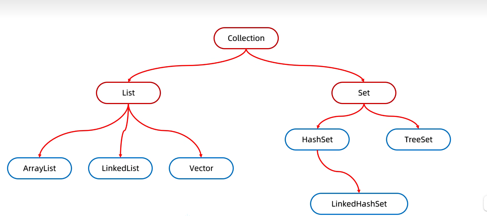

### ArrayList和LinkedList的区别

ArrayList基于动态数组实现（默认初始容量为0，第一次添加时会扩容为10，后面扩容倍数为1.5倍），LinkedList基于链表实现。ArrayList的get和set方法时$O(1)$的，LinkedList是$O(n)$的。因为可以实现基于下标随机访问，而链表只能通过遍历指针找到目标。LinkedList的增删速度比ArrayListkuai，这是因为链表只需要移动指针就能实现增删操作，而数组还要移动其它元素。

## HashSet添加元素的过程

HashSet底层使用HashMap来储存数据，HashSet其实就是在操作HashMap中的Key。  
添加元素时，首先会计算元素的hashCode()方法来计算哈希值，之后根据哈希值和散列函数计算出元素在数组中的索引值，判断该位置是否有元素，如果没有，则元素添加成功；  
如果该位置已经有元素的话，则判断两元素是否相同（通过哈希值和equals()方法判断），不同则添加成功，相同则添加失败。  
所以使用HashSet时类必须实现hashCode()和equals()方法。

## HashMap

### HashMap线程安全嘛？为什么不安全？

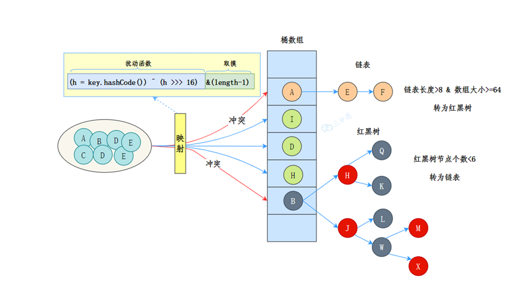

- JDK1.7中的HashMap使用头插法扩容，在多线程的环境下，扩容时可能会造成环形链表，形成死循环。JDK1.8改为尾插法，不会出现环形链表了。
- 多线程put时可能会造成元素丢失。多线程同时put，如果计算出来的索引位置相同的话会造成前一个key被后一个key覆盖从而导致元素丢失
- put和get并发时可能会使get为null。线程1put时可能会使HashMap扩容，会重新计算map中元素的哈希值，线程2此时执行get可能导致get为null。  

### 怎样解决HashMap线程不安全的问题

JAVA中有HashTable、Collections.synchronizedMap、ConcurrentHashMap可以实现线程安全的Map。  

- HasHTable直接在操作方法上加synchronized锁住整个table数组，粒度比较大。  
- Collections.synchronizedMap是使用Collections集合工具的内部类，通过传入一个Map封装出一个Collections.synchronizedMap对象，内部定义了一个对象锁，方法内通过对象锁实现。（从锁的角度来看，基本上锁住了尽可能大的代码块，性能比较差）。
- ConcurrentHashMap在JDK1.7使用分段锁，在JDK1.8之后使用CAS+synchronized。  

### ConcurrentHashMap怎么保证线程安全？

在JDK1.8之后，ConcurrentHashMap在散列表的每一个头节点上加锁，使锁的粒度变得很小，加锁使用的是CAS或者synchronized。ConcurrentHashMap使用CAS进行初始化，以防止其它线程的干扰。同时，为了避免二义性问题，ConcurrentHashMap不允许key或者value为null。

jdk1.8实现线程安全不是在数据结构上下功夫，它的数据结构和HashMap是一样的，数组+链表+红黑树。它实现线程安全的关键点在于put流程。
1. 首先计算hash，遍历node数组，如果node是空的话，就通过CAS+自旋的方式初始化
2. 如果当前数组位置是空则直接通过CAS自旋写入数据
3. 如果hash==MOVED，说明需要扩容，执行扩容
4. 如果都不满足，就使用synchronized写入数据，写入数据同样判断链表、红黑树，链表写入和HashMap的方式一样，key hash一样就覆盖，反之就尾插法，链表长度超过8就转换成红黑树

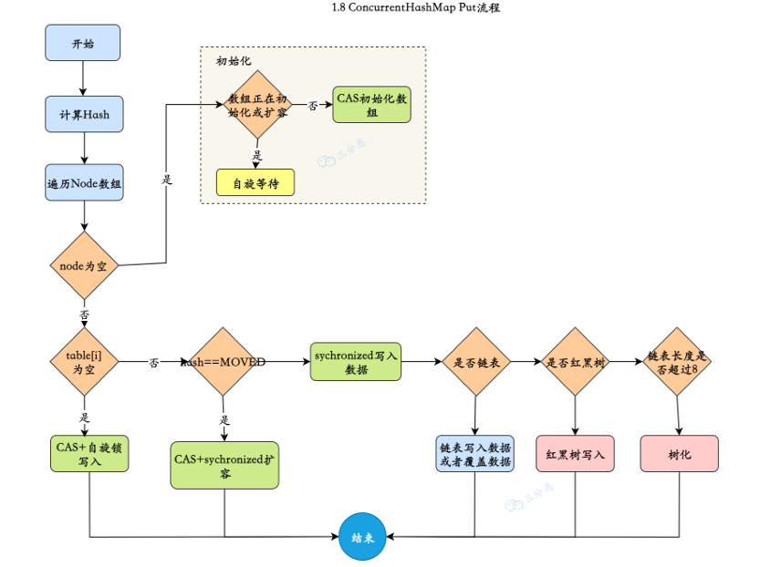

## Volatile关键字

### Volatile关键字的作用有哪些？

- 保证可见性，但不保证原子性。  
    关键字volatile可以用来修饰字段（成员变量），就是告知程序任何该变量的访问均需要从共享内存中获取，而对它的改变必须同步刷新回共享内存，它能保证所有线程对变量访问的可见性。  
- 禁止指令重排

### volatile实现原理

1. volatile怎么保证可见性的呢  
相比synchronized的加锁方式来解决共享变量的内存可见性问题，volatile就是更轻量的选择，它没有上下文切换的额外开销成本。  
volatile可以确保对某个变量的更新对其他线程马上可见，一个变量被声明为volatile 时，线程在写入变量时不会把值缓存在寄存器或者其他地方，而是会把值刷新回主内存 当其它线程读取该共享变量 ，会从主内存重新获取最新值，而不是使用当前线程的本地内存中的值。
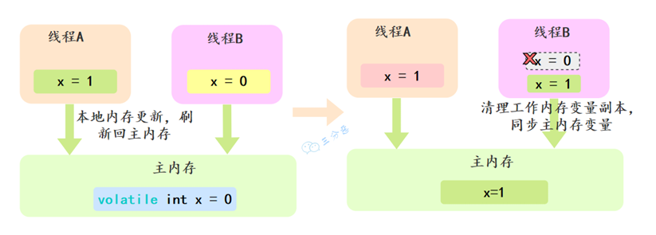
2. volatile怎么保证有序性的呢？  
重排序可以分为编译器重排序和处理器重排序，valatile保证有序性，就是通过分别限制这两种类型的重排序。
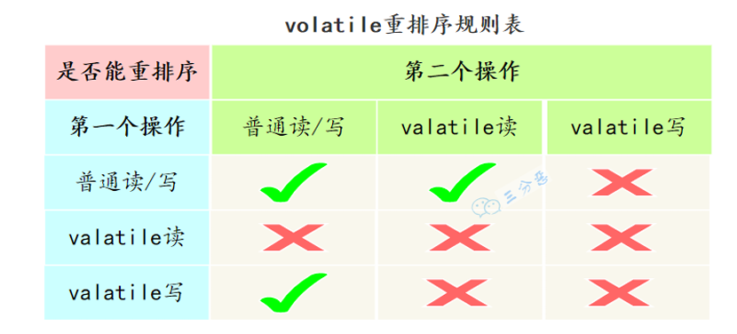
为了实现volatile的内存语义，编译器在生成字节码时，会在指令序列中插入内存屏障来禁止特定类型的处理器重排序。
    1. 在每个volatile写操作的前面插入一个**StoreStore** 屏障
    2. 在每个volatile写操作的后面插入一个 **StoreLoad** 屏障
    3. 在每个volatile读操作的后面插入一个 **LoadLoad** 屏障
    4. 在每个volatile读操作的后面插入一个 **LoadStore** 屏障

## 指令重排

在执行程序时，为了提高性能，编译器和处理器常常会对指令做重排序。重排序分3
种类型。

1. 编译器优化的重排序。编译器在不改变单线程程序语义的前提下，可以重新安排
语句的执行顺序。
2. 指令级并行的重排序。现代处理器采用了指令级并行技术（Instruction-Level Parallelism，ILP）来将多条指令重叠执行。如果不存在数据依赖性，处理器可以
改变语句对应 机器指令的执行顺序。
3. 内存系统的重排序。由于处理器使用缓存和读/写缓冲区，这使得加载和存储操
作看上去可能是在乱序执行。
从Java源代码到最终实际执行的指令序列，会分别经历下面3种重排序，如图：
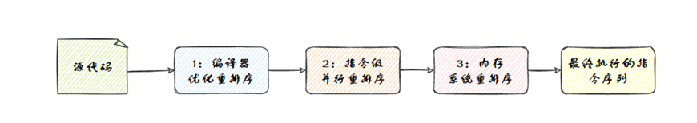

我们比较熟悉的双重校验单例模式就是一个经典的指令重排的例子，
Singleton instance=new Singleton()； 对应的JVM指令分为三步：分配内存空间-->初始化对象--->对象指向分配的内存空间，但是经过了编译器的指令重排序，第二步和第三步就可能会重排序。
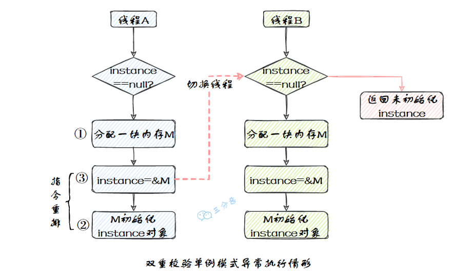

### 指令重排有限制吗？happens-before了解吗？

指令重排也是有一些限制的，有两个规则 happens-before 和 as-if-serial 来约束。

**happens-before**的定义：

- 如果一个操作happens-before另一个操作，那么第一个操作的执行结果将对第二个操作可见，而且第一个操作的执行顺序排在第二个操作之前。
- 两个操作之间存在happens-before关系，并不意味着Java平台的具体实现必须要
按照 happens-before关系指定的顺序来执行。如果重排序之后的执行结果，与按
happens-before关系来执行的结果一致，那么这种重排序并不非法

happens-before和我们息息相关的有六大规则：
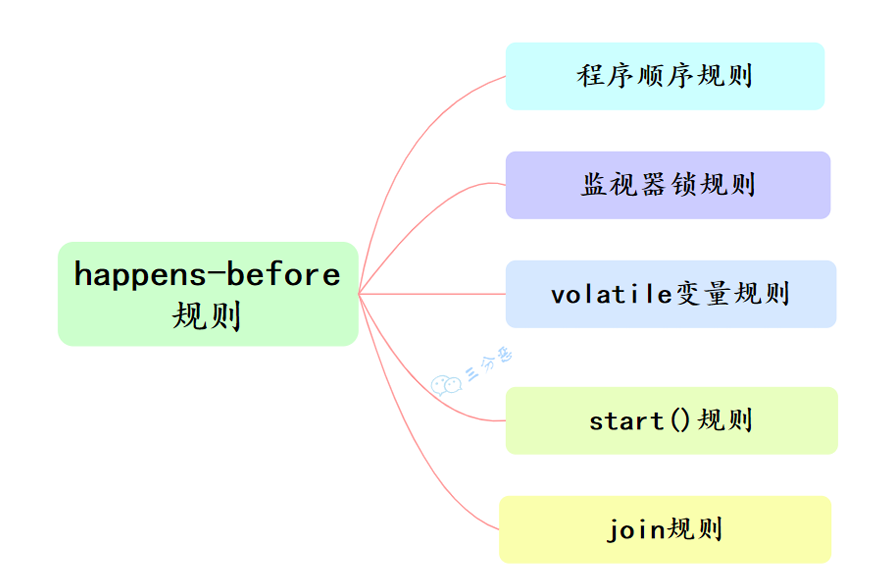

- **程序顺序规则**：一个线程中的每个操作，happens-before于该线程中的任意后续操作。
- **监视器锁规则**：对一个锁的解锁，happens-before于随后对这个锁的加锁。
- **volatile变量规则**：对一个volatile域的写，happens-before于任意后续对这个volatile域的读。
- **传递性**：如果A happens-before B，且B happens-before C，那么A happensbefore C。
- **start()规则**：如果线程A执行操作ThreadB.start()（启动线程B），那么A线程的ThreadB.start()操作happens-before于线程B中的任意操作。
- **join()规则**：如果线程A执行操作ThreadB.join()并成功返回，那么线程B中的任意操作 happens-before于线程A从ThreadB.join()操作成功返回。

**as-if-serial**的定义

不管怎么重排序（编译器和处理器为了提高并行度），单线程程序的执行结果不能被改变。编译器、runtime和处理器都必须遵守as-if-serial语义。  
为了遵守as-if-serial语义，编译器和处理器不会对存在数据依赖关系的操作做重排序，因为这种重排序会改变执行结果。但是，如果操作之间不存在数据依赖关系，这些操作就可能被编译器和处理器重排序。

## Atomic包

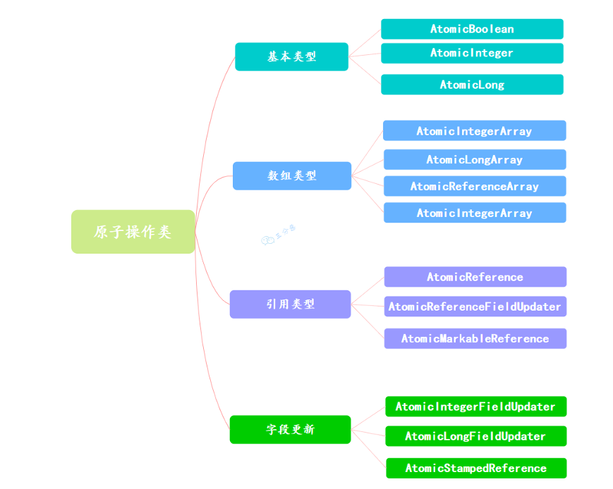

Atomic包里的类基本都是使用Unsafe实现的包装类。  
使用原子的方式更新基本类型，Atomic包提供以下3个类

- AtomicBoolean：原子更新布尔类型。
- AtomicInteger：原子更新整型。
- AtomicLong：原子更新长整型。

通过原子的方式更新数组里的某个元素，Atomic包提供了以下4个类：

- AtomicIntegerArray：原子更新整型数组里的元素。
- AtomicLongArray：原子更新长整型数组里的元素。
- AtomicReferenceArray：原子更新引用类型数组里的元素。

原子更新基本类型的AtomicInteger，只能更新一个变量，如果要原子更新多个变量，就需要使用这个原子更新引用类型提供的类。Atomic包提供了以下3个类：

- AtomicReference：原子更新引用类型。
- AtomicReferenceFieldUpdater：原子更新引用类型里的字段。
- AtomicMarkableReference：原子更新带有标记位的引用类型。可以原子更新一个布尔类型的标记位和引用类型。  

如果需原子地更新某个类里的某个字段时，就需要使用原子更新字段类，Atomic包提供了以下3个类进行原子字段更新：

- AtomicIntegerFieldUpdater：原子更新整型的字段的更新器。
- AtomicLongFieldUpdater：原子更新长整型字段的更新器。
- AtomicStampedReference：原子更新带有版本号的引用类型。该类将整数值与引用关联起来，可用于原子的更新数据和数据的版本号，可以解决使用CAS进行原子更新时可能出现的ABA问题。

## 并发工具类 //todo

## 双检锁 //todo

## Java中的引用类型

Java中的引用有四种，分为**强引用**（Strongly Reference）、软引用（Soft Reference）、弱引用（Weak Reference）和虚引用（Phantom Reference）4种，这4种引用强度依次逐渐减弱。

- 强引用是最传统的引用 的定义，是指在程序代码之中普遍存在的引用赋值，无论任何情况下，只要强引用关系还存在，垃圾收集器就永远不会回收掉被引用的对象。

~~~java
Object obj =new Object();
~~~

- 软引用是用来描述一些还有用，但非必须的对象。只被软引用关联着的对象，在系统将要发生内存溢出异常前，会把这些对象列进回收范围之中进行第二次回收，如果这次回收还没有足够的内存， 才会抛出内存溢出异常。在JDK 1.2版之后提供了SoftReference类来实现软引用。

~~~java
Object obj = new Object();
ReferenceQueue queue = new ReferenceQueue();
SoftReference reference = new SoftReference(obj, queue);
//强引用对象滞空，保留软引用
obj = null;
~~~

- 弱引用也是用来描述那些非必须对象，但是它的强度比软引用更弱一些，被弱引
用关联的对象只能生存到下一次垃圾收集发生为止。当垃圾收集器开始工作，无
论当前内存是否足够，都会回收掉只被弱引用关联的对象。在JDK 1.2版之后提供
了WeakReference类来实现弱引用。

~~~java
Object obj = new Object();
 ReferenceQueue queue = new ReferenceQueue();
 WeakReference reference = new WeakReference(obj, queue);
 //强引用对象滞空，保留弱引用
obj = null;
~~~

- 虚引用也称为“幽灵引用”或者“幻影引用”，它是最弱的一种引用关系。一个对象是否有虚引用的存在，完全不会对其生存时间构成影响，也无法通过虚引用来取得一个对象实例。为一个对象设置虚引用关联的唯一目的只是为了能在这个对象被收集器回收时收到一个系统通知。在JDK 1.2版之后提供了PhantomReference类来实现虚引用。

~~~java
Object obj = new Object();
 ReferenceQueue queue = new ReferenceQueue();
 PhantomReference reference = new PhantomReference(obj, queue);
 //强引用对象滞空，保留虚引用
obj = null;
~~~

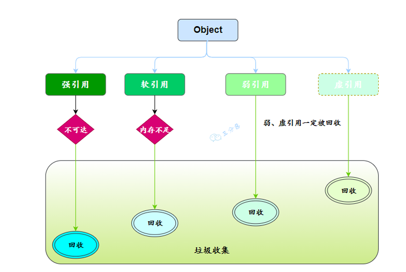

## JVM内存溢出（OOM）的原因和解决方法

1. **堆溢出**
   - 原因
        1. 代码中可能存在大对象分配  
        2. 可能存在内存泄露，导致在多次GC之后，还是无法找到一块足够大的内存容纳当前对象。
   - 解决方法
        1. 检查是否存在大对象的分配，最有可能的是大数组分配  
        2. 通过jmap命令，把堆内存dump下来，使用mat工具分析一下，检查是否存在内存泄露的问题  
        3. 如果没有找到明显的内存泄露，使用 -Xmx 加大堆内存  
        4. 还有一点容易被忽略，检查是否有大量的自定义Finalizable 对象，也有可能是框架内部提供的，考虑其存在的必要性
2. **元空间溢出**
   - 原因
        1. 运行期间生成了大量的代理类，导致方法区被撑爆，无法卸载  
        2. 应用长时间运行，没有重启
   - 解决方法
        1. 检查是否永久代空间或者元空间设置的过小
        2. 检查代码中是否存在大量的反射操作  
        3. dump之后通过mat检查是否存在大量由于反射生成的代理类
        4. 放大招，重启JVM  
3. **GC overhead limit exceeded**
   - 原因
        1. 这个是JDK6新加的错误类型，一般都是堆太小导致的。Sun 官方对此的定义：超过98%的时间用来做GC并且回收了不到2%的堆内存时会抛出此异常。
   - 解决方法
        1. 检查项目中是否有大量的死循环或有使用大内存的代码，优化代码。
        2. 添加参数 -XX:-UseGCOverheadLimit  禁用这个检查，其实这个参数解决不了内存问题，只是把错误的信息延后，最终出现 java.lang.OutOfMemoryError: Java heap space。
        3. dump内存，检查是否存在内存泄露，如果没有，加大内存。  
4. **方法栈溢出**
    - 原因
        1. 出现这种异常，基本上都是创建的了大量的线程导致的，以前碰到过一次，通过jstack出来一共8000多个线程。  
    - 解决方法
        1. 通过 -Xss 降低的每个线程栈大小的容量
        2. 线程总数也受到系统空闲内存和操作系统的限制  
5. **分配超大数组**
    - 原因
        1. 这种情况一般是由于不合理的数组分配请求导致的，在为数组分配内存之前，JVM 会执行一项检查。要分配的数组在该平台是否可以寻址(addressable)，如果不能寻址(addressable)就会抛出这个错误。
    - 解决方法
        1. 解决方法就是检查你的代码中是否有创建超大数组的地方。  
6. **swap溢出**
    - 原因
        1. swap 分区大小分配不足；
        2. 其他进程消耗了所有的内存。  
    - 解决方法
        1. 其它服务进程可以选择性的拆分出去
        2. 加大swap分区大小，或者加大机器内存大小
7. **本地方法溢出**
    - 原因
        1. 本地方法在运行时出现了内存分配失败，和之前的方法栈溢出不同，方法栈溢出发生在 JVM 代码层面，而本地方法溢出发生在JNI代码或本地方法处。
    - 解决方法
        1. 这个异常出现的概率极低，只能通过操作系统本地工具进行诊断，难度有点大，还是放弃为妙。  

## ThreadLocal

hreadLocal，也就是线程本地变量。如果你创建了一个ThreadLocal变量，那么访问这个变量的每个线程都会有这个变量的一个本地拷贝，多个线程操作这个变量的时候，实际是操作自己本地内存里面的变量，从而起到线程隔离的作用，避免了线程安全问题。  
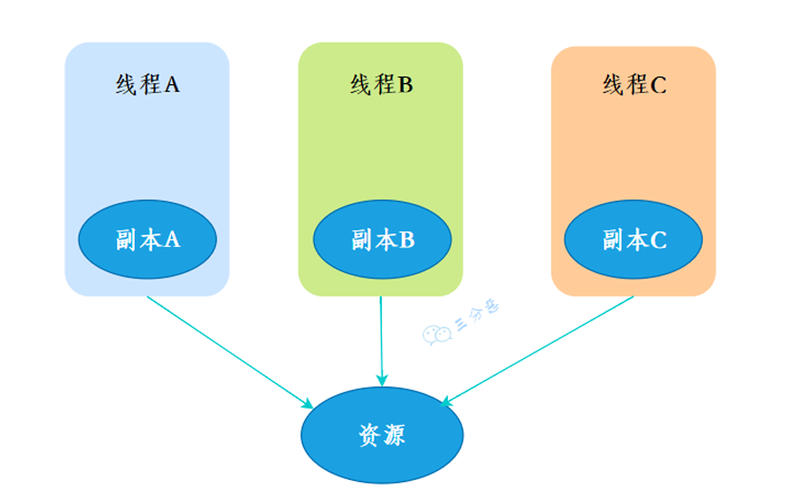

### 1. 原理

- Thread类有一个类型为ThreadLocal.ThreadLocalMap的实例变量threadLocals，每个线程都有一个属于自己的ThreadLocalMap。
- ThreadLocalMap内部维护着Entry数组，每个Entry代表一个完整的对象，key是ThreadLocal的弱引用，value是ThreadLocal的泛型值。
- 每个线程在往ThreadLocal里设置值的时候，都是往自己的ThreadLocalMap里存，读也是以某个ThreadLocal作为引用，在自己的map里找对应的key，从而实现了线程隔离。
- ThreadLocal本身不存储值，它只是作为一个key来让线程往ThreadLocalMap里存取值。  

### 2. ThreadLocal内存泄露是怎么回事？

我们先来分析一下使用ThreadLocal时的内存，我们都知道，在JVM中，栈内存线程私有，存储了对象的引用，堆内存线程共享，存储了对象实例。  

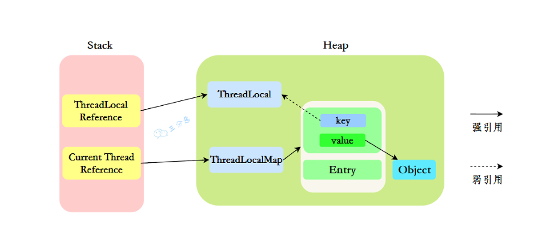

ThreadLocalMap中使用的 key 为 ThreadLocal 的弱引用。
>“弱引用：只要垃圾回收机制一运行，不管JVM的内存空间是否充足，都会回收该对象占用的内存。”  

那么现在问题就来了，弱引用很容易被回收，如果ThreadLocal（ThreadLocalMap的Key）被垃圾回收器回收了，但是ThreadLocalMap生命周期和Thread是一样的，它这时候如果不被回收，就会出现这种情况：ThreadLocalMap的key没了，value还在，这就会造成了内存泄漏问题  

>那为什么key还要设计成弱引用？

key设计成弱引用同样是为了防止内存泄漏。
假如key被设计成强引用，如果ThreadLocal Reference被销毁，此时它指向
ThreadLocal的强引用就没有了，但是此时key还强引用指向ThreadLocal，就会导致ThreadLocal不能被回收，这时候就发生了内存泄漏的问题  

### 3. ThreadLocalMap的结构

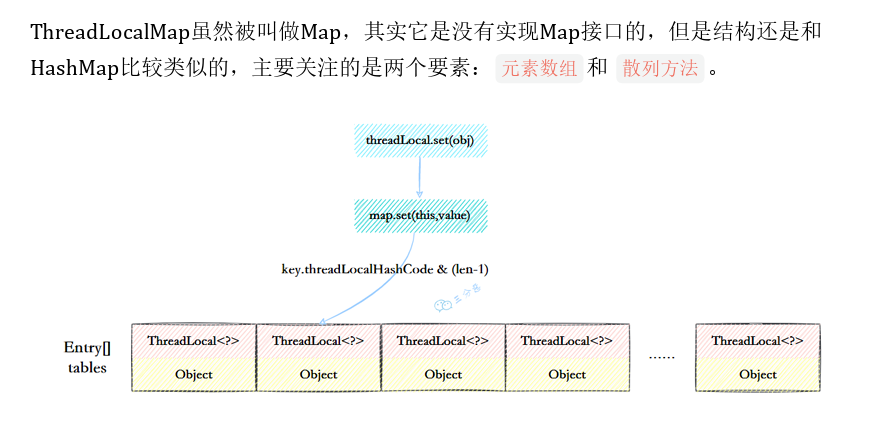

- 元素数组  
一个table数组，存储Entry类型的元素，Entry是ThreaLocal弱引用作为key，Object作为value的结构。
- 散列方法  
散列方法就是怎么把对应的key映射到table数组的相应下标，ThreadLocalMap用的是哈希取余法，取出key的threadLocalHashCode，然后和table数组长度减一&运算（相当于取余）。这里的threadLocalHashCode计算有点东西，每创建一个ThreadLocal对象，它就会
新增 **0x61c88647**，这个值很特殊，它是斐波那契数也叫 黄金分割数。 hash增量为这个数字，带来的好处就是 hash 分布非常均匀  

### 4. ThreadLocalMap怎么解决Hash冲突的？

**开放定址法**
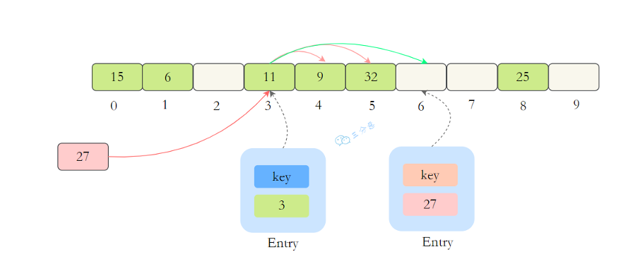

### 5. ThreadLocalMap扩容机制

在ThreadLocalMap.set()方法的最后，如果执行完启发式清理工作后，未清理到任何数据，且当前散列数组中Entry的数量已经达到了列表的扩容阈值 (len $\times$ 2/3)，就开始执行 rehash()逻辑：  
这里会先去清理过期的Entry，然后还要根据条件判断也就是 size >= threshold $\times$ 3/4来决定是否需要扩容。  
接着看看具体的resize() 方法，扩容后的newTab 的大小为老数组的两倍，然后遍历老的table数组，散列方法重新计算位置，开放地址解决冲突，然后放到新的Tab ，遍历完成之后，oldTab 中所有的entry 数据都已经放入到后table引用指向newTab
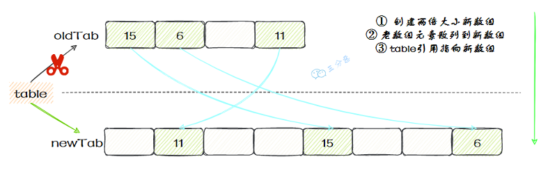  

## GC

### Java堆的内存分区

按照垃圾收集，将Java堆划分为
新生代（Young Generation）和老年代（Old Generation）两个区域，新生代存放存活时间短的对象，而每次回收后存活的少量对象，将会逐步晋升到老年代中存放。  
而新生代又可以分为三个区域，eden、from、to，比例是8：1：1，而新生代的内存分区同样是从垃圾收集的角度来分配的。

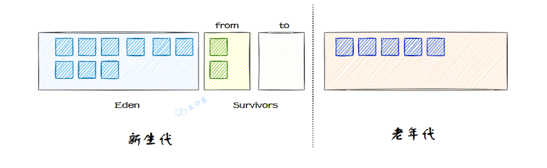

### 垃圾收集算法

1. 标记清除算法  
    见名知义，标记-清除 （Mark-Sweep）算法分为两个阶段：
    - **标记**: 标记出所有需要回收的对象清除
    - **清除**：回收所有被标记的对象
    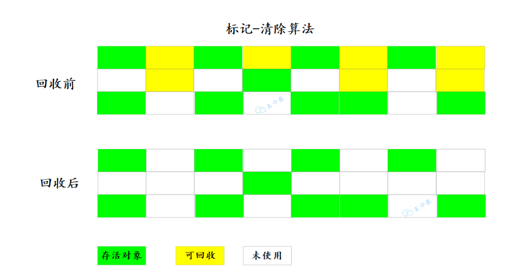
    标记-清除算法比较基础，但是主要存在两个缺点：  
      - 执行效率不稳定，如果Java堆中包含大量对象，而且其中大部分是需要被回收的，这时必须进行大量标记和清除的动作，导致标记和清除两个过程的执行效率都随对象数量增长而降低。  
      - 内存空间的碎片化问题，标记、清除之后会产生大量不连续的内存碎片，空间碎片太多可能会导致当以后在程序运行过程中需要分配较大对象时无法找到足的连续内存而不得不提前触发另一次垃圾收集动作  

2. 标记复制算法  
    标记-复制算法解决了标记-清除算法面对大量可回收对象时执行效率低的问  题。
    过程也比较简单：将可用内存按容量划分为大小相等的两块，每次只使用其中    的一块。当这一块的内存用完了，就将还存活着的对象复制到另外一块上面，    然后再把已使用过的内存空间一次清理掉。
    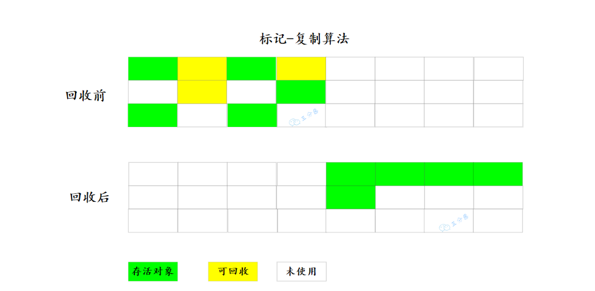
    这种算法存在一个明显的缺点：一部分空间没有使用，存在空间的浪费。  
    新生代垃圾收集主要采用这种算法，因为新生代的存活对象比较少，每次复制    的只是少量的存活对象。当然，实际新生代的收集不是按照这个比例。  

3. 标记整理算法  
    为了降低内存的消耗，引入一种针对性的算法：
    标记-整理 （Mark-Compact）算法。
    其中的标记过程仍然与“标记-清除”算法一样，但后续步骤不是直接对可回收 对象进行清理，而是让所有存活的对象都向内存空间一端移动，然后直接清理 掉边界以外的内存。
    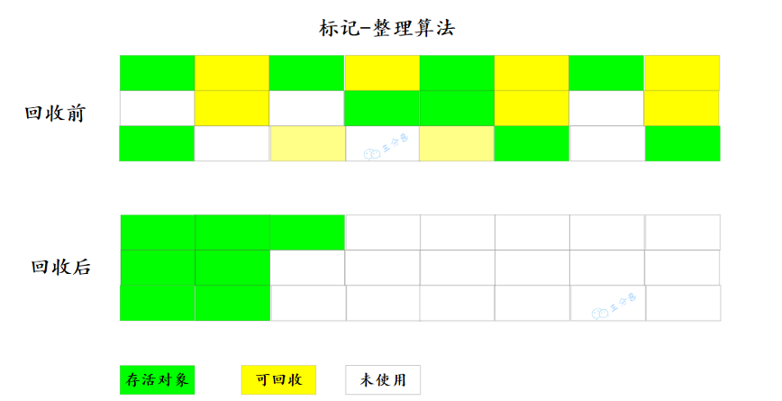
    标记-整理算法主要用于老年代，移动存活对象是个极为负重的操作，而且这 种操作需要Stop The World才能进行，只是从整体的吞吐量来考量，老年代   使用标记-整理算法更加合适。  

### 新生代的区域划分

新生代的垃圾收集主要采用标记-复制算法，因为新生代的存活对象比较少，每次复制少量的存活对象效率比较高。
基于这种算法，虚拟机将内存分为一块较大的Eden空间和两块较小的 Survivor空间，每次分配内存只使用Eden和其中一块Survivor。发生垃圾收集时，将Eden和Survivor中仍然存活的对象一次性复制到另外一块Survivor空间上，然后直接清理掉Eden和已用过的那块Survivor空间。默认Eden和Survivor的大小比例是8∶1。  
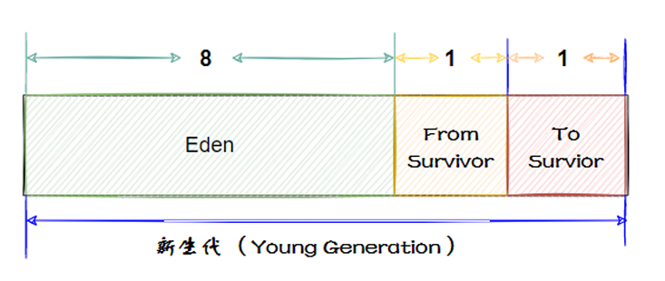

### Minor GC/Young GC、Major GC/Old GC、Mixed GC、Full GC都是什么意思？

部分收集（Partial GC）：指目标不是完整收集整个Java堆的垃圾收集，其中又分为：

- 新生代收集（Minor GC/Young GC）：指目标只是新生代的垃圾收集
- 老年代收集（Major GC/Old GC）：指目标只是老年代的垃圾收集。目前
只有CMS收集器会有单独收集老年代的行为。
- 混合收集（Mixed GC）：指目标是收集整个新生代以及部分老年代的垃圾收集。目前只有G1收集器会有这种行为。

**整堆收集（Full GC）**：收集整个Java堆和方法区的垃圾收集。

### Minor GC/Young GC什么时候触发？

新创建的对象优先在新生代Eden区进行分配，如果Eden区没有足够的空间时，就会触发Young GC来清理新生代。

### 什么时候会触发Full GC？

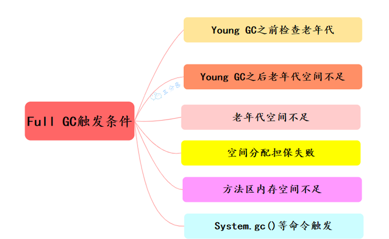

- **Young GC之前检查老年代**：在要进行 Young GC 的时候，发现**内存空间 < 老年代可用的连续新生代历次Young GC后升入老年代的对象总和的平均大小** ，说明本次Young GC后可能升入老年代的对象大小，可能超过了老年代当前可用内存间,那就会触发 Full GC。
- **Young GC之后老年代空间不足**：执行Young GC之后有一批对象需要放入老年代，此时老年代就是没有足够的内存空间存放这些对象了，此时必须立即触一次Full GC
- **老年代空间不足**，老年代内存使用率过高，达到一定比例，也会触发Full GC。
- **空间分配担保失败（ Promotion Failure）**，新生代的 To 区放不下从 Eden 和 From 拷贝过来对象，或者新生代对象 GC 年龄到达阈值需要晋升这两种况，老年代如果放不下的话都会触发 Full GC。
- **System.gc()等命令触发**：System.gc()、jmap -dump 等命令会触发 full gc。

### 对象什么时候会进入老年代？

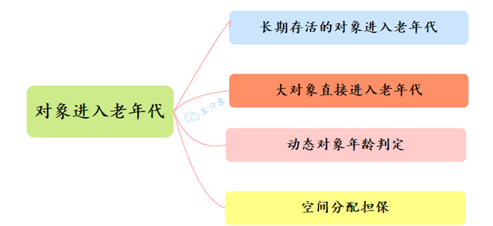

**长期存活的对象将进入老年代**  
在对象的对象头信息中存储着对象的迭代年龄,迭代年龄会在每次YoungGC之后对象的移区操作中增加,每一次移区年龄加一.当这个**年龄达到15**(默认)之后,这对象将会被移入老年代。
可以通过这个参数设置这个年龄值。  
`XX:MaxTenuringThreshold`

**大对象直接进入老年代**  
有一些占用大量连续内存空间的对象在被加载就会直接进入老年代.这样的大对象一般是一些数组,长字符串之类的对象。

**动态对象年龄判定**  
为了能更好地适应不同程序的内存状况，HotSpot虚拟机并不是永远要求对象的年龄必须达到- XX：MaxTenuringThreshold才能晋升老年代，如果在Survivor空间中**相同年龄所有对象大小的总和大于Survivor空间的一半**，年龄大于或等于该年龄的对象就可以直接进入老年代。  

**空间分配担保**  
假如在Young GC之后，新生代仍然有大量对象存活，就需要老年代进行分配担保，把Survivor无法容纳的对象直接送入老年代。

### 垃圾收集器

主要垃圾收集器如下，图中标出了它们的工作区域、垃圾收集算法，以及配合关系。
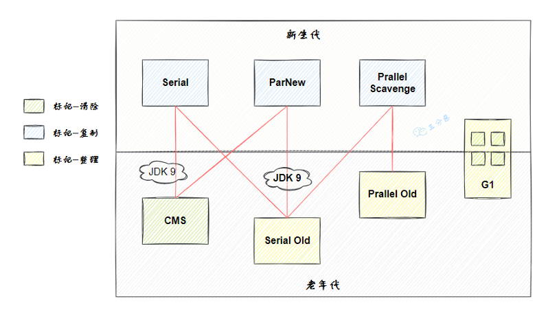

**Serial/Serial Old收集器**  
它是一个单线程工作的收集器，使用一个处理器或一条收
集线程去完成垃圾收集工作。它工作时必须STW，一般不用。

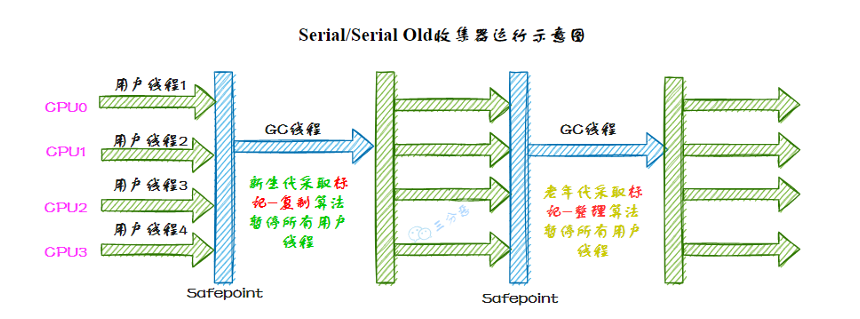

**ParNew**  
ParNew收集器实质上是Serial收集器的多线程并行版本，使用多条线程进行垃圾收集。
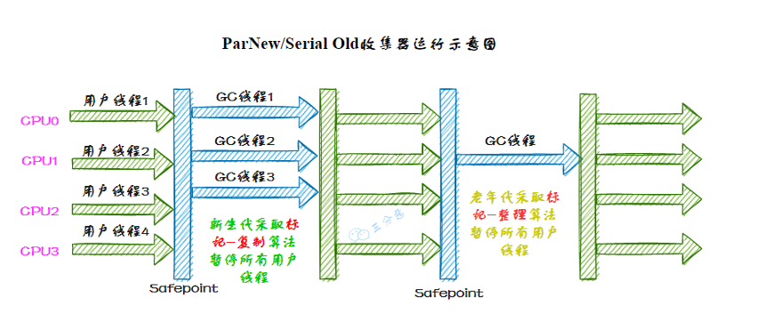

**Parallel Scavenge/Parallel Old**   
Parallel Scavenge收集器是一款新生代收集器，基于标记-复制算法实现也能够并行收集。和ParNew有些类似，但Parallel Scavenge主要关注的垃圾收集的吞吐量
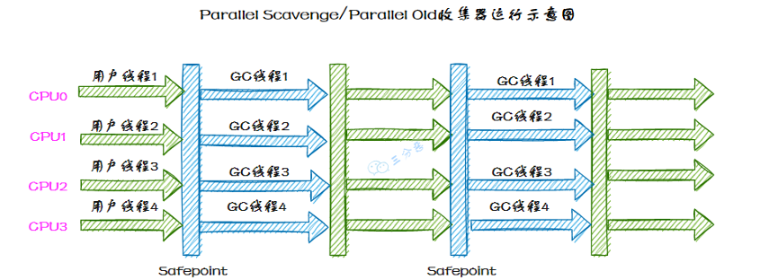

**CMS收集器**  
CMS（Concurrent Mark Sweep）收集器是一种以获取最短回收停顿时间为目标的收集器，同样是老年代的收集器，采用标记-清除算法。

**G1收集器**  
Garbage First（简称G1）收集器是垃圾收集器的一个颠覆性的产物，它开创了局部收集的设计思路和基于Region的内存布局形式。

#### **ZGC**  
[ZGC（Z Garbage Collector）](https://zhuanlan.zhihu.com/p/473629704)是一款性能比 G1 更加优秀的垃圾收集器。ZGC 第一次出现是在 JDK 11 中以实验性的特性引入，这也是 JDK 11 中最大的亮点。在 JDK 15 中 ZGC 不再是实验功能，可以正式投入生产使用了，使用 –XX:+UseZGC 可以启用 ZGC。  
JDK21 中ZGC引入了分代处理，减少了内存消耗并且提高了吞吐量  
ZGC 有 3 个重要特性：
- 停顿时间不超过10ms；
    >JDK 16 发布后，GC 暂停时间已经缩小到 1 ms 以内，并且时间复杂度是O(1)，这也就是说 GC 停顿时间是一个固定值了，并不会受堆内存大小影响
- 停顿时间不会随着堆的大小，或者活跃对象的大小而增加；
- 支持8MB~16TB级别的堆

内存多重映射和染色指针的引入，使 ZGC 的并发性能大幅度提升。

ZGC 只有 3 个需要 STW 的阶段，其中初始标记和初始转移只需要扫描所有 GC Roots，STW 时间 GC Roots 的数量成正比，不会耗费太多时间。再标记过程主要处理并发标记引用地址发生变化的对象，这些对象数量比较少，耗时非常短。可见整个 ZGC 的 STW 时间几乎只跟 GC Roots 数量有关系，不会随着堆大小和对象数量的变化而变化。

#### CMS

CMS收集齐的垃圾收集分为四步：
- **初始标记**（CMS initial mark）：单线程运行，需要Stop The World，标记GC 
Roots能直达的对象。
- **并发标记**
（（CMS concurrent mark）：无停顿，和用户线程同时运行，从GC 
Roots直达对象开始遍历整个对象图。
- **重新标记**
（CMS remark）：多线程运行，需要Stop The World，标记并发标记
阶段产生对象。
- **并发清除**
（CMS concurrent sweep）：无停顿，和用户线程同时运行，清理掉标
记阶段标记的死亡的对象。
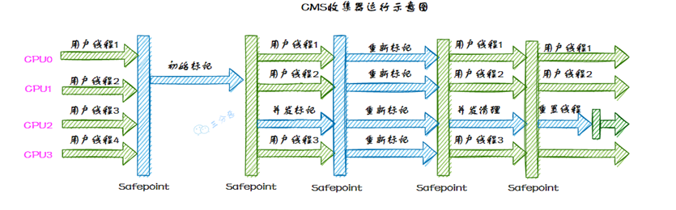

**优点**：CMS最主要的优点在名字上已经体现出来——并发收集、低停顿。  
**缺点**：CMS同样有三个明显的缺点。
- Mark Sweep算法会导致内存碎片比较多
- CMS的并发能力比较依赖于CPU资源，并发回收时垃圾收集线程可能会抢占用户线程的资源，导致用户程序性能下降。
- 并发清除阶段，用户线程依然在运行，会产生所谓的理“浮动垃圾”（Floating Garbage），本次垃圾收集无法处理浮动垃圾，必须到下一次垃圾收集才能处理。如果浮动垃圾太多，会触发新的垃圾回收，导致性能降低。

#### G1收集器

Garbage First（简称G1）收集器是垃圾收集器的一个颠覆性的产物，它开创了局部收集的设计思路和基于Region的内存布局形式。  
虽然G1也仍是遵循分代收集理论设计的，但其堆内存的布局与其他收集器有非常明显的差异。以前的收集器分代是划分新生代、老年代、持久代等。  
G1把连续的Java堆划分为多个大小相等的独立区域（Region），每一个Region都可以根据需要，扮演新生代的Eden空间、Survivor空间，或者老年代空间。收集器能够对扮演不同角色的Region采用不同的策略去处理。

这样就避免了收集整个堆，而是按照若干个Region集进行收集，同时维护一个优先级列表，跟踪各个Region回收的“价值，优先收集价值高的Region。

G1收集器的运行过程大致可划分为以下四个步骤：

- **初始标记**（initial mark），标记了从GC Root开始直接关联可达的对象。STW（Stop the World）执行。
- **并发标记**（concurrent marking），和用户线程并发执行，从GC Root开始对堆中对象进行可达性分析，递归扫描整个堆里的对象图，找出要回收的对象
- **最终标记**（Remark），STW，标记再并发标记过程中产生的垃圾。
- **筛选回收**（Live Data Counting And Evacuation），制定回收计划，选择多个Region 构成回收集，把回收集中Region的存活对象复制到空的Region中，再清理掉整个旧 Region的全部空间。需要STW。
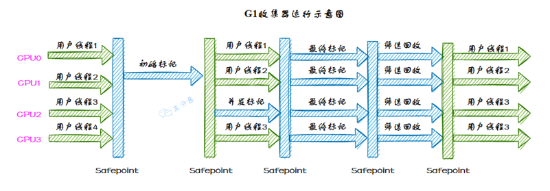

G1主要解决了内存碎片过多的问题。

	

#### 收集器的适用场景：
**Serial** ：如果应用程序有一个很小的内存空间（大约100 MB）亦或它在没有停顿时间要求的单线程处理器上运行。  
**Parallel**：如果优先考虑应用程序的峰值性能，并且没有时间要求要求，或者可以接受1秒或更长的停顿时间。  
**CMS/G1**：如果响应时间比吞吐量优先级高，或者垃圾收集暂停必须保持在大约1秒以内。  
**ZGC**：如果响应时间是高优先级的，或者堆空间比较大。

### 可作为GC Roots的对象
虚拟机栈中引用的对象
方法区中引用的对象
方法区中常量引用的对象
本地方法栈中JNI引用的对象
Java虚拟机内部的引用（类型对应的Class对象，常驻的异常对象等等）
所有被synchronized持有的对象
反映 Java 虚拟机内部情况的 JMXBean、JVMTI中注册的回调、本地代码缓存等等

### [OopMap和安全点](https://zhuanlan.zhihu.com/p/461298916)

在HotSpot中，有个数据结构（映射表）称为 OopMap。一旦类加载动作完成的时候，HotSpot就会把对象内什么偏移量上是什么类型的数据计算出来，记录到OopMap。在即时编译过程中，也会在 
特定的位置 生成 OopMap，记录下栈上和寄存器里哪些位置是引用。
这些特定的位置主要在：
1. 循环的末尾（非 counted 循环）
2. 方法临返回前 / 调用方法的call指令后
3. 可能抛异常的位置

这些位置就叫作**安全点**(safepoint)。用户程序执行时并非在代码指令流的任意位置都能够在停顿下来开始垃圾收集，而是必须是执行到安全点才能够暂停。

## Java对象内存分配流程

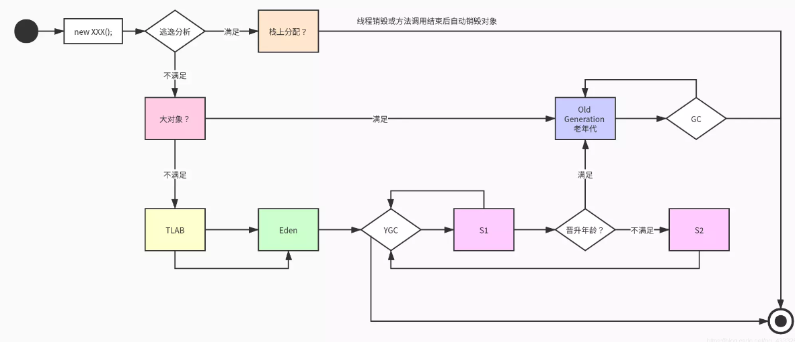

### **针对不同年龄段的对象分配原则**

- 优先分配到Eden区
- 大对象（过长的字符串、数组）直接分配到老年代，尽量避免程序中出现过多的大对象
- 长期存活的对象分配到老年代  

### **动态对象年龄判断**

- 如果survivor区中相同年龄的所有对象所占内存大小的总和大于survivor空间的一半，则年龄大于或等于该年龄的对象可以直接进入老年代，无须等到MaxTenuringThreshold中要求的年龄。

### **对象分配过程：TLAB**   
TLAB，全称Thread Local Allocation Buffer, 即：线程本地分配缓存。这是一块每个线程私有的内存分配区域，它存在于Eden区，TLAB空间的内存非常小，仅占有整个Eden空间的1%。  
**作用**
  - **为了加速对象的分配**，由于对象一般分配在堆上，而堆是线程共享的，因此可能会有多个线程在堆上申请空间，而每一次的对象分配都必须线程同步，会使分配的效率下降。
  - 考虑到对象分配几乎是Java中最常用的操作，**因此JVM使用了TLAB这样的线程专有区域来避免多线程冲突，提高对象分配的效率**，称之为快速分配策略。  

**其他TLAB说明**
  - 不是所有的对象实例都能够在TLAB中成功分配内存，但JVM确实是将TLAB作为内存分配的首选。
  - XX:UseTLAB: 设置是否开启TLAB。
  - XX:TLABWasteTargetPercent: 设置TLAB空间所占用Eden空间的百分比大小。
  - 一旦对象在TLAB空间分配内存失败时，JVM就会**尝试着通过使用加锁机制确保数据操作的原子性**，从而直接在Eden空间中分配内存。

**局限性**： TLAB空间一般不会太大（占Eden区1%），所以大对象无法进行TLAB分配。

### 逃逸分析

**逃逸分析的基本行为就是分析对象动态作用域**

- 当一个对象在方法中被定义后，对象只在方法内部使用，则认为没有发生逃逸。
- 当一个对象在方法中被定义后，它被外部方法所引用，则认为发生逃逸。例如作为调用参数传递到其他地方中。

**快速判断逃逸**：只要在方法内new的对象实体在外部被使用到了，则认为发生了逃逸，**不管是不是静态**，只要new的对象跑出了方法，注意关注的是对象实体，不是变量名，

**逃逸分析：代码优化**  
使用逃逸分析，编译器可以对代码做如下优化:

**一、栈上分配**。将堆分配转化为栈分配。如果一个对象在子程序中被分配，要使指向该对象的指针永远不会逃逸，对象可能是栈分配的候选，而不是堆分配。  
  -  JIT编译器在编译期间根据逃逸分析的结果，发现如果一个对象并没有逃逸出方法的话，就可能被优化成栈上分配。分配完成后，继续在调用栈内执行，最后线程结束，栈空间被回收，局部变量对象也被回收。这样就无须进行垃圾回收了。
 - 常见的栈上分配的场景：给成员变量赋值、方法返回值、实例引用传递。  

**二、同步省略（锁消除）**。如果一个对象被发现只能从一个线程被访问到，那么对于这个对象的操作可以不考虑同步。
 - 线程同步的代价是相当高的，同步的后果是降低并发性和性能。  
    在动态编译同步块的时候，JIT编译器可以借助逃逸分析来**判断同步块所使用的锁对象是否只能够被一个线程访问而没有被到其他线程占有**。如果没有，那么JIT编译器在编译这个同步块的时候就会取消对这部分代码的同步。这样就能大大提高并发性和性能。这个取消同步的过程就叫同步省略，也叫锁消除。
 

**三、分离对象或标量替换**。  
有的对象可能不需要作为一个连续的内存结构存在也可以被访问到，那么对象的部分（或全部）可以不存储在内存，而是存储在CPU寄存器中。
- 标量(Scalar)：指一个无法再分解成更小的数据的数据。Java中的原始数据类型就是标量
- 相对的，那些还可以分解的数据叫做聚合量(Aggregate) ,Java中的对象就是聚合量，因为他可以分解成其他聚合量和标量。
- 在JIT阶段，如果经过逃逸分析，如果没有发生逃逸的话，那么经过JIT优化，**就会把这个对象拆解成若干个其中的成员变量来代替**。这个过程就是标量替换

    **标量替换的好处**

  - 就是可以大大减少堆内存的占用。因为一旦不需要创建对象了，那么就不再需要分配堆内存了。
  - 标量替换为栈上分配提供了很好的基础。
>逃逸分析技术并不成熟  
  根本原因就是**无法保证逃逸分析的性能消耗一定能高于他的消耗**。虽然经过逃逸分析可以做标量替换、栈上分配、和锁消除。但是逃逸分析自身也是需要进行一系列复杂的分析的，这其实也是一个相对耗时的过程。
  一个极端的例子，就是经过逃逸分析之后，发现没有一个对象是不逃逸的。那这个逃逸分析的过程就白白浪费掉了。  
  虽然这项技术并不十分成熟，但是它也是即时编译器优化技术中一个十分重要的手段。  
  注意到有一些观点，认为通过逃逸分析，JVM会在栈上分配那些不会逃逸的对象，这在理论上是可行的，但是取决于JVM设计者的选择。据我所知，  oracle中并未这么做，这一点在逃逸分析相关的文档里已经说明，所以可以明确所有的对象实例都是创建在堆上。

## 多线程

### 并行跟并发有什么区别？
- 并行就是同一时刻，两个线程都在执行。这就要求有两个CPU去分别执行两个线程。
- 并发就是同一时刻，只有一个执行，但是一个时间段内，两个线程都执行了。并发的实现依赖于CPU切换线程，因为切换的时间特别短，所以基本对于用户是无感知的。

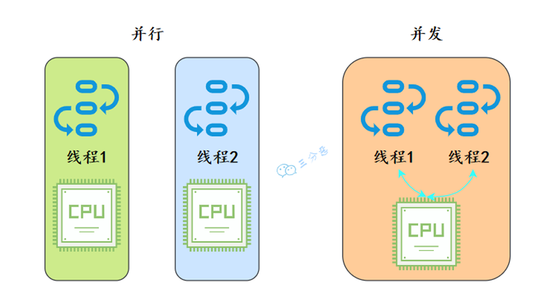

### 进程和线程

- 进程：进程是代码在数据集合上的一次运行活动，是系统进行资源分配和调度的基本单位。
- 线程：线程是进程的一个执行路径，一个进程中至少有一个线程，进程中的多个线程共享进程的资源。

### 线程和协程(虚拟线程)

Java 中的虚拟线程，也叫做协程或“轻量级线程”，它诞生于 JDK 19（预览 API），正式发布于 JDK 21，它是一种在 Java 虚拟机（JVM）层面实现的逻辑线程，不直接和操作系统的物理线程一一对应，因此它可以减少上下文切换所带来的性能开销。

操作系统线程、普通线程（Java 线程）和虚拟线程的关系如下

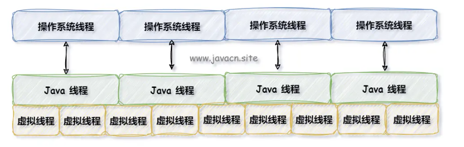

虚拟线程和普通线程的区别主要体现在以下几点：

1. 普通线程是和操作系统的物理线程是一一对应的，而虚拟线程是 JVM 层面的逻辑线程，并不和操作系统的物理线程一一对应，它可以看作是轻量级的线程。
2. 普通线程默认创建的是用户线程（而守护线程），而虚拟线程是守护线程，并且其守护线程的属性不能被修改，如果修改就会报错，如下图所示：
3. 虚拟线程由 JVM 调度和使用，避免了普通线程频繁切换的性能开销，所以相比于普通的线程来说，运行效率更高。

虚拟线程的优势

1. **更加轻量级**：虚拟线程相比传统线程更加轻量级。因为它们不是直接映射到操作系统线程上，而是在用户空间内被管理。这种设计减少了线程创建和销毁的开销，允许在同一应用中运行成千上万的线程。
2. **资源消耗更少**：由于不是直接映射到操作系统线程，虚拟线程显著降低了内存和其他资源的消耗。这使得在有限资源下可以创建更多的线程。
3. **上下文切换开销更低**：由于虚拟线程在用户空间，而不是通过操作系统，所以它的上下文切换开销更低。
4. **改善阻塞操作的处理**：在传统线程模型中，阻塞操作（如 I/O）会导致整个线程被阻塞，浪费宝贵的系统资源。然而当一个虚拟线程阻塞时，它可以被挂起，底层的操作系统线程则可以用来运行其他虚拟线程。
5. **简化并发编程**：可以像编写普通顺序代码一样编写并发代码，而不需要过多考虑线程管理和调度。它简化了 Java 的并发编程模型。
6. **提升性能**：在 I/O 密集型应用中，虚拟线程能够显著地提升性能。而且由于它们的创建和销毁成本低，能够更加高效地利用系统资源。

注意,虽然虚拟线程这么厉害，但是它不做以下几件事:
1. **不替代传统线程**：虚拟线程并不旨在完全替代传统的操作系统线程，而是作为一个补充。对于需要密集计算和精细控制线程行为的场景，传统线程仍然是主流。
2. **非针对最低延迟**：虚拟线程主要针对高并发和高吞吐量，而不是最低延迟。对于需要极低延迟的应用，传统线程可能是更好的选择。
3. *不改变基本的线程模型*：虚拟线程改进了线程的实现方式，但并未改变Java基本的线程模型和同步机制。锁和同步仍然是并发控制的重要工具。

### 线程的创建方式

Java中创建线程主要有三种方式，分别为继承Thread类、实现Runnable接口、实现Callable接口。

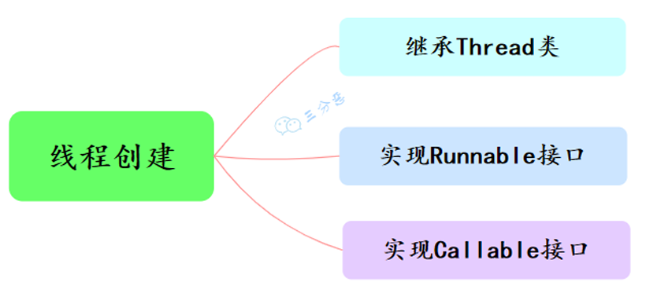

- 继承Thread类，重写run()方法，调用start()方法启动线程,该方法无返回值
- 实现 Runnable 接口，重写run()方法,该方法无返回值
- 实现Callable接口，重写call()方法，这种方式可以通过FutureTask获取任务执行的返回值

### 为什么调用start()方法时会执行run()方法，那怎么不直接调用run()方法？

JVM执行start方法，会先创建一条线程，由创建出来的新线程去执行thread的run方法，这才起到多线程的效果。

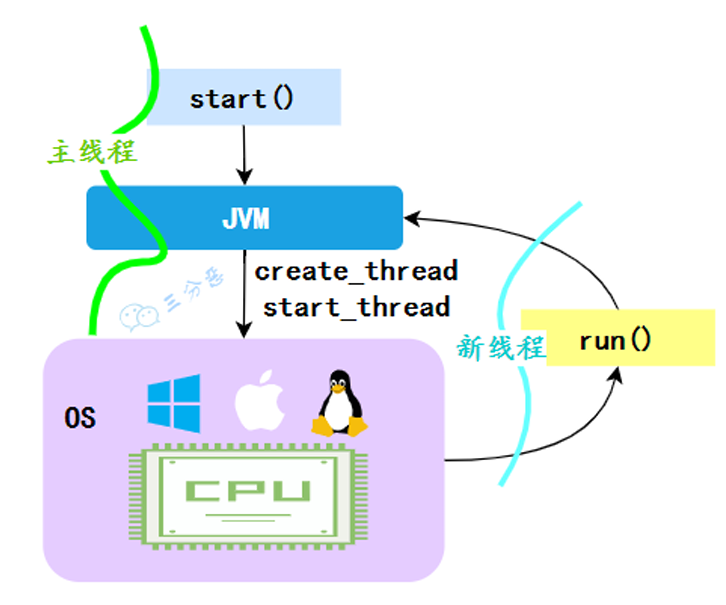

为什么我们不能直接调用run()方法？也很清楚， 如果直接调用Thread的run()方法，那么run方法还是运行在主线程中，相当于顺序执行，就起不到多线程的效果。

### 线程有哪些常用的调度方法？

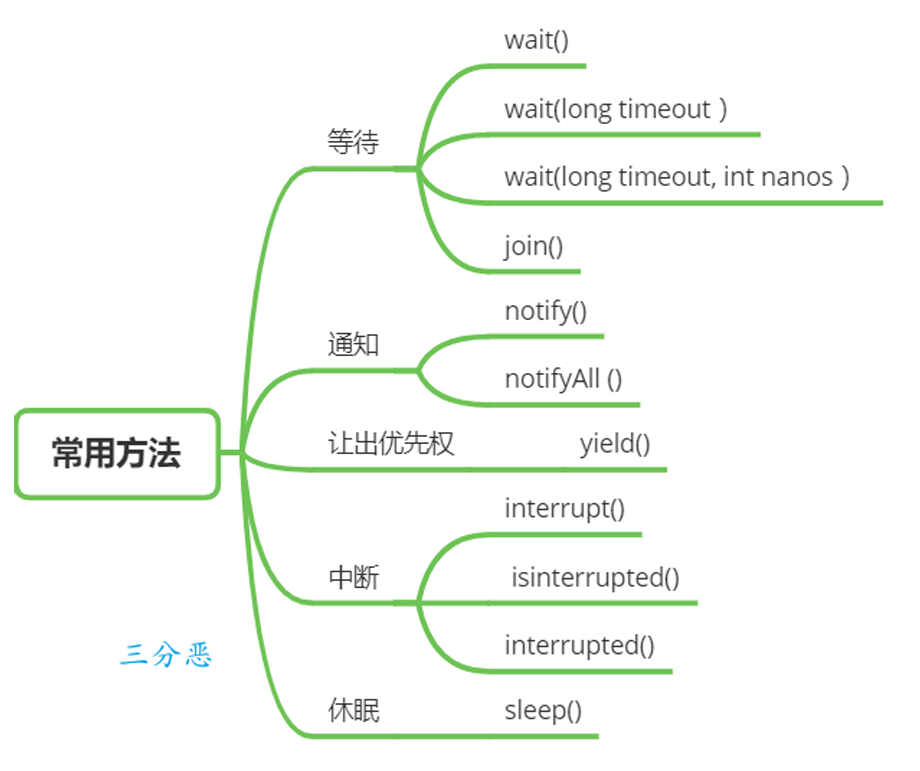

**线程等待与通知**

在Object类中有一些函数可以用于线程的等待与通知。
- wait()：当一个线程A调用一个共享变量的 wait()方法时， 线程A会被阻塞挂起， 发生下面几种情况才会返回 ：
    - 线程A调用了共享对象 notify()或者 notifyAll()方法；
    - 其他线程调用了线程A的 interrupt() 方法，线程A抛出InterruptedException异常返回。
- wait(long timeout) ：这个方法相比 wait() 方法多了一个超时参数，它的不同之处在于，如果线程A调用共享对象的wait(long timeout)方法后，没有在指定的 timeout ms时间内被其它线程唤醒，那么这个方法还是会因为超时而返回。
- wait(long timeout, int nanos)，其内部调用的是 wait(long timout)函数。

上面是线程等待的方法，而唤醒线程主要是下面两个方法：

- notify() : 一个线程A调用共享对象的 notify() 方法后，会唤醒一个在这个共享变量上调用 wait 系列方法后被挂起的线程。 一个共享变量上可能会有多个线程在等待，具体唤醒哪个等待的线程是随机的。
- notifyAll() ：不同于在共享变量上调用 notify() 函数会唤醒被阻塞到该共享变量上的一个线程，notifyAll()方法则会唤醒所有在该共享变量上由于调用 wait 系列方法而被挂起的线程。

Thread类也提供了一个方法用于等待的方法：
- join()：如果一个线程A执行了thread.join()语句，其含义是：当前线程A等待thread线程终止之后从thread.join()返回。

**线程休眠**

- sleep(long millis)  :Thread类中的静态方法，当一个执行中的线程A调用了Thread的sleep方法后，线程A会暂时让出指定时间的执行权，但是线程A所拥有的监视器资源，比如锁还是持有不让出的。指定的睡眠时间到了后该函数会正常返回，接着参与 CPU 的调度，获取到 CPU 资源后就可以继续运行。

**让出优先权**

- yield() ：Thread类中的静态方法，当一个线程调用 yield 方法时，实际就是在暗示线程调度器当前线程请求让出自己的CPU ，但是线程调度器可以无条件忽略这个暗示。

**线程中断**

Java 中的线程中断是一种线程间的协作模式，通过设置线程的中断标志并不能直接终止该线程的执行，而是被中断的线程根据中断状态自行处理。
- void interrupt() ：中断线程，例如，当线程A运行时，线程B可以调用钱程interrupt() 方法来设置线程的中断标志为true 并立即返回。设置标志仅仅是设置标志, 线程A实际并没有被中断， 会继续往下执行。
- boolean isInterrupted() 方法： 检测当前线程是否被中断。
- boolean interrupted() 方法： 检测当前线程是否被中断，与isInterrupted 不同的是，该方法如果发现当前线程被中断，则会清除中断标志。

### 线程的状态

在Java中，线程共有六种状态：

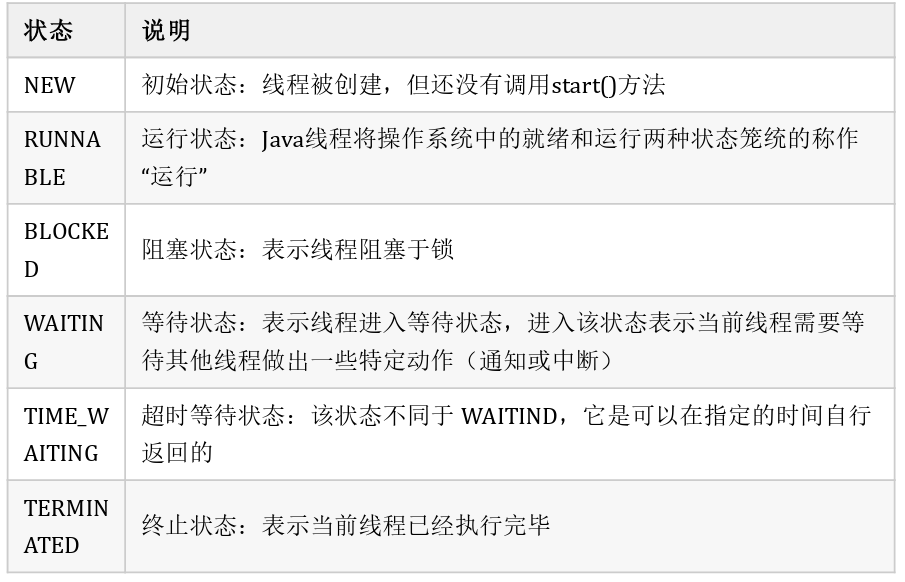

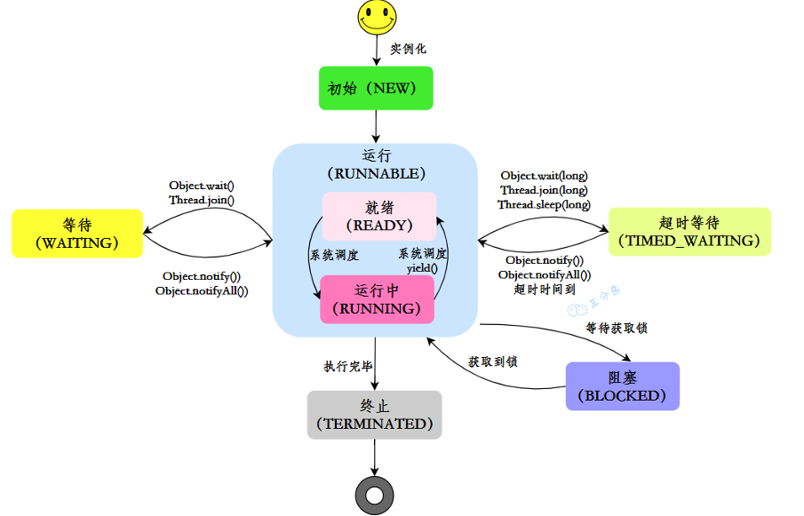

### 守护线程

Java中的线程分为两类，分别为 daemon 线程（守护线程）和 user 线程（用户线程）。  
在JVM 启动时会调用 main 函数，main函数所在的钱程就是一个用户线程。其实在 JVM 内部同时还启动了很多守护线程， 比如垃圾回收线程。

那么守护线程和用户线程有什么区别呢？区别之一是当最后一个非守护线程束时， JVM会正常退出，而不管当前是否存在守护线程，也就是说守护线程是否结束并不影响 JVM退出。换而言之，只要有一个用户线程还没结束，正常情况下JVM就不会退出。

### 线程间通信方式

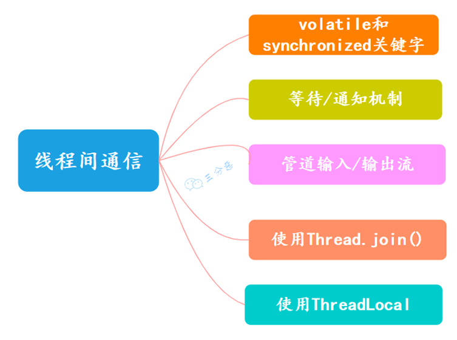

- volatile和synchronized关键字

关键字volatile可以用来修饰字段（成员变量），就是告知程序任何对该变量的访问均需要从共享内存中获取，而对它的改变必须同步刷新回共享内存，它能保证所有线程对变量访问的可见性。

关键字synchronized可以修饰方法或者以同步块的形式来进行使用，它主要确保多个线程在同一个时刻，只能有一个线程处于方法或者同步块中，它保证了线程对变量访问的可见性和排他性。

- 等待/通知机制

可以通过Java内置的等待/通知机制（wait()/notify()）实现一个线程修改一个对象的值，而另一个线程感知到了变化，然后进行相应的操作。

- 管道输入/输出流

管道输入/输出流和普通的文件输入/输出流或者网络输入/输出流不同之处在于，它主要用于线程之间的数据传输，而传输的媒介为内存。
管道输入/输出流主要包括了如下4种具体实现：`PipedOutputStream`、
`PipedInputStream`、 `PipedReader`和`PipedWriter`，前两种面向字节，而后两种面向字符

- 使用Thread.join()

如果一个线程A执行了thread.join()语句，其含义是：当前线程A等待thread线程终止之后才从thread.join()返回。。线程Thread除了提供join()方法之外，还提供了`join(long millis)`和j`oin(long millis,int nanos)`两个具备超时特性的方法。

- 使用ThreadLocal

ThreadLocal，即线程变量，是一个以ThreadLocal对象为键、任意对象为值的存储结构。这个结构被附带在线程上，也就是说一个线程可以根据一个ThreadLocal对象查询到绑定在这个线程上的一个值。

可以通过set(T)方法来设置一个值，在当前线程下再通过get()方法获取到原先设置的值。

### 进程间通信

1. 管道pipe：管道是一种半双工的通信方式，数据只能单向流动，而且只能在具有亲缘关系的进程间使用。进程的亲缘关系通常是指父子进程关系。
2. 命名管道FIFO：有名管道也是半双工的通信方式，但是它允许无亲缘关系进程间的通信。
3. 消息队列MessageQueue：消息队列是由消息的链表，存放在内核中并由消息队列标识符标识。消息队列克服了信号传递信息少、管道只能承载无格式字节流以及缓冲区大小受限等缺点。
4. 共享存储SharedMemory：共享内存就是映射一段能被其他进程所访问的内存，这段共享内存由一个进程创建，但多个进程都可以访问。共享内存是最快的 IPC 方式，它是针对其他进程间通信方式运行效率低而专门设计的。它往往与其他通信机制，如信号量，配合使用，来实现进程间的同步和通信。
5. 信号量Semaphore：信号量是一个计数器，可以用来控制多个进程对共享资源的访问。它常作为一种锁机制，防止某进程正在访问共享资源时，其他进程也访问该资源。因此，主要作为进程间以及同一进程内不同线程之间的同步手段。
6. 套接字Socket：套解口也是一种进程间通信机制，与其他通信机制不同的是，它可用于不同及其间的进程通信。
7. 信号 ( sinal ) ： 信号是一种比较复杂的通信方式，用于通知接收进程某个事件已经发生。

## 线程池

### 优点

- 降低系统资源消耗，通过重用已存在的线程，降低线程创建和销毁造成的消耗；
- 提高系统响应速度，当有任务到达时，无需等待新线程的创建便能立即执行；
- 方便线程并发数的管控，线程若是无限制的创建，不仅会额外消耗大量系统资源，更是占用过多资源而阻塞系统或oom等状况，从而降低系统的稳定性。线程池能有效管控线程，统一分配、调优，提供资源使用率；
- 更强大的功能，线程池提供了定时、定期以及可控线程数等功能的线程池，使用方便简单。

### Executor 框架介绍

Executor 框架是 Java5 之后引进的，在 Java 5 之后，通过 Executor 来启动线程比使用 Thread 的 start 方法更好，除了更易管理，效率更好（用线程池实现，节约开销）外，还有关键的一点：有助于避免 [this 逃逸问题](https://blog.csdn.net/xmtblog/article/details/117489711)。
>this 逃逸是指在构造函数返回之前其他线程就持有该对象的引用，调用尚未构造完全的对象的方法可能引发令人疑惑的错误。

Executor 框架结构主要由三大部分组成：  
1. 任务(Runnable /Callable)  
    执行任务需要实现的 Runnable 接口 或 Callable接口。Runnable 接口或 Callable 接口 实现类都可以被 ThreadPoolExecutor 或 ScheduledThreadPoolExecutor 执行。
2. 任务的执行(Executor)  

3. 异步计算的结果(Future)
    Future 接口以及 Future 接口的实现类 FutureTask 类都可以代表异步计算的结果。当我们把 Runnable接口 或 Callable 接口 的实现类提交给 ThreadPoolExecutor 或 ScheduledThreadPoolExecutor 执行。（调用 submit() 方法时会返回一个 FutureTask 对象）Executor 框架的使用示意图：

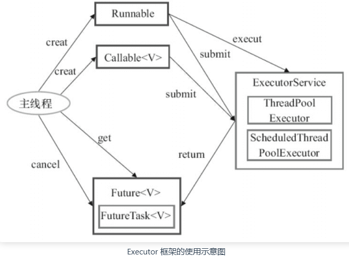

### 内置线程池
java通过Executors提供四种线程池，分别为：  

- **newSingleThreadExecutor**:这个线程池只有一个线程。若多个任务被提交到此线程池，那么会被缓存到队列（队列长度为Integer.MAX_VALUE）。当线程空闲的时候，按照FIFO的方式进行处理.  
    - 线程池特点:
        - 核心线程数为1
        - 最大线程数也为1
        - 阻塞队列是无界队列LinkedBlockingQueue，可能会导致OOM
        - keepAliveTime为0
    - 适用场景
        - 适用于串行执行任务的场景，一个任务一个任务地执行。

- **newFixedThreadPool**:该方法返回一个固定线程数量的线程池。该线程池中的线程数量始终不变。当有一个新的任务提交时，线程池中若有空闲线程，则立即执行。若没有，则新的任务会被暂存在一个任务队列中，待有线程空闲时，便处理在任务队列中的任务。
    - 线程池特点:
        - 核心线程数和最大线程数大小一样
        - 没有所谓的非空闲时间，即keepAliveTime为0
        - 阻塞队列为无界队列LinkedBlockingQueue，可能会导致OOM
    - 适用场景
        - FixedThreadPool 适用于处理CPU密集型的任务，确保CPU在长期被工作线程使用的情况下，尽可能的少的分配线程，即适用执行长期的任务。

- **newCachedThreadPool**：这种方式创建的线程池，核心线程池的长度为0，线程池最大长度为**Integer.MAX_VALUE**。由于本身使用SynchronousQueue作为等待队列的缘故，导致往队列里面每插入一个元素，必须等待另一个线程从这个队列删除一个元素。
    - 线程池特点:
        - 核心线程数为0
        - 最大线程数为Integer.MAX_VALUE，即无限大，可能会因为无限创建线程，导致OOM
        - 阻塞队列是SynchronousQueue
        - 非核心线程空闲存活时间为60秒
    - 适用场景
        - 用于并发执行大量短期的小任务

- **newScheduledThreadPool**:该返回一个用来在给定的延迟后运行任务或者定期执行任务的线程池
    - 线程池特点:
        - 最大线程数为Integer.MAX_VALUE，也有OOM的风险
        - 阻塞队列是DelayedWorkQueue
        - keepAliveTime为0
        - scheduleAtFixedRate() ：按某种速率周期执行
        - scheduleWithFixedDelay()：在某个延迟后执行
    - 适用场景
        - 周期性执行任务的场景，需要限制线程数量的场景

### 线程池的参数

这个构造方法有7个参数，我们逐一来进行分析。

- corePoolSize，线程池中的核心线程数
- maximumPoolSize，线程池中的最大线程数
- keepAliveTime，空闲时间，当线程池数量超过核心线程数时，多余的空闲线程存活的时间，即：这些线程多久被销毁。
- unit，空闲时间的单位，可以是毫秒、秒、分钟、小时和天，等等
- **workQueue**，等待队列，线程池中的线程数超过核心线程数时，任务将放在等待队列，它是一个BlockingQueue类型的对象
- threadFactory，线程工厂，我们可以使用它来创建一个线程
- **handler**，拒绝策略，当线程池和等待队列都满了之后，需要通过该对象的回调函数进行回调处理

这些参数里面，基本类型的参数都比较简单，我们不做进一步的分析。我们更关心的是workQueue、threadFactory和handler，接下来我们将进一步分析

#### 等待队列-workQueue

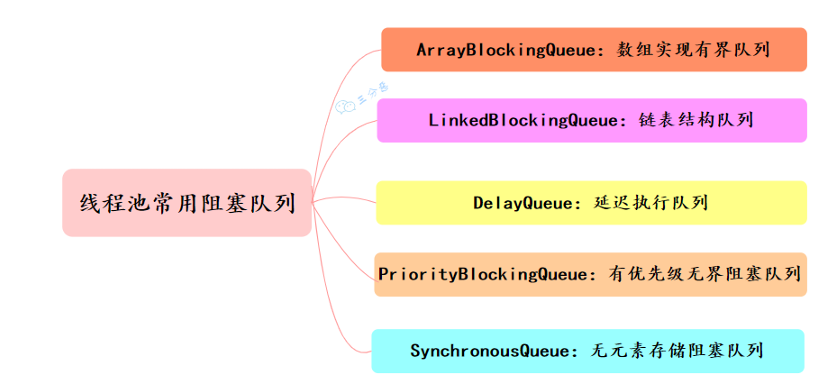

- **ArrayBlockingQueue**：ArrayBlockingQueue（有界队列）是一个用数组实现的有界阻塞队列，按FIFO排序量。
- **LinkedBlockingQueue**：LinkedBlockingQueue（可设置容量队列）是基于链表结构的阻塞队列，按FIFO排序任务，容量可以选择进行设置，不设置的话，将是一个无边界的阻塞队列，最大长度为Integer.MAX_VALUE，吞吐量通常要高于ArrayBlockingQuene；newFixedThreadPool线程池使用了这个队列
- **DelayQueue**：DelayQueue（延迟队列）是一个任务定时周期的延迟执行的队列。根据指定的执行时间从小到大排序，否则根据插入到队列的先后排序。newScheduledThreadPool线程池使用了这个队列。
- **PriorityBlockingQueue**：PriorityBlockingQueue（优先级队列）是具有优先级的无界阻塞队列
- **SynchronousQueue**：SynchronousQueue（同步队列）是一个不存储元素的阻塞队列，每个插入操作必须等到另一个线程调用移除操作，否则插入操作一直处于阻塞状态，吞吐量通常要高于LinkedBlockingQuene，newCachedThreadPool线程池使用了这个队列。

#### 线程工厂-threadFactory

ThreadFactory是一个接口，只有一个方法。既然是线程工厂，那么我们就可以用它生产一个线程对象。

Executors的实现使用了默认的线程工厂`-DefaultThreadFactory`。它的实现主要用于创建一个线程，线程的名字为`pool-{poolNum}-thread-{threadNum}`。

很多时候，我们需要自定义线程名字。我们只需要自己实现ThreadFactory，用于创建特定场景的线程即可。

#### 拒绝策略-handler

jdk自带4种拒绝策略

- CallerRunsPolicy // 在调用者线程执行
- AbortPolicy // 直接抛出`RejectedExecutionException`异常
- DiscardPolicy // 任务直接丢弃，不做任何处理
- DiscardOldestPolicy // 丢弃队列里最旧的那个任务，再尝试执行当前任务

想实现自己的拒绝策略，实现`RejectedExecutionHandler`接口即可。

### 提交任务的几种方式

往线程池中提交任务，主要有两种方法，`execute()`和`submit()`。

`execute()`用于提交不需要返回结果的任务

`submit()`用于提交一个需要返回果的任务。该方法返回一个Future对象，通过调用这个对象的`get()`方法，我们就能获得返回结果。`get()`方法会一直阻塞，直到返回结果返回。另外，我们也可以使用它的重载方法`get(long timeout, TimeUnit unit)`，这个方法也会阻塞，但是在超时时间内仍然没有返回结果时，将抛出异常TimeoutException。

### 关闭线程池

可以通过调用线程池的 
`shutdown` 或 `shutdownNow `方法来关闭线程池。它们的原理是遍历线程池中的工作线程，然后逐个调用线程的interrupt方法来中断线程，所以无法响应中断的任务可能永远无法终止。

`shutdown()`将线程池状态置为shutdown,并不会立即停止：

    1. 停止接收外部submit的任务
    2. 内部正在跑的任务和队列里等待的任务，会执行完
    3. 等到第二步完成后，才真正停止

`shutdownNow()`	将线程池状态置为stop。一般会立即停止，事实上不一定：

    1. 和shutdown()一样，先停止接收外部提交的任务
    2. 忽略队列里等待的任务
    3. 尝试将正在跑的任务interrupt中断
    4. 返回未执行的任务列表

shutdown 和shutdownnow简单来说区别如下：
- shutdownNow()能立即停止线程池，正在跑的和正在等待的任务都停下了。这样做立即生效，但是风险也比较大。
- shutdown()只是关闭了提交通道，用submit()是无效的；而内部的任务该怎么跑还是怎么跑，跑完再彻底停止线程池。

### 线程池的状态

线程池有这几个状态：RUNNING,SHUTDOWN,STOP,TIDYING,TERMINATED

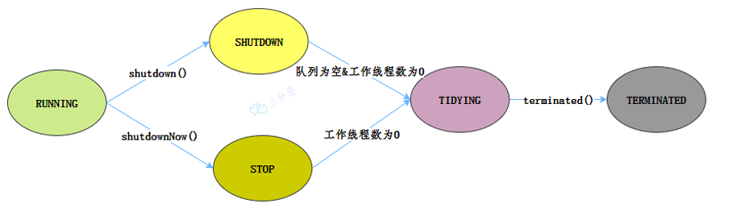

**RUNNING**
- 该状态的线程池会接收新任务，并处理阻塞队列中的任务;
- 调用线程池的shutdown()方法，可以切换到SHUTDOWN状态;
- 调用线程池的shutdownNow()方法，可以切换到STOP状态;

**SHUTDOWN**
- 该状态的线程池不会接收新任务，但会处理阻塞队列中的任务；
- 队列为空，并且线程池中执行的任务也为空,进入TIDYING状态;

**STOP**
- 该状态的线程不会接收新任务，也不会处理阻塞队列中的任务，而且会中断正在运行的任务；
- 线程池中执行的任务为空,进入TIDYING状态;

**TIDYING**
- 该状态表明所有的任务已经运行终止，记录的任务数量为0。
- terminated()执行完毕，进入TERMINATED状态

**TERMINATED**
- 该状态表示线程池彻底终止

### 线程池的线程数应该怎么配置?

线程在Java中属于稀缺资源，线程池不是越大越好也不是越小越好。任务分为计算密集型、IO密集型、混合型。

1. 计算密集型：大部分都在用CPU跟内存，加密，逻辑操作业务处理等。
2. IO密集型：数据库链接，网络通讯传输等.

一般的经验，不同类型线程池的参数配置：
1. 计算密集型一般推荐线程池不要过大，一般是CPU数 + 1，+1是因为可能存在页缺失(就是可能存在有些数据在硬盘中需要多来一个线程将数据读入内存)。如果线程池数太大，可能会频繁的 进行线程上下文切换跟任务调度。
2. IO密集型：线程数适当大一点，机器的Cpu核心数*2。

### 线程池异常怎么处理

在使用线程池处理任务的时候，任务代码可能抛出RuntimeException，抛出异常后，线程池可能捕获它，也可能创建一个新的线程来代替异常的线程，我们可能无法感知任务出现了异常，因此我们需要考虑线程池异常情况。

常见的异常处理方式：

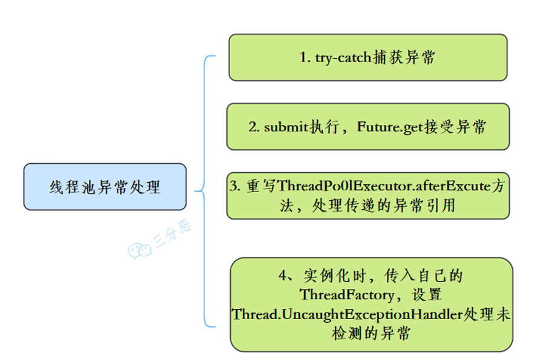

### 线程池监控

首先，ThreadPoolExecutor自带了一些方法

- `long getTaskCount()`，获取已经执行或正在执行的任务数
- `long getCompletedTaskCount()`，获取已经执行的任务数
- `int getLargestPoolSize()`，获取线程池曾经创建过的最大线程数，根据这个参数，我们可以知道线程池是否满过
- `int getPoolSize()`，获取线程池线程数
- `int getActiveCount()`，获取活跃线程数（正在执行任务的线程数）
 

其次，ThreadPoolExecutor留给我们自行处理的方法有3个，它在ThreadPoolExecutor中为空实现

- `protected void beforeExecute(Thread t, Runnable r)` // 任务执行前被调用
- `protected void afterExecute(Runnable r, Throwable t)` // 任务执行后被调用
- `protected void terminated()`// 线程池结束后被调用

## 设计原则 //todo

## 设计模式 //todo

