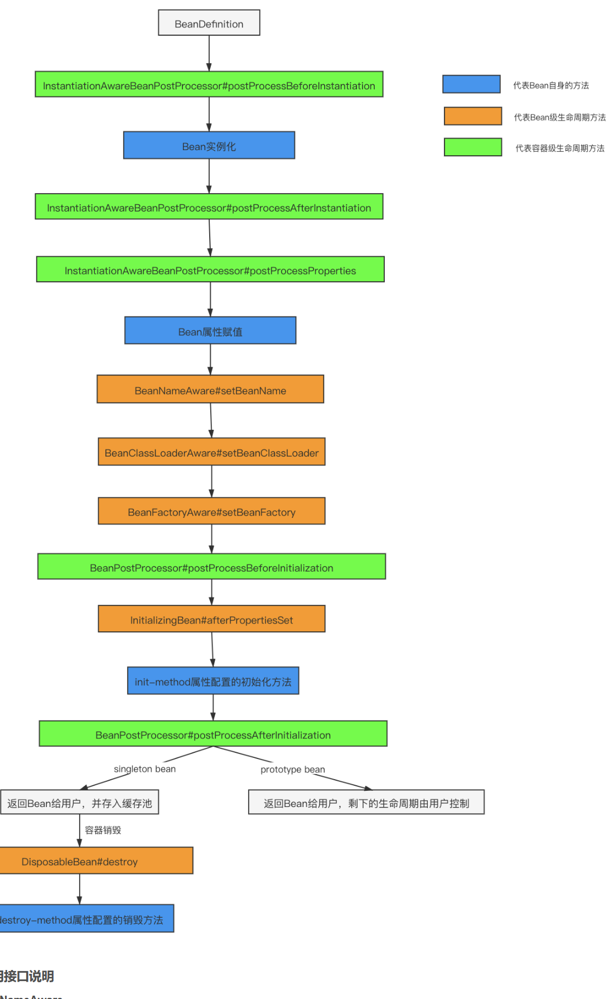
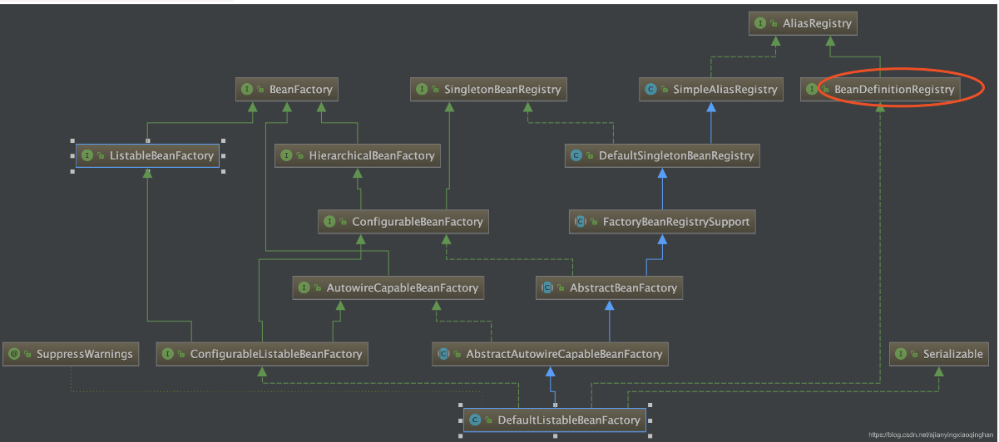
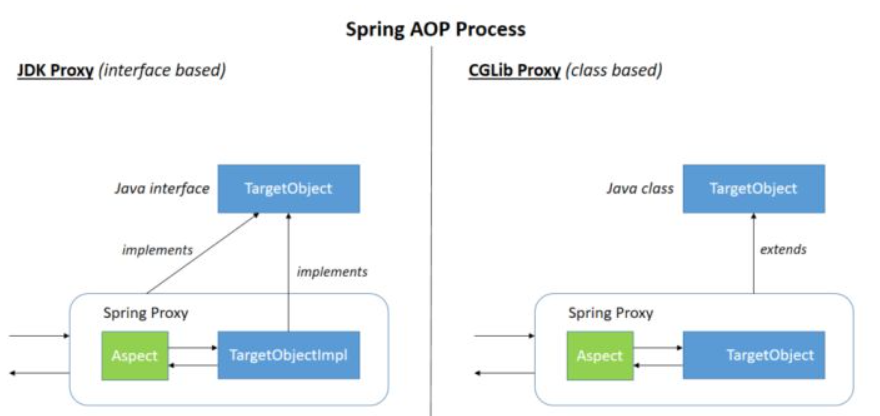
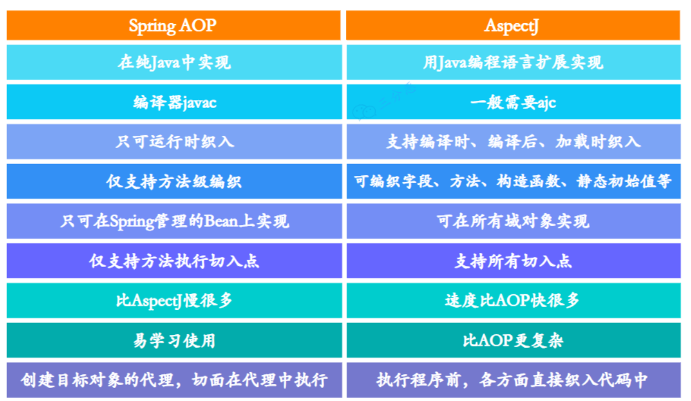

# Bean
## Bean的作用域

**singleton** : 唯一 bean 实例，Spring 中的 bean 默认都是单例的。  
**prototype** : 每次请求都会创建一个新的 bean 实例。  
**request** : 每一次 HTTP 请求都会产生一个新的 bean，该 bean 仅在当前 HTTP request 内有效。  
**session** : 每一次 HTTP 请求都会产生一个新的 bean，该 bean 仅在当前 HTTP session 内有效。  
**global-session**： 全局 session 作用域，仅仅在基于 Portlet 的 web 应用中才有意义，Spring5 已经没有了。Portlet 是能够生成语义代码（例如：HTML）片段的小型 Java Web 插件。它们基于 portlet 容器，可以像 servlet 一样处理 HTTP 请求。但是，与 servlet 不同，每个 portlet 都有不同的会话。  

## Bean 的生命周期

这里我们说的 Spring Bean 的生命周期主要指的是 singleton bean，对于 prototype 的 bean ，Spring 在创建好交给使用者之后则不会再管理后续的生命周期。

对于普通的 Java 对象来说，它们的生命周期就是：  

- 实例化
- 该对象不再被使用时通过垃圾回收机制进行回收

而对于 Spring Bean 的生命周期来说：

- 实例化 Instantiation
- 属性赋值 Populate
- 初始化 Initialization
- 销毁 Destruction

1. 实例化：以 InstantiationAwareBeanPostProcessor 接口方法为包装，进行实例化过程。该接口主要功能有三个：实例化前预处理、实例化后预处理、设置属性值预处理；  
    - 实例化前预处理：InstantiationAwareBeanPostProcessor # postProcessBeforeInstantiation();
    - **实例化**
    - 实例化后预处理：InstantiationAwareBeanPostProcessor # postProcessAfterInstantiation();
2. 填充属性值：同样以 InstantiationAwareBeanPostProcessor 接口方法为包装；
    - 设置属性值预处理：InstantiationAwareBeanPostProcessor # postProcessPropertyValues();
    - **设置属性值**
    > 注：循环依赖问题的解决在该部分实现。具体过程见前面的解析；
    注：只有 Singleton 允许循环依赖；Prototype 的 Bean 在发现循环依赖会抛出异常；
3. 初始化：进行一系列初始化接口 (比如用于预处理 Bean 的 BeanPostProcessor 接口等) 的方法，完成初始化；
    - 设置 BeanName: BeanNameAware # setBeanName();
    - 设置 BeanFactoryName: BeanFactoryNameAware # setBeanFactoryName();
    - （对于 ApplicationContext） 设置应用上下文 (ApplicationContext): ApplicationContextAware # setApplicationContext;
    - 初始化前预处理：BeanPostProcessor # postProcessBeforeInstantiation();
    - 初始化接口方法：InitializingBean # afterPropertiesSet();
    - XML init-method 初始化方法；
    - 初始化后预处理：BeanPostProcessor # postProcessAfterInstantiation();
    >注：
Spring AOP 的功能就是基于 BeanPostProcessor 实现的；
4. 生命周期管理：Spring Bean 的生命周期有单例 (Singleton) 与复数 (Prototype) 两种（WebApplicationContext 又添加了其他三种）；只有 Singleton 有缓存管理的功能；
    - prototype: 构造完毕之后直接返回，Spring 不再管理该 Bean 的生命周期；
    - singleton: 将构造完成的 Bean 放入 Spring IoC 的缓存池中，将该 Bean 的引用返回给调用者，Spring 继续对该 Bean 进行生命周期的管理。
5. 销毁：容器销毁时对 Bean 执行的操作；
    - DisposableBean # afterPropertiesSet();
    - XML destroy-method 销毁方法；

实例化和属性赋值都是 Spring 帮助我们做的，能够自己实现的有初始化和销毁两个生命周期阶段。

- **InitializingBean** 对应生命周期的初始化阶段，在上面源码的 invokeInitMethods(beanName, wrappedBean, mbd);方法中调用。  
有一点需要注意，因为 Aware 方法都是执行在初始化方法之前，所以可以在初始化方法中放心大胆的使用 Aware 接口获取的资源，这也是我们自定义扩展 Spring 的常用方式。
除了实现 InitializingBean 接口之外还能通过注解或者 xml 配置的方式指定初始化方法  
- **DisposableBean** 类似于 InitializingBean，对应生命周期的销毁阶段，以ConfigurableApplicationContext#close()方法作为入口，实现是通过循环取所有实现了 DisposableBean 接口的 Bean 然后调用其 destroy() 方法，感兴趣的可以自行跟一下源码。

## 循环依赖

Spring 避免循环依赖出现的错误，使用了三层缓存：
- **单例缓存 singletonObjects**：存放填充完毕的，实际的 BeanDefinition
- **Bean 定义缓存 earlySingletonObjects**：存放未填充的 BeanDeinition (属性值全为 null)，用于解决循环依赖问题；
- **工厂缓存 singletonFactories**：存放单例 Bean 的工厂对象，在循环依赖问题中用来辅助解决问题；
singletonFactories 的 key 为 beanName，value 为该 bean 对应的 bean 工厂；这样一个 bean 就可以通过 beanName 从对应的 bean 工厂中找到对应的 bean

**循环依赖的解决过程**
- 构建 classA 对象的未填充 BeanDefinition 对象，**并置入 earlySingletonObjects**，同时**将该 bean 从工厂缓存singletonFactories 中除掉**，为解决循环依赖做准备；
- 尝试向 classA 对象中填充内容，且填充过程到需要填充 classB 对象；
- 首先分别尝试从完全实例化完毕的单例缓存 singletonObjects 和不完全实- 例化的 earlySingletonObjects 中获取 classB 对象，都获取失败；
- 尝试初始化 classB 对象的 BeanDefinition。在初始化过程中，classB 对象需要引用到 classA 对象实例，此时出现了循环依赖的情况；
- classB 对象尝试从 singletonObjects 中获取 classA，但获取失败（因为此时 classA 当前还在初始化过程中，所以没有放入 singletonObjects 中）；**然后从 earlySingletonObjects 中获取 classA 的引用。**
- classB 获取到 classA 的引用后，可以继续完成实例化过程；
- classB 实例化完成后，实例对象返回给 classA，然后 classA 完成其实例- 化过程。

### 可以只有两级缓存嘛? //todo

解决代理对象（如aop）循环依赖的问题。

例： a依赖b,b依赖a，同时a,b都被aop增强。

首先明确aop的实现是通过 postBeanProcess后置处理器，在初始化之后做代理操作的。

1. 只使用二级缓存，且二级缓存缓存的是一个不完整的bean

    如果只使用二级缓存，且二级缓存缓存的是一个不完整的bean，这个时候a在设置属性的过程中去获取b（这个时候a还没有被aop的后置处理器增强），创建b的过程中，b依赖a，b去缓存中拿a拿到的是没有经过代理的a。就有问题。

2. 使用二级缓存，且二级缓存是一个工厂方法的缓存

    如果二级缓存是一个工厂的缓存，在从缓存中获取的时候获取到经过aop增强的对象。

    a依赖b，b依赖a，c。c又依赖a。a,b，c均aop增强。

    加载开始： a实例化，放入工厂缓存，设置b，b实例化，设置属性，拿到a,此时从工厂缓存中拿到代理后的a。由于a没加载完毕，不会放入一级缓存。这个时候b开始设置c,c实例化，设置属性a,又去工厂缓存中拿对象a。这个时候拿到的a和b从工厂缓存不是一个对象。出现问题。

3. 使用二级缓存，二级缓存缓存的是增强后的bean。  
    这个与spring加载流程不符合。spring加载流程是：实例化，设置属性，初始化，增强。在有循环引用的时候，之前的bean并不会增强后放入到二级缓存。

## Spring Bean 的注入过程

Spring ioc 容器的核心类是 AbstractApplicationContext，入口是 refresh() 方法，该方法是个模板方法，定义了加载到容器的全部过程。

~~~java
@Override
    public void refresh() throws BeansException, IllegalStateException {
        synchronized (this.startupShutdownMonitor) {
            prepareRefresh();
            ConfigurableListableBeanFactory beanFactory = obtainFreshBeanFactory();
            prepareBeanFactory(beanFactory);
            try {
                postProcessBeanFactory(beanFactory);
                // 注册 BeanDefinition 到 BeanDefinitionRegistry 中
                invokeBeanFactoryPostProcessors(beanFactory);
                registerBeanPostProcessors(beanFactory);
                initMessageSource();
                initApplicationEventMulticaster();
                onRefresh();
                registerListeners();
                // 将 BeanDefinition 转换为 Bean 实例
                finishBeanFactoryInitialization(beanFactory);
                finishRefresh();
            } catch (BeansException ex) {
                if (logger.isWarnEnabled()) {
                    logger.warn("Exception encountered during context initialization - " +
                            "cancelling refresh attempt: " + ex);
                }
                destroyBeans();
                cancelRefresh(ex);
                throw ex;
            }
            finally {
                resetCommonCaches();
            }
        }
    }
~~~
注入 Spring Bean 的逻辑主要在 refresh() 方法的两个方法中。

- **invokeBeanFactoryPostProcessors**：注册 BeanDefinition 到BeanDefinitionRegistry 中；  
- **finishBeanFactoryInitialization**：将 BeanDefinition 转换为 Bean实例；

1. **BeanDefinition的注册**  
   通常使用到的 BeanFactory 类是 **DefaultListableBeanFactory**，如下图的继承图所示，它实现了 BeanDefinitionRegistry 类，所以也实现了 **BeanDefinitionRegistry#registerBeanDefinition()** 方法，该方法将所有的 BeanDefinition 注册到 DefaultListableBeanFactory 中。
   

    1. 对于 XML 文件配置的 Bean，读取 bean 的 xml 配置文件，将 bean 元素分别转换成一个 BeanDefinition 对象；
    2. 对于注解类的 Bean 对象，AnnotationConfigApplicationContext 很关键，它是 spring 加载、管理 bean 的最重要的类。主要包括：
        - **AnnotatedBeanDefinitionReader**：用来加载 class 类型的配置信息，在它初始化的时候，会预先注册一些 BeanPostProcessor 和 BeanFactoryPostProcessor，为后续解析 Bean 和 Configuration 注解做准备；
        - **ClasspathBeanDefinitionScanner**：将指定包下的类通过一定规则过滤后，将 Class 信息包装成 BeanDefinition 的形式，注册到 IOC 容器中；
    3. 然后通过 BeanDefinitionRegistry 将这些 bean 注册到beanFactory中，保存在它的一个 ConcurrentHashMap 中
    >注：将 BeanDefinition 注册到了 beanFactory 之后，在这里Spring 为我们提供了一个扩展的切口，允许我们通过实现接口BeanFactoryPostProcessor 来插入我们定义的代码

2. **BeanDefinition 到 Bean 的实例化**  
在后面的 finishBeanFactoryInitialization 中，调用了方法DefaultListableBeanFactory.preInstantiateSingletons()，该方法中会根据注册的 BeanDefinition 信息依此调用 getBean(beanName) ，将 bean 内容实例化。

## 依赖注入的具体过程 //todo

# AOP 

## 什么是AOP?

AOP（Aspect Oriented Programming）即面向切面编程，AOP 是 OOP（面向对象编程）的一种延续，二者互补，并不对立.

- **横切关注点（cross-cutting concerns）** ：多个类或对象中的公共行为（如日志记录、事务管理、权限控制、接口限流、接口幂等等）。
- **切面（Aspect）**：对横切关注点进行封装的类，一个切面是一个类。切面可以定义多个通知，用来实现具体的功能。
- **连接点（JoinPoint）**：连接点是方法调用或者方法执行时的某个特定时刻（如方法调用、异常抛出等）。
- **通知（Advice）**：通知就是切面在某个连接点要执行的操作。通知有五种类型，分别是前置通知（Before）、后置通知（After）、返回通知（AfterReturning）、异常通知（AfterThrowing）和环绕通知（Around）。前四种通知都是在目标方法的前后执行，而环绕通知可以控制目标方法的执行过程。
- **切点（Pointcut）**：一个切点是一个表达式，它用来匹配哪些连接点需要被切面所增强。切点可以通过注解、正则表达式、逻辑运算等方式来定义。比如 execution(* com.xyz.service..*(..))匹配 com.xyz.service 包及其子包下的类或接口。
- **织入（Weaving）**：织入是将切面和目标对象连接起来的过程，也就是将通知应用到切点匹配的连接点上。常见的织入时机有两种，分别是编译期织入（AspectJ）和运行期织入（AspectJ）。

## AOP 解决了什么问题？

OOP 不能很好地处理一些分散在多个类或对象中的公共行为（如日志记录、事务管理、权限控制、接口限流、接口幂等等），这些行为通常被称为 横切关注点（cross-cutting concerns） 。如果我们在每个类或对象中都重复实现这些行为，那么会导致代码的冗余、复杂和难以维护。AOP 可以将横切关注点（如日志记录、事务管理、权限控制、接口限流、接口幂等等）从 核心业务逻辑（core concerns，核心关注点） 中分离出来，实现关注点的分离。

## AOP 实现方式有哪些？

AOP 的常见实现方式有动态代理、字节码操作等方式。Spring AOP 就是基于动态代理的，如果要代理的对象，实现了某个接口，那么 Spring AOP 会使用 JDK Proxy，去创建代理对象，而对于没有实现接口的对象，就无法使用 JDK Proxy 去进行代理了，这时候 Spring AOP 会使用 Cglib 生成一个被代理对象的子类来作为代理，如下图所示：

Spring AOP 属于运行时增强，而 AspectJ 是编译时增强。 Spring AOP 基于代理(Proxying)，而 AspectJ 基于字节码操作(Bytecode Manipulation)。

如果我们的切面比较少，那么两者性能差异不大。但是，当切面太多的话，最好选择 AspectJ ，它比 Spring AOP 快很多。

## AspectJ和Spring AOP的区别？

Spring AOP 属于**运行时增强**，主要具有如下特点：

1. 基于动态代理来实现，默认如果使用接口的，用 JDK 提供的动态代理实现，如果是方法则使用 CGLIB 实现
2. Spring AOP 需要依赖 IOC 容器来管理，并且只能作用于 Spring 容器，使用纯 Java 代码实现
3. 在性能上，由于 Spring AOP 是基于动态代理来实现的，在容器启动时需要生成代理实例，在方法调用上也会增加栈的深度，使得 Spring AOP 的性能不如 AspectJ 的那么好。
4. Spring AOP 致力于解决企业级开发中最普遍的 AOP(方法织入)。

AspectJ属于**编译时增强**,可以单独使用，也可以整合到其它框架中，是 AOP 编程的完全解决方案。AspectJ 需要用到单独的编译器 ajc。

AspectJ属于静态织入，通过修改代码来实现，有如下几个织入的时机：

1. 编译期织入（Compile-time weaving）： 如类 A 使用 AspectJ 添加了一个属性，类 B 引用了它，这个场景就需要编译期的时候就进行织入，否则没法编译类 B。
2. 编译后织入（Post-compile weaving）： 也就是已经生成了 .class 文件，或已经打成 jar 包了，这种情况我们需要增强处理的话，就要用到编译后织入。
3. 类加载后织入（Load-time weaving）： 指的是在加载类的时候进行织入，要实现这个时期的织入，有几种常见的方法。1、自定义类加载器来干这个，这个应该是最容易想到的办法，在被织入类加载到 JVM 前去对它进行加载，这样就可以在加载的时候定义行为了。2、在 JVM 启动的时候指定 AspectJ 提供的 agent：-javaagent:xxx/xxx/aspectjweaver.jar。

- AspectJ可以做Spring AOP干不了的事情，它是AOP编程的完全解决方案，Spring AOP则致力于解决企业级开发中最普遍的AOP（方法织入）。而不是成为像AspectJ一样的AOP方案
- 因为AspectJ在实际运行之前就完成了织入，所以说它生成的类是没有额外运行时开销的

# Spring事务

## Spring事务传播行为

什么叫事务传播行为？听起来挺高端的，其实很简单。

即然是传播，那么至少有两个东西，才可以发生传播。单体不存在传播这个行为。

事务传播行为（propagation behavior）指的就是当一个事务方法被另一个事务方法调用时，这个事务方法应该如何进行。

例如：methodA事务方法调用methodB事务方法时，methodB是继续在调用者methodA的事务中运行呢，还是为自己开启一个新事务运行，这就是由methodB的事务传播行为决定的。

Spring定义了七种传播行为：

| 事务传播行为类型	| 说明| 
| :---:|:---:|
|PROPAGATION_REQUIRED |	如果当前没有事务，就新建一个事务，如果已经存在一个事务中，加入到这个事务中。这是最常见的选择。|
| PROPAGATION_SUPPORTS|	支持当前事务，如果当前没有事务，就以非事务方式执行。|
| PROPAGATION_MANDATORY	| 使用当前的事务，如果当前没有事务，就抛出异常。|
| PROPAGATION_REQUIRES_NEW	| 新建事务，如果当前存在事务，把当前事务挂起。|
| PROPAGATION_NOT_SUPPORTED	| 以非事务方式执行操作，如果当前存在事务，就把当前事务挂起。|
| PROPAGATION_NEVER	| 以非事务方式执行，如果当前存在事务，则抛出异常。|
| PROPAGATION_NESTED	| 如果当前存在事务，则在嵌套事务内执行。如果当前没有事务，则执行与PROPAGATION_REQUIRED类似的操作。|

其中Spring的默认传播行为是`PROPAGATION_REQUIRED`

## Spring事务失效

1. **事务方法非public修饰**  
由于Spring的事务是基于AOP的方式结合动态代理来实现的。因此事务方法一定要是public的，这样才能便于被Spring做事务的代理和增强。
2. **非事务方法调用事务方法** 

    有这样一段代码：
    ~~~java
    @Service
    public class OrderService {

        public void createOrder(){
            // ... 准备订单数据

            // 生成订单并扣减库存
            insertOrderAndReduceStock();
        }

        @Transactional
        public void insertOrderAndReduceStock(){
            // 生成订单
            insertOrder();
            // 扣减库存
            reduceStock();
        }
    }
    ~~~
    可以看到，`insertOrderAndReduceStock`方法是一个事务方法，肯定会被 Spring事务管理。Spring会给OrderService类生成一个动态代理对象，对 insertOrderAndReduceStock方法做增强，实现事务效果。

    但是现在createOrder方法是一个非事务方法，在其中调用了   insertOrderAndReduceStock方法，这个调用其实隐含了一个this.的前 缀。也就是说，**这里相当于是直接调用原始的OrderService中的普通方法**，而非被Spring代理对象的代理方法。那事务肯定就失效了！
3. **事务方法的异常被捕获了**  
Spring的事务管理就是要感知业务方法的异常，当捕获到异常后才会回滚事务。
现在事务被捕获，就会导致Spring无法感知事务异常，自然不会回滚，事务就失效了。
4. **事务异常类型不对**
Spring的事务管理默认感知的异常类型是`RuntimeException`和`Error`，当事务方法内部抛出了一个IOException时，不会被Spring捕获，因此就不会触发事务回滚，事务就失效了
5. **事务传播行为不对**
    ~~~java
    @Service
     public class OrderService {
        @Transactional
        public void createOrder(){
            // 生成订单
            insertOrder();
            // 扣减库存
            reduceStock();
            throw new RuntimeException("业务异常");
        }
        @Transactional
        public void insertOrder() {
        }
        @Transactional(propagation = Propagation.REQUIRES_NEW)
        public void reduceStock() {
        }
     }
    ~~~
    在示例代码中，事务的入口是`createOrder()`方法，会开启一个事务，可以成为外部事务。在`createOrder()`方法内部又调用了`insertOrder()`方法和`reduceStock()`方法。这两个都是事务方法。  
    不过，`reduceStock()`方法的事务传播行为是`REQUIRES_NEW`，这会导致在进入reduceStock()方法时会创建一个新的事务，可以成为子事务。`insertOrder()`则是默认，因此会与createOrder()合并事务。  
    **因此，当createOrder方法最后抛出异常时，只会导致insertOrder方法回滚，而不会导致reduceStock方法回滚，因为reduceStock是一个独立事务。**
6. **没有被Spring管理**

