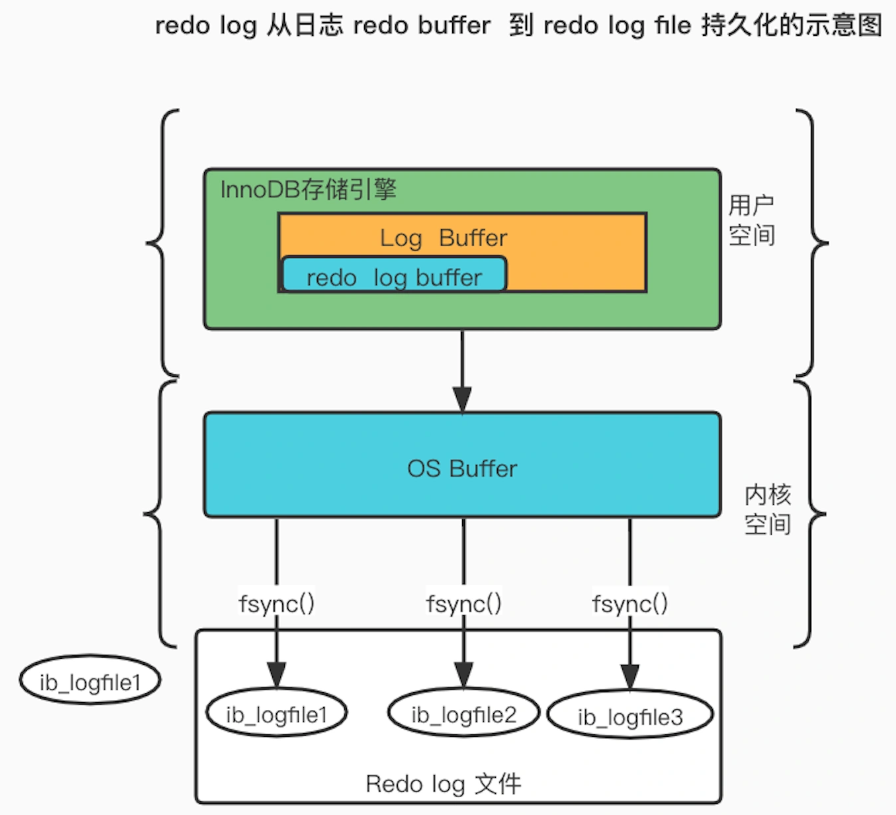
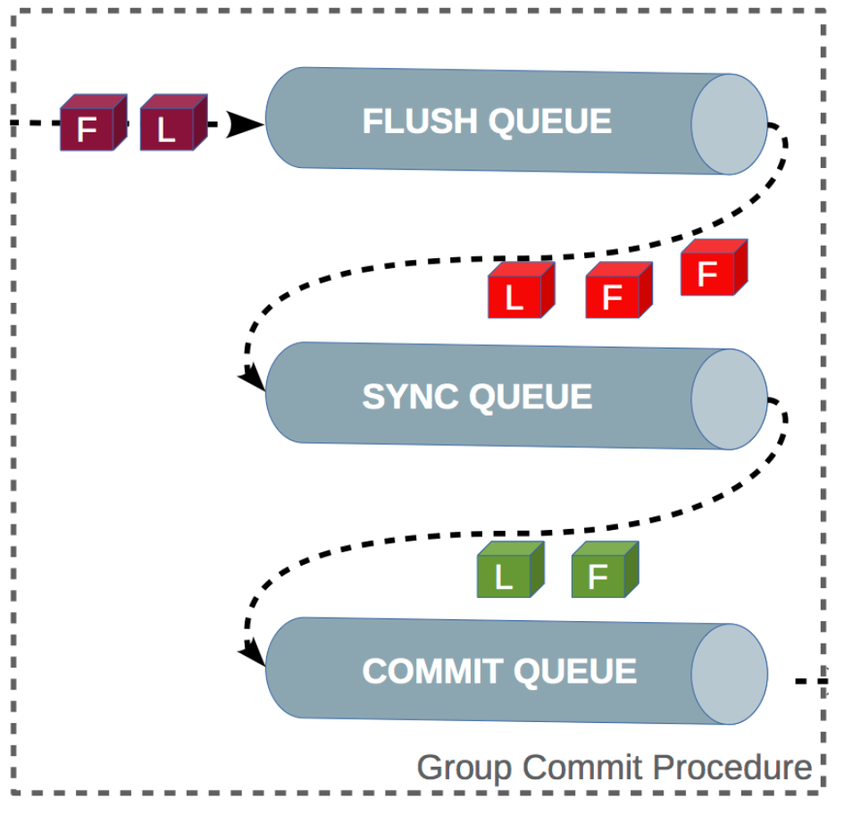
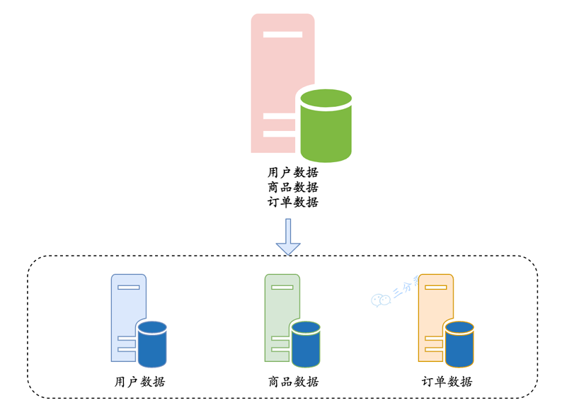

# MySQL相关面试题

## 索引

### 索引是什么？为什么能提高查询效率？

索引：单独的、物理的对数据库表中一列或多列的值进行排序的一种存储结构  
  
索引就是通过事先排好序，从而在查找时可以应用二分查找等高效率的算法。
一般的顺序查找，复杂度为O(n)，而二分查找复杂度为O(log2n)。当n很大时，二者的效率相差及其悬殊。

### 索引的分类

- 按「数据结构」分类：**B+tree索引**、**Hash索引**、**Full-text索引**。
- 按「物理存储」分类：**聚簇索引（主键索引）**、**二级索引（辅助索引）**。
- 按「字段特性」分类：**主键索引**、**唯一索引**、**普通索引**、**前缀索引**。
- 按「字段个数」分类：**单列索引**、**联合索引**。

#### 按数据结构分

每一种存储引擎支持的索引类型不一定相同，表中总结了 MySQL 常见的存储引擎 InnoDB、MyISAM 和 Memory 分别支持的索引类型。

在创建表时，InnoDB 存储引擎会根据不同的场景选择不同的列作为索引：

- 如果有主键，默认会使用主键作为聚簇索引的索引键（key）；
- 如果没有主键，就选择第一个不包含 NULL 值的唯一列作为聚簇索引的索引键（key）；
- 在上面两个都没有的情况下，InnoDB 将自动生成一个隐式自增 id 列作为聚簇索引的索引键（key）；

##### B+tree索引
B+树：只有叶子节点才会存储数据，非叶子节点只存储键值。而且每个节点里的数据是**按主键顺序存放**的。叶子节点之间使用双向指针连接，最底层的叶子节点形成了一个双向有序链表。

- 最外面的方块，的块我们称之为一个磁盘块，可以看到每个磁盘块包含几个数据项（粉色所示）和指针（黄色/灰色所示），如根节点磁盘包含数据项17和35，包含指针P1、P2、P3，P1表示小于17的磁盘块，P2表示在17和35之间的磁盘块，P3表示大于35的磁盘块。真实的数据存在于叶子节点即3、4、5……、65。非叶子节点只不存储真实的数据，只存储指引搜索方向的数据项，如17、35并不真实存在于数据表中。
- 叶子节点之间使用双向指针连接，最底层的叶子节点形成了一个双向有序链表，可以进行范围查询。

**B+Tree 相比于 B 树和二叉树来说，最大的优势在于查询效率很高，因为即使在数据量很大的情况，查询一个数据的磁盘 I/O 依然维持在 3-4次**

##### 二级索引

主键索引的 B+Tree 和二级索引的 B+Tree 区别如下：

- 主键索引的 B+Tree 的叶子节点存放的是实际数据，所有完整的用户记录都存放在主键索引的 B+Tree 的叶子节点里；
- 二级索引的 B+Tree 的叶子节点存放的是主键值，而不是实际数据。

>注：该图叶子节点应为双向链表。其中非叶子的 key 值是 product_no（图中橙色部分），叶子节点存储的数据是主键值（图中绿色部分）。

##### 回表
在InnoDB存储引擎里，利用辅助索引查询，先通过辅助索引找到主键索引的键值，再通过主键值查出主键索引里面没有符合要求的数据，它比基于主键索引的查询多扫描了一棵索引树，这个过程就叫回表。

##### 为什么要用B+树，而不用普通二叉树？

为什么不用普通二叉树？  
>普通二叉树存在退化的情况，如果它退化成链表，相当于全表扫描。平衡二叉树相比于二叉查找树来说，查找效率更稳定，总体的查找速度也更快。

为什么不用平衡二叉树呢？
>读取数据的时候，是从磁盘读到内存。如果树这种数据结构作为索引，那每查找一次数据就需要从磁盘中读取一个节点，也就是一个磁盘块，但是平衡二叉树可是每个节点只存储一个键值和数据的，如果是 B+ 树，可以存储更多的节点数据，树的高度也会降低，因此读取磁盘的次数就降下来啦，查询效率就快。

为什么用B+树而不用B	树呢？
> 它是 B Tree 的变种，B Tree 能解决的问题，它都能解决。
> B Tree 解决的两大问题：每个节点存储更多关键字；路数更多
> - 扫库、扫表能力更强  
> 如果我们要对表进行全表扫描，只需要遍历叶子节点就可以 了，不需要遍历整棵 B+Tree 拿到所有的数据。
> - B+Tree 的磁盘读写能力相对于 B Tree 来说更强，IO次数更少  
> 根节点和枝节点不保存数据区， 所以一个节点可以保存更多的关键字，一次磁盘加载的关键字更多，IO次数更少。
> - 排序能力更强  
> 因为叶子节点上有下一个数据区的指针，数据形成了链表。
> - 效率更加稳定  
> B+Tree 永远是在叶子节点拿到数据，所以 IO 次数是稳定的。

##### Hash索引和B+树索引区别是什么？

- B+ 树可以进行范围查询，Hash 索引不能。
- B+ 树支持联合索引的最左侧原则，Hash 索引不支持。
- B+ 树支持 order by 排序，Hash 索引不支持。
- Hash 索引在等值查询上比 B+ 树效率更高。
- B+ 树使用 like 进行模糊查询的时候，like 后面（比如 % 开头）的话可以起到优化的作用，Hash 索引根本无法进行模糊查询。

Hash 在做等值查询的时候效率贼快，搜索复杂度为 O(1)。
但是 Hash 表不适合做范围查询，它更适合做等值的查询，这也是 B+Tree 索引要比 Hash 表索引有着更广泛的适用场景的原因。

#### 按物理存储分

##### 聚簇索引与非聚簇索引的区别？

- 索引的数据结构是树，聚簇索引的索引和数据存储在一棵树上，树的叶子节点就是数据，非聚簇索引索引和数据不在一棵树上。
- 一个表中只能拥有一个聚簇索引，而非聚簇索引一个表可以存在多个。
- 聚簇索引，索引中键值的逻辑顺序决定了表中相应行的物理顺序；  
  非聚簇索引，索引中索引的逻辑顺序与磁盘上行的物理存储顺序不同。
- 聚簇索引：物理存储按照索引排序；非聚集索引：物理存储不按照索引排序；

#### 按字段特性分类

**主键索引**  
主键索引就是建立在主键字段上的索引，通常在创建表的时候一起创建，一张表最多只有一个主键索引，索引列的值不允许有空值。

**唯一索引**  
唯一索引建立在 UNIQUE 字段上的索引，一张表可以有多个唯一索引，索引列的值必须唯一，但是允许有空值。

**普通索引**  
普通索引就是建立在普通字段上的索引，既不要求字段为主键，也不要求字段为 UNIQUE。

**前缀索引**  
前缀索引是指对字符类型字段的前几个字符建立的索引，而不是在整个字段上建立的索引，前缀索引可以建立在字段类型为 char、 varchar、binary、varbinary 的列上。

使用前缀索引的目的是为了减少索引占用的存储空间，提升查询效率

#### 按字段个数分类

- 建立在单列上的索引称为单列索引，比如主键索引；
- 建立在多列上的索引称为联合索引

##### 联合索引

通过将多个字段组合成一个索引，该索引就被称为联合索引。

比如，将商品表中的 product_no 和 name 字段组合成联合索引(product_no, name)  
联合索引(product_no, name) 的 B+Tree 示意图如下  
>（图中叶子节点之间画了单向链表，但是实际上是双向链表）。

可以看到，联合索引的非叶子节点用两个字段的值作为 B+Tree 的 key 值。当在联合索引查询数据时，先按 product_no 字段比较，在 product_no 相同的情况下再按 name 字段比较。  

也就是说，联合索引查询的 B+Tree 是先按 product_no 进行排序，然后再 product_no 相同的情况再按 name 字段排序。  

因此，使用联合索引时，存在**最左匹配原则**，也就是按照最左优先的方式进行索引的匹配。在使用联合索引进行查询的时候，如果不遵循「最左匹配原则」，联合索引会失效，这样就无法利用到索引快速查询的特性了。

###### 最左匹配原则

**最左匹配原则**：在InnoDB的联合索引中，查询的时候只有匹配了前一个/左边的值之后，才能匹配下一个。

比如，如果创建了一个 (a, b, c) 联合索引，如果查询条件是以下这几种，就可以匹配上联合索引：

where a=1；  
where a=1 and b=2 and c=3；  
where a=1 and b=2；  
需要注意的是，因为有**查询优化器**，所以 a 字段在 where 子句的顺序并不重要。

但是，如果查询条件是以下这几种，因为不符合最左匹配原则，所以就无法匹配上联合索引，联合索引就会失效:

where b=2；   
where c=3；  
where b=2 and c=3；  
上面这些查询条件之所以会失效，是因为(a, b, c) 联合索引，是先按 a 排序，在 a 相同的情况再按 b 排序，在 b 相同的情况再按 c 排序。所以，**b 和 c 是全局无序，局部相对有序的**，这样在没有遵循最左匹配原则的情况下，是无法利用到索引的。  
**利用索引的前提是索引里的 key 是有序的。**

**联合索引的最左匹配原则，在遇到范围查询（如 >、<）的时候，就会停止匹配，也就是范围查询的字段可以用到联合索引，但是在范围查询字段的后面的字段无法用到联合索引。注意，对于 >=、<=、BETWEEN、like 前缀匹配的范围查询，并不会停止匹配。**

###### 索引下推优化

现在我们知道，对于联合索引（a, b），在执行 `select * from table where a > 1 and b = 2 `语句的时候，只有 a 字段能用到索引，那在联合索引的 B+Tree 找到第一个满足条件的主键值（ID 为 2）后，还需要判断其他条件是否满足（看 b 是否等于 2），那是在联合索引里判断？还是回主键索引去判断呢？

- 在 MySQL 5.6 之前，只能从 ID2 （主键值）开始一个个回表，到「主键索引」上找出数据行，再对比 b 字段值。

- 而 MySQL 5.6 引入的索引下推优化（index condition pushdown)， 可以在联合索引遍历过程中，对联合索引中包含的字段先做判断，直接过滤掉不满足条件的记录，减少回表次数。

当你的查询语句的执行计划里，出现了 Extra 为 `Using index condition`，那么说明使用了索引下推的优化。

**索引条件下推优化可以减少存储引擎查询基础表的次数，也可以减少MySQL服务器从存储引擎接收数据的次数。**

###### 索引区分度

建立联合索引时的字段顺序，对索引效率也有很大影响。越靠前的字段被用于索引过滤的概率越高，实际开发工作中**建立联合索引时，要把区分度大的字段排在前面，这样区分度大的字段越有可能被更多的 SQL 使用到。**

区分度就是某个字段 column 不同值的个数「除以」表的总行数，计算公式如下：

性别的区分度就很小，不适合建立索引或不适合排在联合索引列的靠前的位置，而 UUID 这类字段就比较适合做索引或排在联合索引列的靠前的位置。

因为如果索引的区分度很小，假设字段的值分布均匀，那么无论搜索哪个值都可能得到一半的数据。在这些情况下，还不如不要索引，因为 MySQL 还有一个查询优化器，查询优化器发现某个值出现在表的数据行中的百分比（惯用的百分比界线是"30%"）很高的时候，它一般会忽略索引，进行全表扫描.

### 什么时候需要 / 不需要创建索引？

- 需要占用物理空间，数量越大，占用空间越大；
- 创建索引和维护索引要耗费时间，这种时间随着数据量的增加而增大；
- 会降低表的增删改的效率，因为每次增删改索引，B+ 树为了维护索引有序性，都需要进行动态维护。

#### 什么时候适用索引？

- 字段有唯一性限制的，比如商品编码；
- 经常用于 WHERE 查询条件的字段，这样能够提高整个表的查询速度，如果查询条件不是一个字段，可以建立联合索引。
- 经常用于 GROUP BY 和 ORDER BY 的字段，这样在查询的时候就不需要再去做一次排序了，因为我们都已经知道了建立索引之后在 B+Tree 中的记录都是排序好的。

#### 什么时候不需要创建索引？

- WHERE 条件，GROUP BY，ORDER BY 里用不到的字段，索引的价值是快速定位，如果起不到定位的字段通常是不需要创建索引的，因为索引是会占用物理空间的。
- 字段中存在大量重复数据，不需要创建索引，比如性别字段，只有男女，如果数据库表中，男女的记录分布均匀，那么无论搜索哪个值都可能得到一半的数据。在这些情况下，还不如不要索引，因为 MySQL 还有一个查询优化器，查询优化器发现某个值出现在表的数据行中的百分比很高的时候，它一般会忽略索引，进行全表扫描。
- 表数据太少的时候，不需要创建索引；
- 经常更新的字段不用创建索引，比如不要对电商项目的用户余额建立索引，因为索引字段频繁修改，由于要维护 B+Tree的有序性，那么就需要频繁的重建索引，这个过程是会影响数据库性能的

### 索引的优化

- 前缀索引优化；
- 覆盖索引优化；
- 主键索引最好是自增的；
- 防止索引失效；

#### 前缀索引优化

前缀索引顾名思义就是使用某个字段中字符串的前几个字符建立索引，那我们为什么需要使用前缀来建立索引呢？

使用前缀索引是为了减小索引字段大小，可以增加一个索引页中存储的索引值，有效提高索引的查询速度。在一些大字符串的字段作为索引时，使用前缀索引可以帮助我们减小索引项的大小。

不过，前缀索引有一定的局限性，例如：

order by 就无法使用前缀索引；
无法把前缀索引用作覆盖索引

#### 覆盖索引优化

覆盖索引是指 SQL 中 query 的所有字段，在索引 B+Tree 的叶子节点上都能找得到的那些索引，从二级索引中查询得到记录，而不需要通过聚簇索引查询获得，可以避免回表的操作。

假设我们只需要查询商品的名称、价格，有什么方式可以避免回表呢？

我们可以建立一个联合索引，即「商品ID、名称、价格」作为一个联合索引。如果索引中存在这些数据，查询将不会再次检索主键索引，从而避免回表。

所以，使用覆盖索引的好处就是，不需要查询出包含整行记录的所有信息，也就减少了大量的 I/O 操作。

#### 主键索引最好是自增的

InnoDB 创建主键索引默认为聚簇索引，数据被存放在了 B+Tree 的叶子节点上。也就是说，同一个叶子节点内的各个数据是按主键顺序存放的，因此，每当有一条新的数据插入时，数据库会根据主键将其插入到对应的叶子节点中。

如果我们使用**自增主键**，那么每次插入的新数据就会按顺序添加到当前索引节点的位置，不需要移动已有的数据，当页面写满，就会自动开辟一个新页面。因为**每次插入一条新记录，都是追加操作，不需要重新移动数据**，因此这种插入数据的方法效率非常高。

如果我们使用**非自增主键**，由于每次插入主键的索引值都是随机的，因此每次插入新的数据时，就可能会插入到现有数据页中间的某个位置，这将不得不移动其它数据来满足新数据的插入，甚至需要从一个页面复制数据到另外一个页面，我们通常将这种情况称为**页分裂。页分裂还有可能会造成大量的内存碎片，导致索引结构不紧凑，从而影响查询效率。**

举个例子，假设某个数据页中的数据是1、3、5、9，且数据页满了，现在准备插入一个数据7，则需要把数据页分割为两个数据页：

出现页分裂时，需要将一个页的记录移动到另外一个页，性能会受到影响，同时页空间的利用率下降，造成存储空间的浪费。

而如果记录是顺序插入的，例如插入数据11，则只需开辟新的数据页，也就不会发生页分裂：

另外，主键字段的长度不要太大，因为**主键字段长度越小，意味着二级索引的叶子节点越小（二级索引的叶子节点存放的数据是主键值），这样二级索引占用的空间也就越小**

#### 索引最好设置为 NOT NULL

- 第一原因：索引列存在 NULL 就会导致优化器在做索引选择的时候更加复杂，更加难以优化，因为可为 NULL 的列会使索引、索引统计和值比较都更复杂，比如进行索引统计时，count 会省略值为NULL 的行。

- 第二个原因：NULL 值是一个没意义的值，但是它会占用物理空间，所以会带来的存储空间的问题，因为 InnoDB 存储记录的时候，如果表中存在允许为 NULL 的字段，那么行格式 (opens new window)中至少会用 1 字节空间存储 NULL 值列表，如下图的紫色部分：

#### 防止索引失效

- 当我们使用左或者左右模糊匹配的时候，也就是 like %xx 或者 like %xx%这两种方式都会造成索引失效；
- 当我们在查询条件中对索引列做了计算、函数、类型转换操作，这些情况下都会造成索引失效；
- 联合索引要能正确使用需要遵循最左匹配原则，也就是按照最左优先的方式进行索引的匹配，否则就会导致索引失效。
- 在 WHERE 子句中，如果在 OR 前的条件列是索引列，而在 OR 后的条件列不是索引列，那么索引会失效。
- 

##  count(1)、count(*)、count(字段)的区别

### count(1)/ count(*)执行过程是怎样的
count(\*) 其实等于 count(0)，也就是说，当你使用 count(*) 时，MySQL 会将 * 参数转化为参数 0 来处理。
>InnoDB以相同的方式处理SELECT COUNT（\*）和SELECT COUNT（1）操作，没有性能差异。

InnoDB 循环遍历聚簇索引（主键索引），将读取到的记录返回给 server 层，但是**不会读取记录中的任何字段的值**，因为 count 函数的参数是 1，不是字段，所以不需要读取记录中的字段值。
可以看到，count(1) 相比 count(主键字段) 少一个步骤，就是不需要读取记录中的字段值，所以通常会说 count(1) 执行效率会比 count(主键字段) 高一点。

但是，如果表里有二级索引时，InnoDB 循环遍历的对象就二级索引了。
而且 MySQL 会对 count(*) 和 count(1) 有个优化，如果有多个二级索引的时候，优化器会使用key_len 最小的二级索引进行扫描。

### count(主键字段) 执行过程是怎样的？

在通过 count 函数统计有多少个记录时，MySQL 的 server 层会维护一个名叫 count 的变量。

server 层会循环向 InnoDB 读取一条记录，如果 count 函数指定的参数不为 NULL，那么就会将变量 count 加 1，直到符合查询的全部记录被读完，就退出循环。最后将 count 变量的值发送给客户端。

表里只有主键索引，没有二级索引时，那么，InnoDB 循环遍历聚簇索引，将读取到的记录返回给 server 层，然后读取记录中的 id 值，就会**判断id 值是否为 NULL，如果不为 NULL，就将 count 变量加 1**。
如果表里有二级索引时，InnoDB 循环遍历的对象就不是聚簇索引，而是二级索引。

### count(字段) 执行过程是怎样的?

全表扫描，性能差，一般不用。

### 总结

- count(1)/ count(*)包括了忽略所有列，用数字代表代码行，在统计结果的时候，不会忽略列值为NULL
- count(列名)只包括列名那一列，在统计结果的时候，会忽略列值为空（这里的空不是只空字符串或者0，而是表示null）的计数，即某个字段值为NULL时，不统计。

## 连接

### 什么是内连接、外连接、交叉连接、笛卡尔积呢？

- 内连接（inner join）：取得两张表中满足存在连接匹配关系的记录。
- 外连接（outer join）：不只取得两张表中满足存在连接匹配关系的记录，还包括某张表（或两张表）中不满足匹配关系的记录。
- 交叉连接（cross join）：显示两张表所有记录一一对应，没有匹配关系进行筛选，它是笛卡尔积在SQL中的实现，如果A表有m行，B表有n行，那么A和B交叉连接的结果就有m*n行。
- 笛卡尔积：是数学中的一个概念，例如集合A={a,b}，集合B={1,2,3}，那么A✖ B={<a,o>,<a,1>,<a,2>,<b,0>,<b,1>,<b,2>,}。

### MySQL的内连接、左连接、右连接有有什么区别

- inner join 内连接，在两张表进行连接查询时，只保留两张表中完全匹配的结果集
- left join 在两张表进行连接查询时，会返回左表所有的行，即使在右表中没有匹配的记录。
- right join 在两张表进行连接查询时，会返回右表所有的行，即使在左表中没有匹配的记录。

## 数据库的三大范式

- 第一范式：数据表中的每一列（每个字段）都不可以再拆分。  
    例如用户表，用户地址还可以拆分成国家、省份、市，这样才是符合第一范式的。
- 第二范式：在第一范式的基础上，非主键列完全依赖于主键，而不能是依赖于主键的一部分。  
    例如订单表里，存储了商品信息（商品价格、商品类型），那就需要把商品ID和订单ID作为联合主键，才满足第二范式。
- 第三范式：在满足第二范式的基础上，表中的非主键只依赖于主键，而不依赖于其他非主键。  
    例如订单表，就不能存储用户信息（姓名、地址）。

三大范式的作用是为了控制数据库的冗余，是对空间的节省，实际上，一般互联网公司的设计都是反范式的，通过冗余一些数据，避免跨表跨库，利用空间换时间，提高性能。

## blob和text有什么区别？

- blob用于存储二进制数据，而text用于存储大字符串。
- blob没有字符集，text有一个字符集，并且根据字符集的校对规则对值进行排序和比较

## DATETIME和TIMESTAMP的异同？

相同：
1. 两个数据类型存储时间的表现格式一致。均为 `YYYY-MM-DD HH:MM:SS`
2. 两个数据类型都包含「日期」和「时间」部分。
3. 两个数据类型都可以存储微秒的小数秒（秒后6位小数秒）

不同:
1. **日期范围**：DATETIME 的日期范围是 
`1000-01-01 00:00:00.000000` 到 `9999-12-31 23:59:59.999999` ；TIMESTAMP 的时间范围是 `1970-01-01 00:00:01.000000 UTC `到 `2038-01-09 03:14:07.999999 UTC`  
2. **存储空间**：DATETIME 的存储空间为 8 字节；TIMESTAMP 的存储空间为 4 字节  
3. **时区相关**：DATETIME 存储时间与时区无关；TIMESTAMP 存储时间与时区有关，显示的值也依赖于时区  
4. **默认值**：DATETIME 的默认值为 null；TIMESTAMP 的字段默认不为空(not null)，默认值为当前时间(CURRENT_TIMESTAMP)

## MySQL中in和exists的区别

MySQL中的in语句是把外表和内表作hash 连接，而exists语句是对外表作loop循环，
每次loop循环再对内表进行查询。

1. 如果查询的两个表大小相当，那么用in和exists差别不大。
2. 如果两个表中一个较小，一个是大表，则子查询表大的用exists，子查询表小的用in。
3. not in 和not exists：如果查询语句使用了not in，那么内外表都进行全表扫描，没有用到索引；而not extsts的子查询依然能用到表上的索引。所以无论那个表大，用not exists都比not in要快。

## drop、delete与truncate的区别？

因此，在不再需要一张表的时候，用drop；在想删除部分数据行时候，用delete；在保留表而删除所有数据的时候用truncate。

## UNION与UNION	ALL的区别

UNION和UNION ALL是SQL中用于合并两个或多个SELECT语句结果集的操作符。
主要区别如下：
1. UNION会自动去重，而UNION ALL不会。UNION操作符会将结果集中的重复行去除，只返回唯一的行。而UNION ALL操作符则会保留所有的行，包括重复的行。
2. UNION ALL的执行速度通常比UNION快，因为不需要进行去重的操作。
3. UNION要求两个SELECT语句的结果集具有相同的列数和相似的数据类型。而UNION ALL则没有这个限制，可以合并具有不同列数和不同数据类型的结果集。  

因此，如果我们需要合并两个结果集并且不需要去重的话，可以使用UNION ALL来提高查询性能。如果你需要合并结果集并且希望去除重复行，那么可以使用UNION操作符。

## 一条SQL语句的执行流程

1. 先检查该语句 **是否有权限** ，如果没有权限，直接返回错误信息，如果有权限会先查询缓存 (MySQL8.0 版本以前)。  
2. 如果没有缓存，分析器进行 **语法分析** ，提取 sql 语句中 select 等关键元素，然后判断 sql 语句是否有语法错误，比如关键词是否正确等等。
3. 语法解析之后，MySQL的服务器会对查询的语句进行优化，确定执行的方案。
4. 完成查询优化后，按照生成的执行计划 调用**数据库引擎接口**，返回执行结果。

## 日志

### MySQL日志文件有哪些？分别介绍下作用？

MySQL日志文件有很多，包括 ：
- 错误日志（error log）：错误日志文件对MySQL的启动、运行、关闭过程进行了记录，能帮助定位MySQL问题。
- 慢查询日志（slow query log）：慢查询日志是用来记录执行时间超过 
long_query_time 这个变量定义的时长的查询语句。通过慢查询日志，可以查找出哪些查询语句的执行效率很低，以便进行优化。
- 一般查询日志（general log）：一般查询日志记录了所有对MySQL数据库请求的信息，无论请求是否正确执行。
- 二进制日志（bin log）：关于二进制日志，它记录了数据库所有执行的DDL和DML语句（除了数据查询语句select、show等），以事件形式记录并保存在二进制文件中。

还有两个InnoDB存储引擎特有的日志文件：  
- 重做日志（redo log）：重做日志至关重要，因为它们记录了对于InnoDB存储引擎的事务日志。
- 回滚日志（undo log）：回滚日志同样也是InnoDB引擎提供的日志，顾名思义，回滚日志的作用就是对数据进行回滚。当事务对数据库进行修改，InnoDB引擎不仅会记录redo log，还会生成对应的undo log日志；如果事务执行失败或调用了rollback，导致事务需要回滚，就可以利用undo log中的信息将数据回滚到修改之前的样子。

### undo log、redo log、binlog 有什么用？
- undo log（回滚日志）：是 Innodb 存储引擎层生成的日志，实现了事务中的**原子性**，主要用于事务回滚和 MVCC。
- redo log（重做日志）：是 Innodb 存储引擎层生成的日志，实现了事务中的**持久性**，主要用于掉电等故障恢复；
- binlog （归档日志）：是 Server 层生成的日志，主要用于数据备份和主从复制；

### 为什么需要 undo log？

我们在执行执行一条“增删改”语句的时候，虽然没有输入 begin 开启事务和 commit 提交事务，但是 MySQL 会**隐式开启事务**来执行“增删改”语句的，执行完就自动提交事务的，这样就保证了执行完“增删改”语句后，我们可以及时在数据库表看到“增删改”的结果了。

undo log 是一种用于撤销回退的日志。在事务没提交之前，MySQL 会先记录更新前的数据到 undo log 日志文件里面，当事务回滚时，可以利用 undo log 来进行回滚。

每当 InnoDB 引擎对一条记录进行操作（修改、删除、新增）时，要把回滚时需要的信息都记录到 undo log 里，比如：
- 在插入一条记录时，要把这条记录的主键值记下来，这样之后回滚时只需要把这个主键值对应的记录删掉就好了；
- 在删除一条记录时，要把这条记录中的内容都记下来，这样之后回滚时再把由这些内容组成的记录插入到表中就好了；
- 在更新一条记录时，要把被更新的列的旧值记下来，这样之后回滚时再把这些列更新为旧值就好了。

#### undo log的作用

- **实现事务回滚**，保障事务的原子性。事务处理过程中，如果出现了错误或者用户执 行了 ROLLBACK 语句，MySQL 可以利用 undo log 中的历史数据将数据恢复到事务开始之前的状态。
- **实现 MVCC（多版本并发控制）关键因素之一**。MVCC 是通过 ReadView + undo log 实现的。undo log 为每条记录保存多份历史数据，MySQL 在执行快照读（普通 select 语句）的时候，会根据事务的 Read View 里的信息，顺着 undo log 的版本链找到满足其可见性的记录。

### 为什么需要 redo log ？

Buffer Pool 是提高了读写效率没错，但是问题来了，Buffer Pool 是基于内存的，而内存总是不可靠，万一断电重启，还没来得及落盘的脏页数据就会丢失。

为了防止断电导致数据丢失的问题，当有一条记录需要更新的时候，InnoDB 引擎就会先更新内存（同时标记为脏页），然后将本次对这个页的修改以 redo log 的形式记录下来，**这个时候更新就算完成了。**

后续，InnoDB 引擎会在适当的时候，由后台线程将缓存在 Buffer Pool 的脏页刷新到磁盘里，这就是 **WAL （Write-Ahead Logging）技术**。

WAL 技术指的是，**MySQL 的写操作并不是立刻写到磁盘上，而是先写日志，然后在合适的时间再写到磁盘上**.

#### 什么是 redo log？ 
redo log 是物理日志，记录了某个数据页做了什么修改，比如对 XXX 表空间中的 YYY 数据页 ZZZ 偏移量的地方做了AAA 更新，每当执行一个事务就会产生这样的一条或者多条物理日志。

在事务提交时，只要先将 redo log 持久化到磁盘即可，可以不需要等到将缓存在 Buffer Pool 里的脏页数据持久化到磁盘。

当系统崩溃时，虽然脏页数据没有持久化，但是 redo log 已经持久化，接着 MySQL 重启后，可以根据 redo log 的内容，将所有数据恢复到最新的状态。
所以有了 redo log，再通过 WAL 技术，InnoDB 就可以保证即使数据库发生异常重启，之前已提交的记录都不会丢失，这个能力称为 crash-safe（崩溃恢复）。可以看出来， redo log 保证了事务四大特性中的**持久性**。

#### redo log 要写到磁盘，数据也要写磁盘，为什么要多此一举？

写入 redo log 的方式使用了追加操作， 所以磁盘操作是**顺序写**，而写入数据需要先找到写入位置，然后才写到磁盘，所以磁盘操作是**随机写**。

磁盘的「顺序写 」比「随机写」 高效的多，因此 redo log 写入磁盘的开销更小。

针对「顺序写」为什么比「随机写」更快这个问题，可以比喻为你有一个本子，按照顺序一页一页写肯定比写一个字都要找到对应页写快得多。

可以说这是 WAL 技术的另外一个优点：MySQL 的写操作**从磁盘的「随机写」变成了「顺序写」**，提升语句的执行性能。这是因为 MySQL 的写操作并不是立刻更新到磁盘上，而是先记录在日志上，然后在合适的时间再更新到磁盘上 。

#### 产生的 redo log 是怎么写入磁盘

执行一个事务的过程中，产生的 redo log 也不是直接写入磁盘的，因为这样会产生大量的 I/O 操作，而且磁盘的运行速度远慢于内存。

所以，redo log 也有自己的缓存—— **redo log buffer**，每当产生一条 redo log 时，会先写入到 redo log buffer，后续在持久化到磁盘如下图：

#### redo log 什么时候刷盘?

缓存在 redo log buffer 里的 redo log 还是在内存中，它什么时候刷新到磁盘？

主要有下面几个时机：

- MySQL 正常关闭时；
- 当 redo log buffer 中记录的写入量大于 redo log buffer 内存空间的一半时，会触发落盘；
- InnoDB 的后台线程每隔 1 秒，将 redo log buffer 持久化到磁盘。
- 每次事务提交时都将缓存在 redo log buffer 里的 redo log 直接持久化到磁盘（这个策略可由 innodb_flush_log_at_trx_commit 参数控制，下面会说）。

InnoDB 还提供了另外两种策略，由参数 innodb_flush_log_at_trx_commit 参数控制，可取的值有：0、1、2，默认值为 1，这三个值分别代表的策略如下：

- 当设置该参数为 0 时，表示每次事务提交时 ，还是将 redo log 留在 redo log buffer 中 ，该模式下在事务提交时不会主动触发写入磁盘的操作。
- 当设置该参数为 1 时，表示每次事务提交时，都将缓存在 redo log buffer 里的 redo log 直接持久化到磁盘，这样可以保证 MySQL 异常重启之后数据不会丢失。
- 当设置该参数为 2 时，表示每次事务提交时，都只是缓存在 redo log buffer 里的 redo log 写到 redo log 文件，**注意写入到「 redo log 文件」并不意味着写入到了磁盘**，因为操作系统的文件系统中有个 Page Cache，Page Cache 是专门用来缓存文件数据的，所以写入「 redo log文件」意味着写入到了操作系统的文件缓存。

InnoDB 的后台线程每隔 1 秒：

- 针对参数 0 ：会把缓存在 redo log buffer 中的 redo log ，通过调用 write() 写到操作系统的 Page Cache，然后调用 fsync() 持久化到磁盘。所以**参数为 0 的策略，MySQL 进程的崩溃会导致上一秒钟所有事务数据的丢失**;
- 针对参数 2 ：调用 fsync，将缓存在操作系统中 Page Cache 里的 redo log 持久化到磁盘。所以参数为 2 的策略，较取值为 0 情况下更安全，**因为 MySQL 进程的崩溃并不会丢失数据，只有在操作系统崩溃或者系统断电的情况下，上一秒钟所有事务数据才可能丢失。**

加入了后台现线程后，innodb_flush_log_at_trx_commit 的刷盘时机如下图：

#### redo log 文件写满了怎么办？

默认情况下， InnoDB 存储引擎有 1 个重做日志文件组(redo log Group)，「重做日志文件组」由有 2 个 redo log 文件组成，这两个 redo 日志的文件名叫 ：ib_logfile0 和 ib_logfile1 。在重做日志组中，每个 redo log File 的大小是固定且一致的

重做日志文件组是以循环写的方式工作的，从头开始写，写到末尾就又回到开头，相当于一个环形。

所以 InnoDB 存储引擎会先写 ib_logfile0 文件，当 ib_logfile0 文件被写满的时候，会切换至 ib_logfile1 文件，当 ib_logfile1 文件也被写满时，会切换回 ib_logfile0 文件。

redo log 是循环写的方式，相当于一个环形，InnoDB 用 write pos 表示 redo log 当前记录写到的位置，用 checkpoint 表示当前要擦除的位置，如下图

> - write pos 和 checkpoint 的移动都是顺时针方向；
> - write pos ～ checkpoint 之间的部分（图中的红色部分），用来记录新的更新操作；
> - check point ～ write pos 之间的部分（图中蓝色部分）：待落盘的脏数据页记录；

**如果 write pos 追上了 checkpoint，就意味着 redo log 文件满了，这时 MySQL 不能再执行新的更新操作，也就是说 MySQL 会被阻塞（因此所以针对并发量大的系统，适当设置 redo log 的文件大小非常重要）**，此时会停下来将 Buffer Pool 中的脏页刷新到磁盘中，然后标记 redo log 哪些记录可以被擦除，接着对旧的 redo log 记录进行擦除，等擦除完旧记录腾出了空间，checkpoint 就会往后移动（图中顺时针），然后 MySQL 恢复正常运行，继续执行新的更新操作

### 为什么需要 binlog ？

前面介绍的 undo log 和 redo log 这两个日志都是 Innodb 存储引擎生成的。

MySQL 在完成一条更新操作后，**Server 层**还会生成一条 binlog，等之后事务提交的时候，会将该事物执行过程中产生的所有 binlog 统一写 入 binlog 文件。

binlog 文件是记录了所有数据库表结构变更和表数据修改的日志，**不会记录查询类的操作**，比如 SELECT 和 SHOW 操作。

#### redo log 和 binlog 有什么区别？

1. 适用对象不同
    - binlog 是 MySQL 的 Server 层实现的日志，所有存储引擎都可以使用；
    - redo log 是 Innodb 存储引擎实现的日志；
2. 文件格式不同:
    - binlog 有 3 种格式类型，分别是 STATEMENT（默认格式）、ROW、 MIXED，区别如下
        - STATEMENT：**每一条修改数据的 SQL 都会被记录到 binlog 中**（相当于记录了逻辑操作，所以针对这种格式， binlog 可以称为逻辑日志），主从复制中 slave 端再根据 SQL 语句重现。但 STATEMENT 有动态函数的问题，比如你用了 uuid 或者 now 这些函数，你在主库上执行的结果并不是你在从库执行的结果，这种随时在变的函数会导致复制的数据不一致；
        - ROW：**记录行数据最终被修改成什么样了**（这种格式的日志，就不能称为逻辑日志了），不会出现 STATEMENT 下动态函数的问题。但 ROW 的缺点是每行数据的变化结果都会被记录，比如执行批量 update 语句，更新多少行数据就会产生多少条记录，使 binlog 文件过大，而在 STATEMENT 格式下只会记录一个 update 语句而已；
        - MIXED：包含了 STATEMENT 和 ROW 模式，**它会根据不同的情况自动使用 ROW 模式和 STATEMENT 模式；**
    - redo log 是物理日志，记录的是在某个数据页做了什么修改，比如对 XXX 表空间中的 YYY 数据页 ZZZ 偏移量的地方做了AAA 更新；
3. 写入方式不同:
- binlog 是追加写，写满一个文件，就创建一个新的文件继续写，不会覆盖以前的日志，保存的是全量的日志。
- redo log 是循环写，日志空间大小是固定，全部写满就从头开始，保存未被刷入磁盘的脏页日志。
4. 用途不同:
- binlog 用于备份恢复、主从复制；
- redo log 用于掉电等故障恢复。

#### 如果不小心整个数据库的数据被删除了，能使用 redo log 文件恢复数据吗？

不可以使用 redo log 文件恢复，只能使用 binlog 文件恢复。

因为 redo log 文件是循环写，是会边写边擦除日志的，只记录未被刷入磁盘的数据的物理日志，已经刷入磁盘的数据都会从 redo log 文件里擦除。

binlog 文件保存的是全量的日志，也就是保存了所有数据变更的情况，理论上只要记录在 binlog 上的数据，都可以恢复，所以如果不小心整个数据库的数据被删除了，得用 binlog 文件恢复数据

#### binlog 什么时候刷盘？

事务执行过程中，先把日志写到 binlog cache（Server 层的 cache），事务提交的时候，再把 binlog cache 写到 binlog 文件中。

一个事务的 binlog 是不能被拆开的，因此无论这个事务有多大（比如有很多条语句），也要保证一次性写入。这是因为有一个线程只能同时有一个事务在执行的设定，所以每当执行一个 begin/start transaction 的时候，就会默认提交上一个事务，这样如果一个事务的 binlog 被拆开的时候，在备库执行就会被当做多个事务分段自行，这样破坏了原子性，是有问题的。

在事务提交的时候，执行器把 binlog cache 里的完整事务写入到 binlog 文件中，并清空 binlog cache。如下图：

虽然每个线程有自己 binlog cache，但是最终都写到同一个 binlog 文件：

图中的 write，指的就是指把日志写入到 binlog 文件，但是并没有把数据持久化到磁盘，因为数据还缓存在文件系统的 page cache 里，write 的写入速度还是比较快的，因为不涉及磁盘 I/O。
图中的 fsync，才是将数据持久化到磁盘的操作，这里就会涉及磁盘 I/O，所以频繁的 fsync 会导致磁盘的 I/O 升高。
MySQL提供一个 sync_binlog 参数来控制数据库的 binlog 刷到磁盘上的频率：

- sync_binlog = 0 的时候，表示每次提交事务都只 write，不 fsync，后续交由操作系统决定何时将数据持久化到磁盘；
- sync_binlog = 1 的时候，表示每次提交事务都会 write，然后马上执行 fsync；
- sync_binlog =N(N>1) 的时候，表示每次提交事务都 write，但累积 N 个事务后才 fsync。

在MySQL中系统默认的设置是 sync_binlog = 0，也就是不做任何强制性的磁盘刷新指令，这时候的性能是最好的，但是风险也是最大的。因为一旦主机发生异常重启，还没持久化到磁盘的数据就会丢失。

而当 sync_binlog 设置为 1 的时候，是最安全但是性能损耗最大的设置。因为当设置为 1 的时候，即使主机发生异常重启，最多丢失一个事务的 binlog，而已经持久化到磁盘的数据就不会有影响，不过就是对写入性能影响太大。

如果能容少量事务的 binlog 日志丢失的风险，为了提高写入的性能，一般会 sync_binlog 设置为 100~1000 中的某个数值。

### 两阶段提交

事务提交后，redo log 和 binlog 都要持久化到磁盘，但是这两个是独立的逻辑，可能出现半成功的状态，这样就造成两份日志之间的逻辑不一致。

举个例子，假设 id = 1 这行数据的字段 name 的值原本是 'jay'，然后执行 `UPDATE t_user SET name = 'xiaolin' WHERE id = 1`; 如果在持久化 redo log 和 binlog 两个日志的过程中，出现了半成功状态，那么就有两种情况：

- **如果在将 redo log 刷入到磁盘之后， MySQL 突然宕机了，而 binlog 还没有来得及写入**。MySQL 重启后，通过 redo log 能将 Buffer Pool 中 id = 1 这行数据的 name 字段恢复到新值 xiaolin，但是 binlog 里面没有记录这条更新语句，在主从架构中，binlog 会被复制到从库，由于 binlog 丢失了这条更新语句，从库的这一行 name 字段是旧值 jay，与主库的值不一致性；
- **如果在将 binlog 刷入到磁盘之后， MySQL 突然宕机了，而 redo log 还没有来得及写入**。由于 redo log 还没写，崩溃恢复以后这个事务无效，所以 id = 1 这行数据的 name 字段还是旧值 jay，而 binlog 里面记录了这条更新语句，在主从架构中，binlog 会被复制到从库，从库执行了这条更新语句，那么这一行 name 字段是新值 xiaolin，与主库的值不一致性；
可以看到，在持久化 redo log 和 binlog 这两份日志的时候，如果出现半成功的状态，就会造成主从环境的数据不一致性。**这是因为 redo log 影响主库的数据，binlog 影响从库的数据**，所以 redo log 和 binlog 必须保持一致才能保证主从数据一致。

MySQL 为了避免出现两份日志之间的逻辑不一致的问题，使用了「**两阶段提交**」来解决，两阶段提交其实是分布式事务一致性协议，它可以保证多个逻辑操作要不全部成功，要不全部失败，不会出现半成功的状态。

**两阶段提交把单个事务的提交拆分成了 2 个阶段，分别是「准备（Prepare）阶段」和「提交（Commit）阶段」**，每个阶段都由协调者（Coordinator）和参与者（Participant）共同完成。注意，不要把提交（Commit）阶段和 commit 语句混淆了，commit 语句执行的时候，会包含提交（Commit）阶段。

#### 两阶段提交的过程是怎样的?

在 MySQL 的 InnoDB 存储引擎中，开启 binlog 的情况下，MySQL 会同时维护 binlog 日志与 InnoDB 的 redo log，为了保证这两个日志的一致性，MySQL 使用了**内部 XA 事务**（是的，也有外部 XA 事务），内部 XA 事务由 binlog 作为协调者，存储引擎是参与者。

当客户端执行 commit 语句或者在自动提交的情况下，MySQL 内部开启一个 XA 事务，**分两阶段来完成 XA 事务的提交**，如下图：

从图中可看出，事务的提交过程有两个阶段，就是将 redo log 的写入拆成了两个步骤：prepare 和 commit，中间再穿插写入binlog，具体如下：

- **prepare 阶段**：将 XID（内部 XA 事务的 ID） 写入到 redo log，同时将 redo log 对应的事务状态设置为 prepare，然后将 redo log 持久化到磁盘（innodb_flush_log_at_trx_commit = 1 的作用）；

- **commit 阶段**：把 XID 写入到 binlog，然后将 binlog 持久化到磁盘（sync_binlog = 1 的作用），接着调用引擎的提交事务接口，将 redo log 状态设置为 commit，此时该状态并不需要持久化到磁盘，只需要 write 到文件系统的 page cache 中就够了，因为只要 binlog 写磁盘成功，就算 redo log 的状态还是 prepare 也没有关系，一样会被认为事务已经执行成功；

#### 异常重启会出现什么现象？

我们来看看在两阶段提交的不同时刻，MySQL 异常重启会出现什么现象？下图中有时刻 A 和时刻 B 都有可能发生崩溃：

不管是时刻 A（redo log 已经写入磁盘， binlog 还没写入磁盘），还是时刻 B （redo log 和 binlog 都已经写入磁盘，还没写入 commit 标识）崩溃，**此时的 redo log 都处于 prepare 状态。**  

在 MySQL 重启后会按顺序扫描 redo log 文件，碰到处于 prepare 状态的 redo log，就拿着 redo log 中的 XID 去 binlog 查看是否存在此 XID：

- 如果 binlog 中没有当前内部 XA 事务的 XID，说明 **redolog 完成刷盘，但是 binlog 还没有刷盘**，则回滚事务。对应时刻 A 崩溃恢复的情况。
- 如果 binlog 中有当前内部 XA 事务的 XID，**说明 redolog 和 binlog 都已经完成了刷盘**，则提交事务。对应时刻 B 崩溃恢复的情况。
- 
可以看到，**对于处于 prepare 阶段的 redo log，即可以提交事务，也可以回滚事务，这取决于是否能在 binlog 中查找到与 redo log 相同的 XID**，如果有就提交事务，如果没有就回滚事务。这样就可以保证 redo log 和 binlog 这两份日志的一致性了。

所以说，**两阶段提交是以 binlog 写成功为事务提交成功的标识**，因为 binlog 写成功了，就意味着能在 binlog 中查找到与 redo log 相同的 XID。

#### 两阶段提交有什么问题？

- **磁盘 I/O 次数高**：对于“双1”配置，每个事务提交都会进行两次 fsync（刷盘），一次是 redo log 刷盘，另一次是 binlog 刷盘。
    >如果 sync_binlog 和 当 innodb_flush_log_at_trx_commit 都设置为 1，那么在每个事务提交过程中， 都会**至少调用 2 次刷盘操作**，一次是 redo log 刷盘，一次是 binlog 落盘，所以这会成为性能瓶颈。
- **锁竞争激烈**：两阶段提交虽然能够保证「单事务」两个日志的内容一致，但在「多事务」的情况下，却不能保证两者的提交顺序一致，因此，在两阶段提交的流程基础上，还需要加一个锁来保证提交的原子性，从而保证多事务的情况下，两个日志的提交顺序一致。
    >在早期的 MySQL 版本中，通过使用 prepare_commit_mutex 锁来保证事务提交的顺序，在一个事务获取到锁时才能进入 prepare 阶段，一直到 commit 阶段结束才能释放锁，下个事务才可以继续进行 prepare 操作。  
    通过加锁虽然完美地解决了顺序一致性的问题，但在并发量较大的时候，就会导致对锁的争用，性能不佳。

### 组提交

MySQL 引入了 binlog 组提交（group commit）机制，当有多个事务提交的时候，会将多个 binlog 刷盘操作合并成一个，从而减少磁盘 I/O 的次数

引入了组提交机制后，prepare 阶段不变，只针对 commit 阶段，将 commit 阶段拆分为三个过程：

- flush 阶段：多个事务按进入的顺序将 binlog 从 cache 写入文件（不刷盘）；
- sync 阶段：对 binlog 文件做 fsync 操作（多个事务的 binlog 合并一次刷盘）；
- commit 阶段：各个事务按顺序做 InnoDB commit 操作；
上面的每个阶段都有一个队列，每个阶段有锁进行保护，因此保证了事务写入的顺序，第一个进入队列的事务会成为 leader，leader领导所在队列的所有事务，全权负责整队的操作，完成后通知队内其他事务操作结束。

对每个阶段引入了队列后，锁就只针对每个队列进行保护，不再锁住提交事务的整个过程，可以看的出来，**锁粒度减小了，这样就使得多个阶段可以并发执行，从而提升效率。**

>所以在 MySQL 5.7 版本中，做了个改进，在 prepare 阶段不再让事务各自执行 redo log 刷盘操作，而是推迟到组提交的 flush 阶段，也就是说 prepare 阶段融合在了 flush 阶段。 
这个优化是将 redo log 的刷盘延迟到了 flush 阶段之中，sync 阶段之前。通过延迟写 redo log 的方式，为 redolog 做了一次组写入，这样 binlog 和 redo log 都进行了优化。

#### flush 阶段

第一个事务会成为 flush 阶段的 Leader，此时后面到来的事务都是 Follower  

接着，获取队列中的事务组，由 Leader 对 redo log 做一次 write + fsync，即一次将同组事务的 redolog 刷盘  

完成了 prepare 阶段后，将绿色这一组事务执行过程中产生的 binlog 写入 binlog 文件（调用 write，不会调用 fsync，所以不会刷盘，binlog 缓存在操作系统的文件系统中）。  

从上面这个过程，可以知道**flush 阶段队列的作用是用于支撑 redo log 的组提交。**

如果在这一步完成后数据库崩溃，由于 binlog 中没有该组事务的记录，所以 MySQL 会在重启后回滚该组事务。

#### sync 阶段

一组事务的 binlog 写入到 binlog 文件后，并不会马上执行刷盘的操作，而是会等待一段时间，这个等待的时长由 `Binlog_group_commit_sync_delay` 参数控制，目的是为了组合更多事务的 binlog，然后再一起刷盘.

**sync 阶段队列的作用是用于支持 binlog 的组提交。**

如果在这一步完成后数据库崩溃，由于 binlog 中已经有了事务记录，MySQL会在重启后通过 redo log 刷盘的数据继续进行事务的提交。

#### commit 阶段

最后进入 commit 阶段，调用引擎的提交事务接口，将 redo log 状态设置为 commit。

commit 阶段队列的作用是承接 sync 阶段的事务，完成最后的引擎提交，使得 sync 可以尽早的处理下一组事务，最大化组提交的效率。

## Buffer Pool

MySQL 的数据都是存在磁盘中的，那么我们要更新一条记录的时候，得先要从磁盘读取该记录，然后在内存中修改这条记录。那修改完这条记录是选择直接写回到磁盘，还是选择缓存起来呢？

当然是缓存起来好，这样下次有查询语句命中了这条记录，直接读取缓存中的记录，就不需要从磁盘获取数据了。

为此，Innodb 存储引擎设计了一个**缓冲池（Buffer Pool）**，来提高数据库的读写性能

有了 Buffer Poo 后：

- 当读取数据时，如果数据存在于 Buffer Pool 中，客户端就会直接读取 Buffer Pool 中的数据，否则再去磁盘中读取。
- 当修改数据时，如果数据存在于 Buffer Pool 中，那直接修改 Buffer Pool 中数据所在的页，然后将其页设置为脏页（该页的内存数据和磁盘上的数据已经不一致），为了减少磁盘I/O，不会立即将脏页写入磁盘，后续由后台线程选择一个合适的时机将脏页写入到磁盘。

### Buffer Pool 缓存什么?

InnoDB 会把存储的数据划分为若干个「页」，以页作为磁盘和内存交互的基本单位，一个页的默认大小为 16KB。因此，Buffer Pool 同样需要按「页」来划分。

在 MySQL 启动的时候，**InnoDB 会为 Buffer Pool 申请一片连续的内存空间，然后按照默认的16KB的大小划分出一个个的页， Buffer Pool 中的页就叫做缓存页**。此时这些缓存页都是空闲的，之后随着程序的运行，才会有磁盘上的页被缓存到 Buffer Pool 中。

Buffer Pool 除了缓存「索引页」和「数据页」，还包括了 Undo 页，插入缓存、自适应哈希索引、锁信息等等

为了更好的管理这些在 Buffer Pool 中的缓存页，InnoDB 为每一个缓存页都创建了一个控制块，控制块信息包括「缓存页的表空间、页号、缓存页地址、链表节点」等等。

控制块也是占有内存空间的，它是放在 Buffer Pool 的最前面，接着才是缓存页，如下图：

### 查询一条记录，就只需要缓冲一条记录吗？

不是的。

当我们查询一条记录时，InnoDB 是会把整个页的数据加载到 Buffer Pool 中，因为，通过索引只能定位到磁盘中的页，而不能定位到页中的一条记录。将页加载到 Buffer Pool 后，再通过页里的页目录去定位到某条具体的记录

### 如何管理 Buffer Pool？

- Free Page（空闲页），表示此页未被使用，位于 Free 链表；
- Clean Page（干净页），表示此页已被使用，但是页面未发生修改，位于LRU 链表。
- Dirty Page（脏页），表示此页「已被使用」且「已经被修改」，其数据和磁盘上的数据已经不一致。当脏页上的数据写入磁盘后，内存数据和磁盘数据一致，那么该页就变成了干净页。脏页同时存在于 LRU 链表和 Flush 链表。

### MySQL中的'LRU'链表

让预读的页停留在 Buffer Pool 里的时间要尽可能的短，让真正被访问的页才移动到 LRU 链表的头部，从而保证真正被读取的热数据留在 Buffer Pool 里的时间尽可能长。

MySQL 是这样做的，它改进了 LRU 算法，将 LRU 划分了 2 个区域：old 区域 和 young 区域。

划分这两个区域后，预读的页就只需要加入到 old 区域的头部，当页被真正访问的时候，才将页插入 young 区域的头部。如果预读的页一直没有被访问，就会从 old 区域移除，这样就不会影响 young 区域中的热点数据。

为了防止Buffer Pool 污染,MySQL在进入到 young 区域条件增加了一个停留在 old 区域的时间判断。

具体是这样做的，在对某个处在 old 区域的缓存页进行第一次访问时，就在它对应的控制块中记录下来这个访问时间：

- 如果后续的访问时间与第一次访问的时间在某个时间间隔内，那么该缓存页就不会被从 old 区域移动到 young 区域的头部；
- 如果后续的访问时间与第一次访问的时间不在某个时间间隔内，那么该缓存页移动到 young 区域的头部；

为了防止 young 区域节点频繁移动到头部。young 区域前面 1/4 被访问不会移动到链表头部，只有后面的 3/4被访问了才会。

## [MySQL持久化原理](https://www.zhihu.com/question/526360983/answer/3400132672)

- 缓冲池由数个实例组成，实例由数个chunk组成，chunk由控制块、缓存页组成，每一个缓存页都有一个对应的控制块（缓冲池 -> 实例 -> chunk -> 控制块、缓存页）   
- 缓存页分为空闲、已使用页干净、已使用脏页三种状态，使用空闲链表、脏页链表、LRU链表对缓存页的控制块进行管理  
- 将LRU链表分为冷热数据区，从磁盘加载的页先放到冷数据区，经过一段时间多次读取后再放入热数据区头部，如果在短时间内多次访问一页则不会放入热数据区（防止范围、全表扫描导致缓存命中率降低），如果页就在热数据区头部附近则不会移动到头部（1/4）  
- 使用先写redo log再将脏页刷盘的方式，用顺序IO替代随机IO  
- redo log 记录数据页修改的数据，用于实现物理上的数据恢复，由于redo log对应的页刷盘后，该redo log相当于无效，因此被设计成环形文件（可覆盖）  
- 在生成redo log时，会将redo log写在redo log buffer缓冲池，由于每个事务可能对应多条redo log，redo log在缓冲池中是被交替写入的  
- redo log在进行刷盘时，会先从缓冲池写入操作系统的文件缓存page cache（write 快），再刷入磁盘（fsync 慢  
- binlog 是MySQL逻辑上的数据恢复日志，在redo log进行刷盘时，为了保证数据一致性，bin log与redo log 基于XA协议使用两阶段提交redo log 恢复数据基于页的完整性，double write 先让页顺序写到磁盘（保证页的可用），后续脏页再刷入磁盘  
- checkpoint 将脏页刷入磁盘，更新redo log上的checkpoint lsn（更新redo log 可覆盖范围）
- 当redo log被写满或缓冲池已满冷数据区末尾是脏页的场景，都会去让脏页刷新，导致用户线程阻塞，对于这种场景应该让DBA调整参数，升级IO能力解决

## 主从集群

### 数据库读写分离了解吗？

读写分离的基本原理是将数据库读写操作分散到不同的节点上，下面是基本架构图：

读写分离的基本实现是:
- 数据库服务器搭建主从集群，一主一从、一主多从都可以。
- 数据库主机负责读写操作，从机只负责读操作。
- 数据库主机通过复制将数据同步到从机，每台数据库服务器都存储了所有的业务数据。
- 业务服务器将写操作发给数据库主机，将读操作发给数据库从机。

### 读写分离的分配怎么实现呢？

将读写操作区分开来，然后访问不同的数据库服务器，一般有两种方式：程序代码封装和中间件封装。

1. 程序代码封装指在代码中抽象一个数据访问层（所以有的文章也称这种方式为 "中间层封装" ） ，实现读写操作分离和数据库服务器连接的管理。：

2. 中间件封装指的是独立一套系统出来，实现读写操作分离和数据库服务器连接的管理。中间件对业务服务器提供 SQL 兼容的协议，业务服务器无须自己进行读写分离。  
对于业务服务器来说，访问中间件和访问数据库没有区别，事实上在业务服务器看来，中间件就是一个数据库服务器。

### 主从复制是怎么实现？

MySQL 的主从复制依赖于 binlog ，也就是记录 MySQL 上的所有变化并以二进制形式保存在磁盘上。复制的过程就是将 binlog 中的数据从主库传输到从库上。

这个过程一般是**异步**的，也就是主库上执行事务操作的线程不会等待复制 binlog 的线程同步完成。

MySQL 集群的主从复制过程梳理成 3 个阶段：

- 写入 Binlog：主库写 binlog 日志，提交事务，并更新本地存储数据。
- 同步 Binlog：把 binlog 复制到所有从库上，每个从库把 binlog 写到暂存日志中。
- 回放 Binlog：回放 binlog，并更新存储引擎中的数据。  

具体详细过程如下：
- MySQL 主库在收到客户端提交事务的请求之后，会先写入 binlog，再提交事务，更新存储引擎中的数据，事务提交完成后，返回给客户端“操作成功”的响应。
- 从库会创建一个专门的 I/O 线程，连接主库的 log dump 线程，来接收主库的 binlog 日志，再把 binlog 信息写入 relay log 的中继日志里，再返回给主库“复制成功”的响应。
- 从库会创建一个用于回放 binlog 的线程，去读 relay log 中继日志，然后回放 binlog 更新存储引擎中的数据，最终实现主从的数据一致性。

在完成主从复制之后，你就可以在写数据时只写主库，在读数据时只读从库，这样即使写请求会锁表或者锁记录，也不会影响读请求的执行。

### 从库是不是越多越好？

不是的。  
因为从库数量增加，从库连接上来的 I/O 线程也比较多，**主库也要创建同样多的 log dump 线程来处理复制的请求，对主库资源消耗比较高，同时还受限于主库的网络带宽。**

所以在实际使用中，一个主库一般跟 2～3 个从库（1 套数据库，1 主 2 从 1 备主），这就是一主多从的 MySQL 集群结构。

### MySQL 主从复制还有哪些模型？

主要有三种：

- **同步复制**：MySQL 主库提交事务的线程要等待所有从库的复制成功响应，才返回客户端结果。这种方式在实际项目中，基本上没法用，原因有两个：一是性能很差，因为要复制到所有节点才返回响应；二是可用性也很差，主库和所有从库任何一个数据库出问题，都会影响业务。
- **异步复制（默认模型）**：MySQL 主库提交事务的线程并不会等待 binlog 同步到各从库，就返回客户端结果。这种模式一旦主库宕机，数据就会发生丢失。
- **半同步复制**：MySQL 5.7 版本之后增加的一种复制方式，介于两者之间，事务线程不用等待所有的从库复制成功响应，只要一部分复制成功响应回来就行，比如一主二从的集群，只要数据成功复制到任意一个从库上，主库的事务线程就可以返回给客户端。**这种半同步复制的方式，兼顾了异步复制和同步复制的优点，即使出现主库宕机，至少还有一个从库有最新的数据，不存在数据丢失的风险**

### 主从同步延迟怎么处理？

1. 写操作后的读操作指定发给数据库主服务器  
    例如，注册账号完成后，登录时读取账号的读操作也发给数据库主服务器。这种方式和业务强绑定，对业务的侵入和影响较大，如果哪个新来的程序员不知道这样写代码，就会导致一个bug。
2. 读从机失败后再读一次主机  
    这就是通常所说的 "二次读取" ，二次读取和业务无绑定，只需要对底层数据库访问的 API 进行封装即可，实现代价较小，不足之处在于如果有很多二次读取，将大大增加主机的读操作压力。例如，黑客暴力破解账号，会导致大量的二次读取操作，主机可能顶不住读操作的压力从而崩溃。
3. 关键业务读写操作全部指向主机，非关键业务采用读写分离
    例如，对于一个用户管理系统来说，注册 + 登录的业务读写操作全部访问主机，用户的介绍、爰好、等级等业务，可以采用读写分离，因为即使用户改了自己的自我介绍，在查询时却看到了自我介绍还是旧的，业务影响与不能登录相比就小很多，还可以忍受。

## 分库分表

#### 分库

- **垂直分库**：以表为依据，按照业务归属不同，将不同的表拆分到不同的库中。

- 水平分库：以字段为依据，按照一定策略（hash、range 等），将一个库中的数据拆分到多个库中。

#### 分表

- **水平分表**：以字段为依据，按照一定策略（hash、range 等），将一个表中的数据拆分到多个表中。
- **垂直分表**：以字段为依据，按照字段的活跃性，将表中字段拆到不同的表（主表和扩展表）中。

##### 水平分表有哪几种路由方式

什么是路由呢？就是数据应该分到哪一张表。
水平分表主要有三种路由方式：
1. **范围路由**：选取有序的数据列 （例如，整形、时间戳等） 作为路由的条件，不同分段分散到不同的数据库表中。
>范围路由设计的复杂点主要体现在分段大小的选取上，分段太小会导致切分后子表数量过多，增加维护复杂度；分段太大可能会导致单表依然存在性能问题.  
范围路由的优点是可以随着数据的增加平滑地扩充新的表。例如，现在的用户是 100 万，如果增加到 1000 万，只需要增加新的表就可以了，原有的数据不需要动。范围路由的一个比较隐含的缺点是分布不均匀，假如按照  1000 万来进行分表，有可能某个分段实际存储的数据量只有 1000 条，而另外一个分段实际存储的数据量有 900 万条。

2. **Hash路由**：选取某个列 （或者某几个列组合也可以） 的值进行 Hash 运算，然后根据 Hash 结果分散到不同的数据库表中。
>Hash 路由设计的复杂点主要体现在初始表数量的选取上，表数量太多维护比较麻烦，表数量太少又可能导致单表性能存在问题。而用了 Hash 路由后，增加子表数量是非常麻烦的，所有数据都要重分布。Hash 路由的优缺点和范围路由基本相反，Hash 路由的优点是表分布比较均匀，缺点是扩充新的表很麻烦，所有数据都要重分布。

3. 配置路由：配置路由就是路由表，用一张独立的表来记录路由信息。同样以订单id 为例，我们新增一张 order_router 表，这个表包含 orderid 和 tableid 两列 , 根据 orderid 就可以查询对应的 table_id。
>配置路由设计简单，使用起来非常灵活，尤其是在扩充表的时候，只需要迁移指定的数据，然后修改路由表就可以了。  
配置路由的缺点就是必须多查询一次，会影响整体性能；而且路由表本身如果太大（例如，几亿条数据） ，性能同样可能成为瓶颈，如果我们再次将路由表分库分表，则又面临一个死循环式的路由算法选择问题。

## 不停机扩容怎么实现？

- 第一阶段：在线双写，查询走老库
    1. 建立好新的库表结构，数据写入久库的同时，也写入拆分的新库
    2. 数据迁移，使用数据迁移程序，将旧库中的历史数据迁移到新库
    3. 使用定时任务，新旧库的数据对比，把差异补齐

- 第二阶段：在线双写，查询走新库
  1. 完成了历史数据的同步和校验
  2. 把对数据的读切换到新库

- 第三阶段：旧库下线
    1. 旧库不再写入新的数据
    2. 经过一段时间，确定旧库没有请求之后，就可以下线老库

## 锁

### 锁有哪些?

如果按锁粒度划分，有以下3种：
- 表锁： 开销小，加锁快；锁定力度大，发生锁冲突概率高，并发度最低;不会出现死锁。
- 行锁： 开销大，加锁慢；会出现死锁；锁定粒度小，发生锁冲突的概率低，并发度高。
- 页锁： 开销和加锁速度介于表锁和行锁之间；会出现死锁；锁定粒度介于表锁和行锁之间，并发度一般  

如果按照兼容性，有两种，
- 共享锁（S Lock）,也叫读锁（read lock），相互不阻塞。
- 排他锁（X Lock），也叫写锁（write lock），排它锁是阻塞的，在一定时间内，只有一个请求能执行写入，并阻止其它锁读取正在写入的数据。

根据加锁的范围，可以分为全局锁、表级锁和行锁三类。

#### 全局锁

要使用全局锁，则要执行这条命令：`flush tables with read lock`
执行后，整个数据库就处于只读状态了，这时其他线程执行以下操作，都会被阻塞：
- 对数据的增删改操作，比如 insert、delete、update等语句；
- 对表结构的更改操作，比如 alter table、drop table 等语句

全局锁主要应用于做全库逻辑备份，这样在备份数据库期间，不会因为数据或表结构的更新，而出现备份文件的数据与预期的不一样。备份期间，**业务只能读数据，而不能更新数据，这样会造成业务停滞。**

##### 备份数据库数据的时候，使用全局锁会影响业务，那有什么其他方式可以避免？

有的，如果数据库的引擎支持的事务支持**可重复读**的隔离级别，那么在备份数据库之前先开启事务，会先创建 Read View，然后整个事务执行期间都在用这个 Read View，而且由于 MVCC 的支持，备份期间业务依然可以对数据进行更新操作。

因为在可重复读的隔离级别下，即使其他事务更新了表的数据，也不会影响备份数据库时的 Read View，这就是事务四大特性中的隔离性，这样备份期间备份的数据一直是在开启事务时的数据。

#### 表级锁
MySQL 里面表级别的锁有这几种:
- 表锁；
- 元数据锁（MDL）;
- 意向锁；
- AUTO-INC 锁；

##### 表锁

如果我们想对学生表（t_student）加表锁，可以使用下面的命令：

表级别的共享锁，也就是读锁；`lock tables t_student read;`  
表级别的独占锁，也就是写锁；`lock tables t_stuent write;`  
**表锁除了会限制别的线程的读写外，也会限制本线程接下来的读写操作。**

不过尽量避免在使用 InnoDB 引擎的表使用表锁，因为表锁的颗粒度太大，会影响并发性能，InnoDB 实现了颗粒度更细的行级锁。

##### 元数据锁(MDL)

我们不需要显示的使用 MDL，因为当我们对数据库表进行操作时，会自动给这个表加上 MDL：
- 对一张表进行 CRUD 操作时，加的是 MDL 读锁；
- 对一张表做结构变更操作的时候，加的是 MDL 写锁；
MDL 是为了保证当用户对表执行 CRUD 操作时，防止其他线程对这个表结构做了变更。

当有线程在执行 select 语句（ 加 MDL 读锁）的期间，如果有其他线程要更改该表的结构（ 申请 MDL 写锁），那么将会被阻塞，直到执行完 select 语句（ 释放 MDL 读锁）。

反之，当有线程对表结构进行变更（ 加 MDL 写锁）的期间，如果有其他线程执行了 CRUD 操作（ 申请 MDL 读锁），那么就会被阻塞，直到表结构变更完成（ 释放 MDL 写锁）。

MDL 是在事务提交后才会释放，这意味着**事务执行期间，MDL 是一直持有的。**

那如果数据库有一个长事务（所谓的长事务，就是开启了事务，但是一直还没提交），那在对表结构做变更操作的时候，可能会发生意想不到的事情，比如下面这个顺序的场景：
1. 首先，线程 A 先启用了事务（但是一直不提交），然后执行一条 select 语句，此时就先对该表加上 MDL 读锁；
2. 然后，线程 B 也执行了同样的 select 语句，此时并不会阻塞，因为「读读」并不冲突；
3. 接着，线程 C 修改了表字段，此时由于线程 A 的事务并没有提交，也就是 MDL 读锁还在占用着，这时线程 C 就无法申请到 MDL 写锁，就会被阻塞  

那么在线程 C 阻塞后，后续有对该表的 select 语句，就都会被阻塞，如果此时有大量该表的 select 语句的请求到来，就会有大量的线程被阻塞住，这时数据库的线程很快就会爆满了

这是因为申请 MDL 锁的操作会形成一个队列，队列中**写锁获取优先级高于读锁**，一旦出现 MDL 写锁等待，会阻塞后续该表的所有 CRUD 操作。

所以为了能安全的对表结构进行变更，在对表结构变更前，先要看看数据库中的长事务，是否有事务已经对表加上了 MDL 读锁，如果可以考虑 kill 掉这个长事务，然后再做表结构的变更

##### 意向锁

- 在使用 InnoDB 引擎的表里对某些记录加上「共享锁」之前，需要先在表级别加上一个「意向共享锁」；
- 在使用 InnoDB 引擎的表里对某些纪录加上「独占锁」之前，需要先在表级别加上一个「意向独占锁」；

也就是，当执行插入、更新、删除操作，需要先对表加上「意向独占锁」，然后对该记录加独占锁。  
而普通的 select 是不会加行级锁的，普通的 select 语句是利用 MVCC 实现一致性读，是无锁的。

**意向共享锁和意向独占锁是表级锁，不会和行级的共享锁和独占锁发生冲突，而且意向锁之间也不会发生冲突，只会和共享表锁（lock tables ... read）和独占表锁（lock tables ... write）发生冲突。**

表锁和行锁是满足读读共享、读写互斥、写写互斥的。

如果没有「意向锁」，那么加「独占表锁」时，就需要遍历表里所有记录，查看是否有记录存在独占锁，这样效率会很慢。

那么有了「意向锁」，由于在对记录加独占锁前，先会加上表级别的意向独占锁，那么在加「独占表锁」时，直接查该表是否有意向独占锁，如果有就意味着表里已经有记录被加了独占锁，这样就不用去遍历表里的记录。

所以，**意向锁的目的是为了快速判断表里是否有记录被加锁。**

##### AUTO-INC 锁

表里的主键通常都会设置成自增的，这是通过对主键字段声明 AUTO_INCREMENT 属性实现的。

之后可以在插入数据时，可以不指定主键的值，数据库会自动给主键赋值递增的值，这主要是通过 AUTO-INC 锁实现的。

**AUTO-INC 锁是特殊的表锁机制，锁不是再一个事务提交后才释放，而是再执行完插入语句后就会立即释放。** 

**在插入数据时，会加一个表级别的 AUTO-INC 锁**，然后为被 AUTO_INCREMENT 修饰的字段赋值递增的值，等插入语句执行完成后，才会把 AUTO-INC 锁释放掉。  
那么，一个事务在持有 AUTO-INC 锁的过程中，其他事务的如果要向该表插入语句都会被阻塞，从而保证插入数据时，被 AUTO_INCREMENT 修饰的字段的值是连续递增的。

但是， AUTO-INC 锁再对大量数据进行插入的时候，会影响插入性能，因为另一个事务中的插入会被阻塞。

因此， 在 MySQL 5.1.22 版本开始，InnoDB 存储引擎提供了一种**轻量级的锁**来实现自增。

一样也是在插入数据的时候，会为被 AUTO_INCREMENT 修饰的字段加上轻量级锁，然后给该字段赋值一个自增的值，就把这个轻量级锁释放了，而**不需要等待整个插入语句执行完后才释放锁**。

#### 行级锁

前面也提到，普通的 select 语句是不会对记录加锁的，因为它属于快照读。如果要在查询时对记录加行锁，可以使用下面这两个方式，这种查询会加锁的语句称为锁定读。

对读取的记录加共享锁`select ... lock in share mode`;  
对读取的记录加独占锁`select ... for update`;

上面这两条语句必须在一个事务中，因为**当事务提交了，锁就会被释放**，所以在使用这两条语句的时候，要加上 begin、start transaction 或者 set autocommit = 0

行级锁的类型主要有三类：

- Record Lock，记录锁，也就是仅仅把一条记录锁上；
- Gap Lock，间隙锁，锁定一个范围，但是不包含记录本身；
- Next-Key Lock：Record Lock + Gap Lock 的组合，锁定一个范围，并且锁定记录本身。

##### Record Lock

Record Lock 称为记录锁，锁住的是一条记录。而且记录锁是有 S 锁(共享锁)和 X 锁(独占锁)之分的：

当事务执行 commit 后，事务过程中生成的锁都会被释放。

##### Gap Lock

Gap Lock 称为间隙锁，**只存在于可重复读隔离级别**，目的是为了**解决可重复读隔离级别下幻读**的现象。

假设，表中有一个范围 id 为（3，5）间隙锁，那么其他事务就无法插入 id = 4 这条记录了，这样就有效的防止幻读现象的发生

间隙锁虽然存在 X 型间隙锁和 S 型间隙锁，但是并没有什么区别，**间隙锁之间是兼容的，即两个事务可以同时持有包含共同间隙范围的间隙锁，并不存在互斥关系，因为间隙锁的目的是防止插入幻影记录而提出的。**

##### Next-Key Lock

Next-Key Lock 称为临键锁，是 Record Lock + Gap Lock 的组合，**锁定一个范围，并且锁定记录本身**

假设，表中有一个范围 id 为（3，5] 的 next-key lock，那么其他事务即不能插入 id = 4 记录，也不能修改 id = 5 这条记录。

所以，next-key lock 即能保护该记录，又能阻止其他事务将新纪录插入到被保护记录前面的间隙中。

**next-key lock 是包含间隙锁+记录锁的，如果一个事务获取了 X 型的 next-key lock，那么另外一个事务在获取相同范围的 X 型的 next-key lock 时，是会被阻塞的。**

虽然相同范围的间隙锁是多个事务相互兼容的，但对于记录锁，我们是要考虑 X 型与 S 型关系，**X 型的记录锁与 X 型的记录锁是冲突的**。

##### 插入意向锁

一个事务在插入一条记录的时候，需要判断插入位置是否已被其他事务加了间隙锁（next-key lock 也包含间隙锁）。

如果有的话，插入操作就会发生**阻塞**，直到拥有间隙锁的那个事务提交为止（释放间隙锁的时刻），在此期间会生成一个**插入意向锁**，表明有事务想在某个区间插入新记录，但是现在处于等待状态。

举个例子，假设事务 A 已经对表加了一个范围 id 为（3，5）间隙锁。

当事务 A 还没提交的时候，事务 B 向该表插入一条 id = 4 的新记录，这时会判断到插入的位置已经被事务 A 加了间隙锁，于是事物 B 会生成一个插入意向锁，然后将锁的状态设置为等待状态（*PS：MySQL 加锁时，是先生成锁结构，然后设置锁的状态，如果锁状态是等待状态，并不是意味着事务成功获取到了锁，只有当锁状态为正常状态时，才代表事务成功获取到了锁*），此时事务 B 就会发生阻塞，直到事务 A 提交了事务

插入意向锁名字虽然有意向锁，但是**它并不是意向锁，它是一种特殊的间隙锁，属于行级别锁。**

如果说**间隙锁锁住的是一个区间，那么「插入意向锁」锁住的就是一个点**。因而从这个角度来说，插入意向锁确实是一种特殊的间隙锁。

插入意向锁与间隙锁的另一个非常重要的差别是：尽管「插入意向锁」也属于间隙锁，但两个事务却不能在同一时间内，一个拥有间隙锁，另一个拥有该间隙区间内的插入意向锁（当然，插入意向锁如果不在间隙锁区间内则是可以的）。

#### 乐观锁和悲观锁

##### 悲观锁（Pessimistic Concurrency Control）：

悲观锁认为被它保护的数据是极其不安全的，每时每刻都有可能被改动，一个事务拿到悲观锁后，其他任何事务都不能对该数据进行修改，只能等待锁被释放才可以执行。

数据库中的行锁，表锁，读锁，写锁均为悲观锁。

##### 乐观锁（Optimistic	Concurrency	Control）

乐观锁认为数据的变动不会太频繁。  
乐观锁通常是通过在表中增加一个版本(version)或时间戳(timestamp)来实现，其中，版本最为常用。

### 行锁的是什么?

行锁在 InnoDB 中是基于索引实现的，所以**一旦某个加锁操作没有使用索引，那么该锁就会退化为表锁**

除了直接在主键索引加锁，我们还可以通过辅助索引找到相应主键索引后再加锁

## 事务//todo

### 事务有哪些特性？ 

