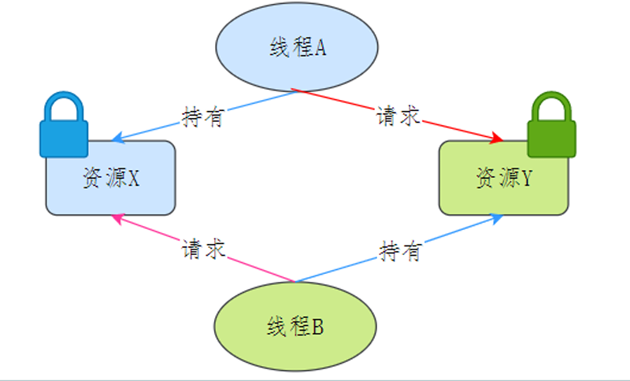

# 进程和线程

- 根本区别：进程是操作系统资源分配的基本单位，而线程是处理器任务调度和执行的基本单位

- 资源开销：每个进程都有独立的代码和数据空间（程序上下文），程序之间的切换会有较大的开销；线程可以看做轻量级的进程，同一类线程共享代码和数据空间，每个线程都有自己独立的运行栈和程序计数器（PC），线程之间切换的开销小。

- 包含关系：如果一个进程内有多个线程，则执行过程不是一条线的，而是多条线（线程）共同完成的；线程是进程的一部分，所以线程也被称为轻权进程或者轻量级进程。

- 内存分配：同一进程的线程共享本进程的地址空间和资源，而进程之间的地址空间和资源是相互独立的

- 影响关系：一个进程崩溃后，在保护模式下不会对其他进程产生影响，但是一个线程崩溃整个进程都死掉。所以多进程要比多线程健壮。

- 执行过程：每个独立的进程有程序运行的入口、顺序执行序列和程序出口。但是线程不能独立执行，必须依存在应用程序中，由应用程序提供多个线程执行控制，两者均可并发执行

# 线程之间同步的方式

线程同步指的是线程之间“协同”，即线程之间按照规定的先后次序运行。
线程同步主要包括四种方式：

1. 互斥量 pthread_mutex_
2. 读写锁 pthread_rwlock_
3. 条件变量 pthread_cond_
4. 信号量 sem_  

# 信号量semaphore的原理

信号量分为有名信号量和无名信号量，无名信号量用于线程同步，有名信号量一般用于进程之间管理。
信号量本质上是一个非负的整数计数器，用于控制公共资源的访问，也被称为PV原子操作：

P操作：即信号量sem减一，若sem小于等于0则P操作被阻塞，直到sem变量大于0为止
V操作：即信号量sem加一  
java中Semaphore采用了CAS来实现，尽量避免锁的使用，提高了性能  

# 虚拟内存

## 什么是虚拟内存

虚拟内存能够创建一个连续更大的空间给进程使用，出现的原因是由于主存的空间是有限，当运行多个进程或者一个进程需要更大的空间进行存储运行，主存显然是不够的，这个时候就需要更大更便宜的磁盘进行保存一部分数据  
对于进程来说，虚拟内存就是一张连续的内存空间，这个空间有些在主存中，有些在磁盘中。  

## 虚拟内存作用

1. 安全隔离，进程访问自身的私有内存片
2. 共享内存，在进程之间有效共享代码库
3. 善用碎片空间，更有效率地使用主存能够创建给主存更多的空间，每个进程都独有一个虚拟内存，并且解决主存非连续空间分配内存给某进程善用碎片空间  

## 虚拟内存会给运行时程序带来什么影响?//todo

# 死锁 

## 什么是死锁?
在两个或者多个并发线程中，如果每个线程持有某种资源，而又等待其它线程释放它或它们现在保持着的资源，在未改变这种状态之前都不能向前推进，称这一组线程产生了死锁。通俗的讲就是两个或多个线程无限期的阻塞、相互等待的一种状态。

## 死锁的产生条件？

死锁产生需要**同时**满足四个条件：
- **互斥**条件：指线程对己经获取到的资源进行它性使用，即该资源同时只由一个线程占用。如果此时还有其它线程请求获取获取该资源，则请求者只能等待，直至占有资源的线程释放该资源。
- **请求并持有**条件：指一个 线程己经持有了至少一个资源，但又提出了新的资源请求，而新资源己被其它线程占有，所以当前线程会被阻塞，但阻塞 的同时并不释放自己已经获取的资源。
- **不可剥夺**条件：指线程获取到的资源在自己使用完之前不能被其它线程抢占，只有在自己使用完毕后才由自己释放该资源。
- **环路等待**条件：指在发生死锁时，必然存在一个线程——资源的环形链，即线程集合 {T0，T1，T2,…… ，Tn} 中 T0 正在等待一 T1 占用的资源，Tl1正在等待 T2用的资源，…… Tn 在等待己被 T0占用的资源。

## 怎么避免死锁 //todo

## 活锁和饥饿锁

- 饥饿锁：  
    饥饿锁，这个饥饿指的是资源饥饿，某个线程一直等不到它所需要的资源，从而无法向前推进，就像一个人因为饥饿无法成长。

- 活锁：  
    在活锁状态下，处于活锁线程组里的线程状态可以改变，但是整个活锁组的线程无法推进。

# 多路复用 //todo

# Linux查看日志
Linux查看日志的命令有多种: tail、cat、tac、head、echo等，本文只介绍几种常用的方法。

1. **tail**
~~~
命令格式: tail[必要参数][选择参数][文件]
-f 循环读取
-q 不显示处理信息
-v 显示详细的处理信息
-c<数目> 显示的字节数
-n<行数> 显示行数
-q, --quiet, --silent 从不输出给出文件名的首部
-s, --sleep-interval=S 与-f合用,表示在每次反复的间隔休眠S秒
~~~
用法如下
~~~
tail  -n  10   test.log   查询日志尾部最后10行的日志;
tail  -n +10   test.log   查询10行之后的所有日志;
tail  -fn 10   test.log   循环实时查看最后1000行记录(最常用的)
~~~
一般还会配合着grep用，例如 :  
~~~
` tail -fn 1000 test.log | grep '关键字'`  
~~~
如果一次性查询的数据量太大,可以进行翻页查看，例如:
~~~
tail -n 4700  aa.log |more -1000 可以进行多屏显示(ctrl + f 或者 空格键可以快捷键)
~~~
2. **head**  
跟tail是相反的head是看前多少行日志
~~~
head -n  10  test.log   查询日志文件中的头10行日志;
head -n -10  test.log   查询日志文件除了最后10行的其他所有日志;
~~~
3. **cat**
cat 是由第一行到最后一行连续显示在屏幕上

4. **more**
`more`命令是一个基于vi编辑器文本过滤器，它以全屏幕的方式按页显示文本文件的内容，支持vi中的关键字定位操作。`more`名单中内置了若干快捷键，常用的有`H`（获得帮助信息），`Enter`（向下翻滚一行），空格（向下滚动一屏），`Q`（退出命令）。`more`命令从前向后读取文件，因此在启动时就加载整个文件。

该命令一次显示一屏文本，满屏后停下来，并且在屏幕的底部出现一个提示信息，给出至今己显示的该文件的百分比：`–More–（XX%）`
5. **sed**
这个命令可以查找日志文件特定的一段 , 根据时间的一个范围查询，可以按照行号和时间范围查询  
按照行号
~~~
sed -n '5,10p' filename 这样你就可以只查看文件的第5行到第10行。
~~~
按照时间段
~~~
 sed -n '/2014-12-17 16:17:20/,/2014-12-17 16:17:36/p'  test.log
~~~
6. **less**

### linux日志文件说明
~~~
/var/log/message 系统启动后的信息和错误日志，是Red Hat Linux中最常用的日志之一
/var/log/secure 与安全相关的日志信息
/var/log/maillog 与邮件相关的日志信息
/var/log/cron 与定时任务相关的日志信息
/var/log/spooler 与UUCP和news设备相关的日志信息
/var/log/boot.log 守护进程启动和停止相关的日志消息
/var/log/wtmp 该日志文件永久记录每个用户登录、注销及系统的启动、停机的事件
~~~
