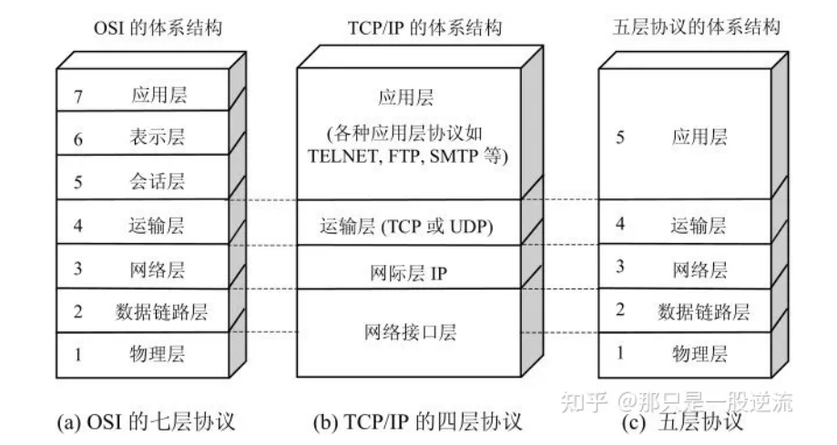
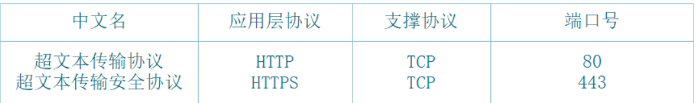
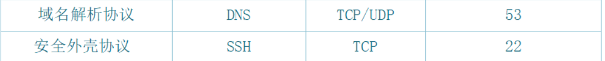

# 网络模型

# 应用层常见协议

# 发送一个http请求后的过程 //todo

1. 浏览器进行DNS域名解析，得到对应的IP地址
2. 根据这个IP，找到对应的服务器建立连接（三次握手）
3. 建立TCP连接后发起HTTP请求（一个完整的http请求报文）
4. 服务器响应HTTP请求，浏览器得到html代码（服务器如何响应）
5. 浏览器解析html代码，并请求html代码中的资源（如js、css、图片等）
6. 浏览器对页面进行渲染呈现给用户
7. 服务器关闭TCP连接（四次挥手）

# 从url到页面渲染 //todo

# udp和tcp //todo

## tcp怎么保证可靠性 //todo

# http和https //todo

## http

## https

