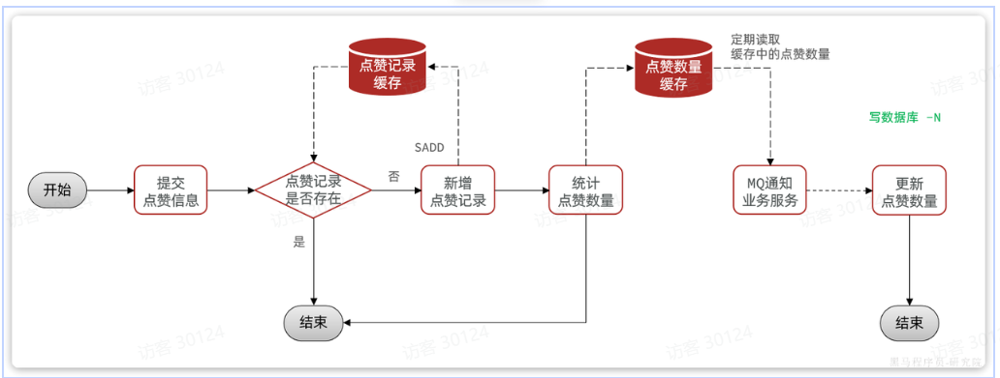
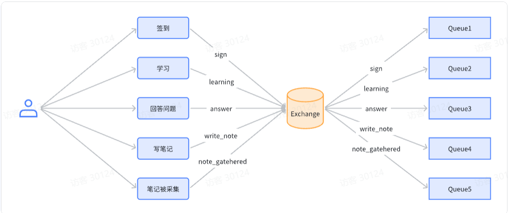
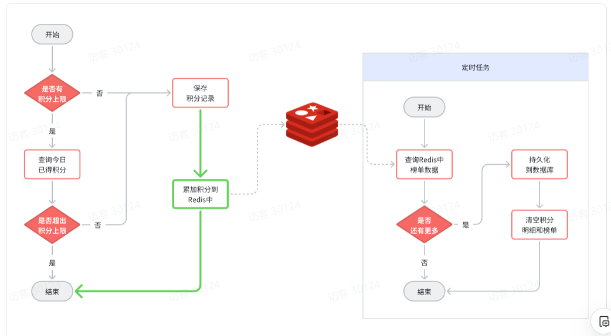
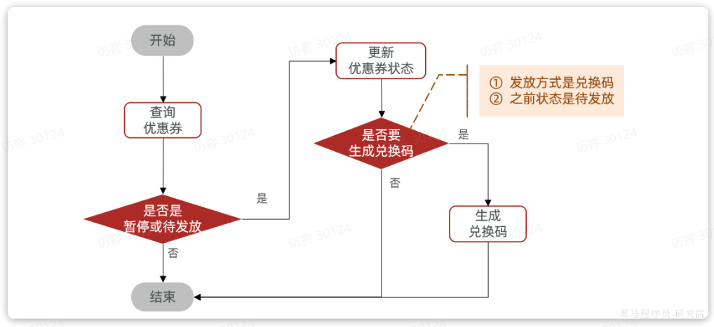
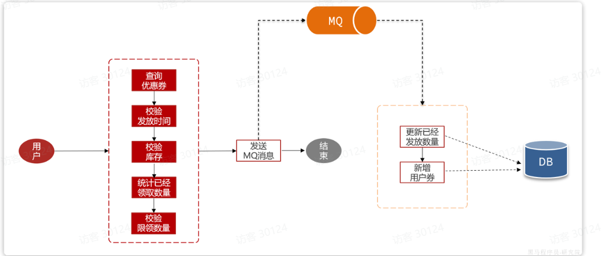
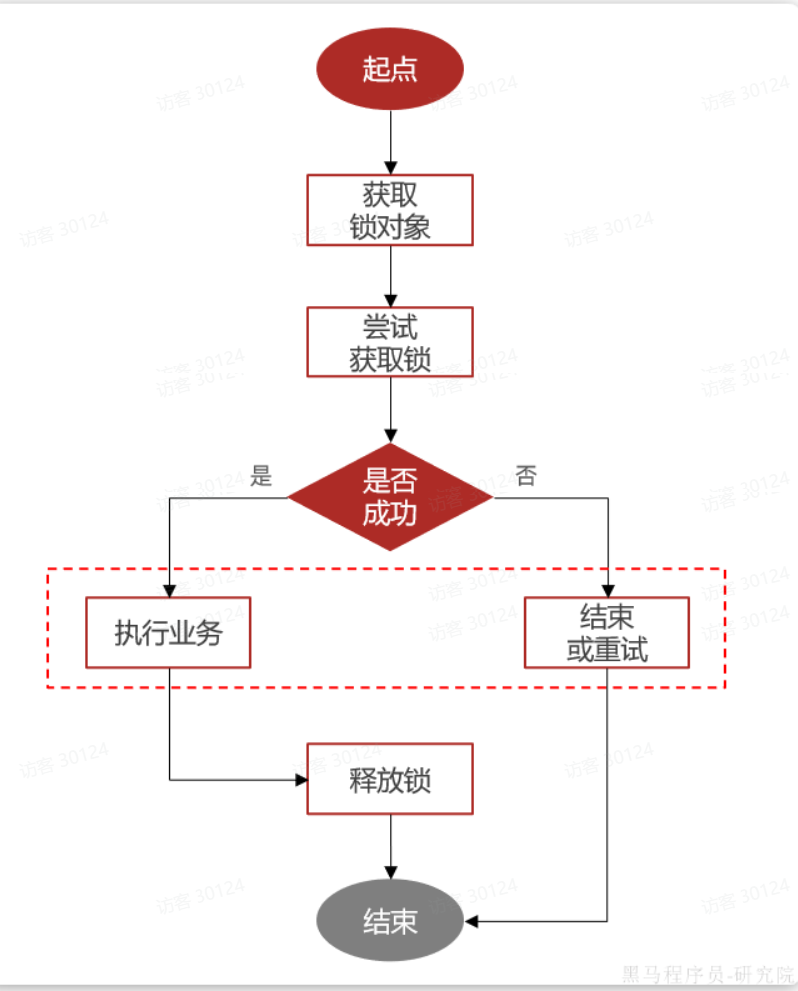

# 项目总结

## 学堂

### 介绍一下项目

这个项目是一个分布式的前后端分离的一个项目，是一个在线的学习平台，主要功能售卖课程和在线学习。同时实现了评论区和点赞功能。  
我主要做了三个模块：  
一个是点赞模块

实现了积分排行榜的功能  

排行榜

最后就是实现了优惠卷模块。这个模块对并发的要求是最高的。因为发放优惠卷要避免超发的问题。

基于BitMap：兑换或没兑换就是两个状态，对应0和1，而兑换码使用的是自增id.我们如果每一个自增id对应一个bit位，用每一个bit位的状态表示兑换状态，是不是完美解决问题。而这种算法恰好就是BitMap的底层实现，而且Redis中的BitMap刚好能支持2^32个bit位。

- 优点：简答、高效、性能好
- 缺点：依赖于Redis

异步生成兑换码：  

异步领卷

实现分布式锁注解

## 外卖

### 介绍一下这个项目

这个项目是一个前后端分离的单体项目。主要功能是商家管理端管理菜品、套餐等，在用户端实现浏览并下单。
